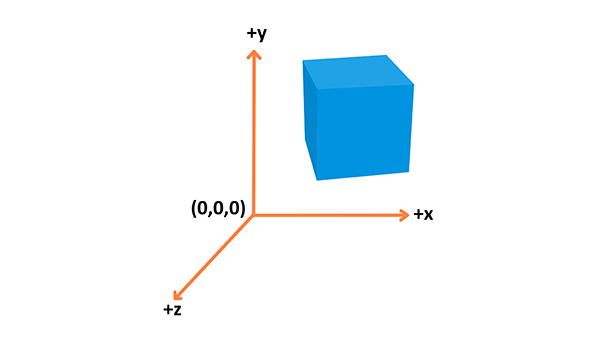
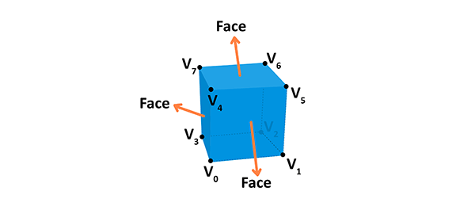
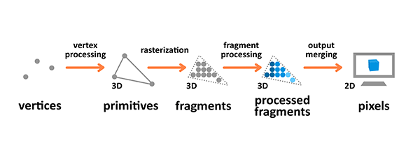
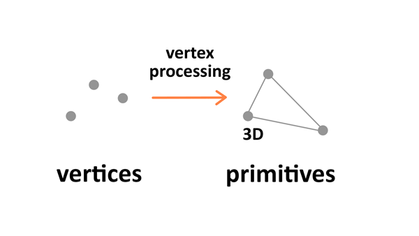
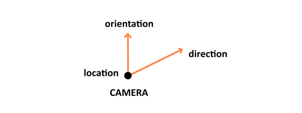
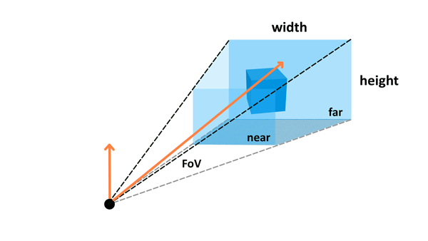
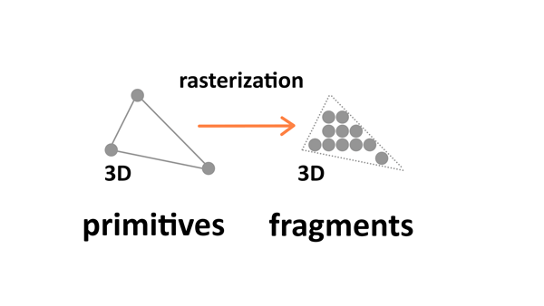
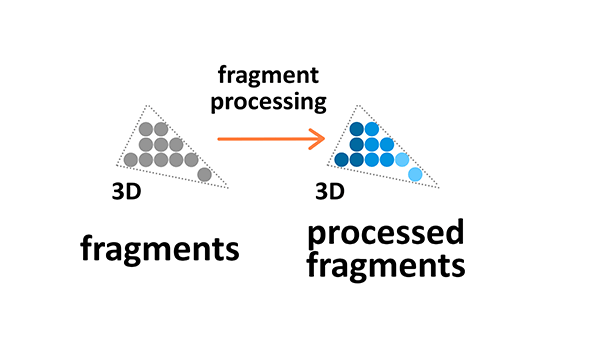
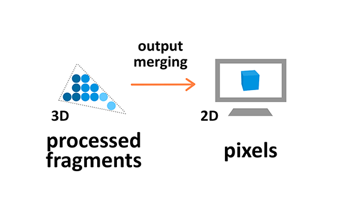

{{GamesSidebar}}

This article explains all of the basic theory that's useful to know when you are getting started working with 3D.

## Coordinate system

3D essentially is all about representations of shapes in a 3D space, with a coordinate system used to calculate their position.

WebGL uses the right-hand coordinate system — the `x` axis points to the right, the `y` axis points up, and the `z` axis points out of the screen, as seen in the above diagram.

## Objects

Different types of objects are built using vertices. A **Vertex** is a point in space having its own 3D position in the coordinate system and usually some additional information that defines it. Every vertex is described by these attributes:

- **Position**: Identifies it in a 3D space (`x`, `y`, `z`).
- **Color**: Holds an RGBA value (R, G and B for the red, green, and blue channels, alpha for transparency — all values range from `0.0` to `1.0`).
- **Normal:** A way to describe the direction the vertex is facing.
- **Texture**: A 2D image that the vertex can use to decorate the surface it is part of instead of a simple color.

You can build geometry using this information — here is an example of a cube:

A face of the given shape is a plane between vertices. For example, a cube has 8 different vertices (points in space) and 6 different faces, each constructed out of 4 vertices. A normal defines which way the face is directed in. Also, by connecting the points we're creating the edges of the cube. The geometry is built from a vertex and the face, while material is a texture, which uses a color or an image. If we connect the geometry with the material we will get a mesh.

## Rendering pipeline

The rendering pipeline is the process by which images are prepared and output onto the screen. The graphics rendering pipeline takes the 3D objects built from **primitives** described using **vertices**, applies processing, calculates the **fragments** and renders them on the 2D screen as **pixels**.

Terminology used in the diagram above is as follows:

- A **Primitive**: An input to the pipeline — it's built from vertices and can be a triangle, point or line.
- A **Fragment**: A 3D projection of a pixel, which has all the same attributes as a pixel.
- A **Pixel**: A point on the screen arranged in the 2D grid, which holds an RGBA color.

Vertex and fragment processing are programmable — you can [write your own shaders](/en-US/docs/Games/Techniques/3D_on_the_web/GLSL_Shaders) that manipulate the output.

## Vertex processing

Vertex processing is about combining the information about individual vertices into primitives and setting their coordinates in the 3D space for the viewer to see. It's like taking a photo of the given scenery you have prepared — you have to place the objects first, configure the camera, and then take the shot.

There are four stages to this processing: the first one involves arranging the objects in the world, and is called **model transformation**. Then there's **view transformation** which takes care of positioning and setting the orientation of the camera in the 3D space. The camera has three parameters — location, direction, and orientation — which have to be defined for the newly created scene.

**Projection transformation** (also called perspective transformation) then defines the camera settings. It sets up what can be seen by the camera — the configuration includes _field of view_, _aspect ratio_ and optional _near_ and _far planes_. read the [Camera paragraph](/en-US/docs/Games/Techniques/3D_on_the_web/Building_up_a_basic_demo_with_Three.js#camera) in the Three.js article to learn about those.

The last step is **viewport transformation**, which involves outputting everything for the next step in the rendering pipeline.

## Rasterization

Rasterization converts primitives (which are connected vertices) to a set of fragments.

Those fragments — which are 3D projections of the 2D pixels — are aligned to the pixel grid, so eventually they can be printed out as pixels on a 2D screen display during the output merging stage.

## Fragment processing

Fragment processing focuses on textures and lighting — it calculates final colors based on the given parameters.

### Textures

Textures are 2D images used in the 3D space to make the objects look better and more realistic. Textures are combined from single texture elements called texels the same way picture elements are combined from pixels. Applying textures onto objects during the fragment processing stage of the rendering pipeline allows us to adjust it by wrapping and filtering it if necessary.

Texture wrapping allows us to repeat the 2D image around the 3D object. Texture filtering is applied when the original resolution or the texture image is different from the displayed fragment — it will be minified or magnified accordingly.

### Lighting

The colors we see on the screen is a result of the light source interacting with the surface colors of the object's material. Light might be absorbed or reflected. The standard **Phong Lighting Model** implemented in WebGL has four basic types of lighting:

- **Diffuse**: A distant directional light, like the sun.
- **Specular**: A point of light, just like a light bulb in a room or a flashlight.
- **Ambient**: The constant light applied to everything on the scene.
- **Emissive**: The light emitted directly by the object.

## Output merging

During the output manipulation stage all the fragments of the primitives from the 3D space are transformed into a 2D grid of pixels that are then printed out on the screen display.

During output merging some processing is also applied to ignore information that is not needed — for example the parameters of objects that are outside the screen or behind other objects, and thus not visible, are not calculated.

## Conclusion

Now you know the basic theory behind 3D manipulation. If you want to move on to practice and see some demos in action, follow up with the tutorials below:

- [Building up a basic demo with Three.js](/en-US/docs/Games/Techniques/3D_on_the_web/Building_up_a_basic_demo_with_Three.js)
- [Building up a basic demo with Babylon.js](/en-US/docs/Games/Techniques/3D_on_the_web/Building_up_a_basic_demo_with_Babylon.js)
- [Building up a basic demo with PlayCanvas](/en-US/docs/Games/Techniques/3D_on_the_web/Building_up_a_basic_demo_with_PlayCanvas)
- [Building up a basic demo with A-Frame](/en-US/docs/Games/Techniques/3D_on_the_web/Building_up_a_basic_demo_with_A-Frame)

Go ahead and create some cool cutting-edge 3D experiments yourself!
