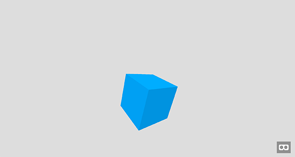
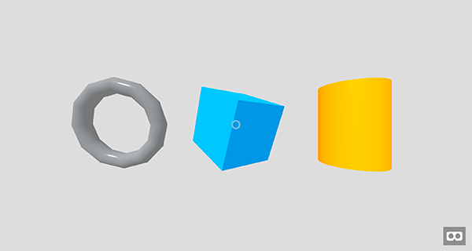

{{GamesSidebar}}

The [WebXR](/en-US/docs/Games/Techniques/3D_on_the_web/WebXR) and [WebGL](/en-US/docs/Web/API/WebGL_API) APIs already enable us to start creating virtual reality (VR) and augmented reality (AR) experiences inside web browsers, but the community is still waiting for tools and libraries to appear, to make this easier. Mozilla's [A-Frame](https://aframe.io/) framework provides a markup language allowing us to build 3D VR landscapes using a system familiar to web developers, which follows game development coding principles; this is useful for quickly and successfully building prototypes and demos, without having to write a lot of JavaScript or GLSL. This article explains how to get up and running with A-Frame, and how to use it to build up a simple demo.

## High level overview

A-Frame runs on most environments, such as desktop, mobile (iOS and Android), and devices such as Oculus Rift, Gear VR and HTC Vive.

A-Frame is built on top of [WebGL](/en-US/docs/Web/API/WebGL_API), and provides pre-built components to use in applications — models, video players, skyboxes, geometries, controls, animations, cursors, etc. It is based on the [entity component system](https://en.wikipedia.org/wiki/Entity_component_system), which is known in the game development world, but it targets web developers with a familiar markup structure, manipulable with JavaScript. The end result is 3D web experiences, which are VR-enabled by default.

## Environment setup

Let's start by setting up an environment to create something with A-Frame. We'll then build up a demo and run it. You should start off by:

- Making sure you are using a modern browser with good WebGL support (and WebVR support if you have available VR hardware) such as the latest Firefox or Chrome — download [Firefox Nightly](https://www.mozilla.org/en-US/firefox/channel/desktop/) or Chrome (v54 or higher).
- (Optional) set up a VR device such as Oculus Rift or Google Cardboard.
- Create a new directory to store your project in.
- Save a copy of the latest [A-Frame JavaScript library file](https://github.com/aframevr/aframe/tree/master/dist) inside your directory (check the GitHub repository for latest stable a dev builds).
- Open the [A-Frame documentation](https://aframe.io/docs/) in a separate tab — it is useful to refer to.

## HTML structure

The first step is to create an HTML document — inside your project directory, create a new `index.html` file, and save the follow HTML inside it:

```html
<!doctype html>
<html lang="en-US">
  <head>
    <meta charset="utf-8" />
    <title>MDN Games: A-Frame demo</title>
    <script src="aframe.min.js"></script>
  </head>
  <body>
    <!-- HTML goes here -->
  </body>
</html>
```

This contains some basic information like the document `charset` and {{htmlelement("title")}}. The {{htmlelement("script")}} element includes the A-Frame framework in the page; we will write our example code inside the {{htmlelement("body")}} element.

### Initializing the scene

A scene is the place where everything happens. When creating new objects in the demo, we will be adding them all to the scene to make them visible on the screen. In A-Frame, the scene is represented by a [Scene entity](https://aframe.io/docs/core/scene.html).

> [!NOTE]
> An Entity is any element — it can be an object like a box, cylinder or cone, but it can also be a camera, light or sound source.

Let's create the scene by adding an `<a-scene>` element inside the `<body>` element:

```html
<a-scene></a-scene>
```

### Adding a cube

Adding the cube to the scene is done by adding a simple [`<a-box>`](https://aframe.io/docs/primitives/a-box.html) element inside the `<a-scene>` element. Add it now:

```html
<a-box color="#0095DD" position="0 1 0" rotation="20 40 0"></a-box>
```

It contains a few parameters already defined: `color`, `position` and `rotation` — these are fairly obvious, and define the base color of the cube, the position inside the 3D scene, and the rotation of the cube.

> [!NOTE]
> The distance values (e.g. for the cube y position) are unitless, and can basically be anything you deem suitable for your scene — millimeters, meters, feet, or miles — it's up to you.

### Adding a background: Sky box

A sky box is a background for the 3D world, represented by an [`<a-sky>`](https://aframe.io/docs/primitives/a-sky.html) element. In our case we will use a simple color, but it could also be an image, etc. Looking around would give an impression of being inside an open sky, a wooden barn — wherever you like! Add the following HTML before the `<a-cube>` element:

```html
<a-sky color="#DDDDDD"></a-sky>
```

At this point, if you save the code and refresh your browser you can already see the cube on the screen with our custom background:



Here's the code we have created so far:

{{JSFiddleEmbed("https://jsfiddle.net/end3r/m85148b4/","","350")}}

You can also [check it out on GitHub](https://github.com/end3r/MDN-Games-3D/blob/gh-pages/A-Frame/cube.html).

A-Frame takes care of setting up everything you need:

- A default light source and camera are included, so the cube is visible.
- The controls are already working: you can use the mouse for looking around and the keyboard for movement
  (try the <kbd>W</kbd>, <kbd>A</kbd>, <kbd>S</kbd>, and <kbd>D</kbd> keys).

- There's even an "Enter VR mode" button in the bottom right corner of the screen, to allow you to shift to full screen, stereoscopic image viewing if you have the necessary VR hardware set up and ready.

### Specifying a camera

A camera entity can be created by adding an [`<a-camera>`](https://aframe.io/docs/primitives/a-camera.html) element to the scene. We can set the position of the camera explicitly and move it back a little bit from the center of the scene, so we'll be able to see the shapes. Add this just before the closing `</a-scene>` element:

```html
<a-camera
  position="0 1 4"
  cursor-visible="true"
  cursor-scale="2"
  cursor-color="#0095DD"
  cursor-opacity="0.5">
</a-camera>
```

We've also defined a cursor for the given camera, using the `cursor-*` attributes (by default it is invisible.) — we've set its scale so it will more easily visible, its color, and some opacity so it won't completely cover the objects behind it.

### Adding lights

The basic light types in A-Frame are directional and ambient. The first type is a directional light placed somewhere on the scene while the second one reflects the light from the first type, so it looks more natural; this can be set globally. Add the new code below your previous additions — this uses the standard `<a-light>` element:

```html
<a-light type="directional" color="#FFF" intensity="0.5" position="-1 1 2">
</a-light>
<a-light type="ambient" color="#FFF"></a-light>
```

The directional light has a white color, its intensity is set to `0.5`, and it is placed at position `-1 1 2`. The ambient light only needs a color, which is also white.

### Adding some advanced geometry

We have a cube on the scene already; now let's try adding more shapes. We are not limited to the default entities like `<a-cube>` — using `<a-entity>` we can create custom advanced shapes. Let's try adding a torus — add this element below the previous code:

```html
<a-entity
  geometry="
    primitive: torus;
    radius: 1;
    radiusTubular: 0.1;
    segmentsTubular: 12;"
  rotation="10 0 0"
  position="-3 1 0">
</a-entity>
```

Our entity has a [torus primitive](https://aframe.io/docs/components/geometry.html#Torus), which represents its shape. We are passing some initial variables to that shape: the radius of the outer edge of the torus, the radius of the tube, and number of segments along the circumference of the tube face respectively. Rotation and position are set in the same way as we saw earlier.

### Defining a material

The torus is now visible on the scene, but its color doesn't look very good — this is because we have to create a [material](https://aframe.io/docs/components/material.html) to define the appearance of the entity. Edit the `<a-entity>` defining the torus to look like the following:

```html
<a-entity
  geometry="
    primitive: torus;
    radius: 1;
    radiusTubular: 0.1;
    segmentsTubular: 12;"
  material="
    color: #EAEFF2;
    roughness: 0.1;
    metalness: 0.5;"
  rotation="10 0 0"
  position="-3 1 0">
</a-entity>
```

In the new `material` attribute, we set up the `color` of the material, then its `roughness` (a rougher material will scatter reflected light in more directions than a smooth material) and `metalness` (how metallic the material is).

## Adding some JavaScript to the mix

It is possible to populate the scene with entities created using JavaScript too, so let's use it to add a third shape, a cylinder. Add a new {{htmlelement("script")}} element at the end of the `<body>` element, just after the `<a-scene>` element, then add the following JavaScript code inside it:

```js
const scene = document.querySelector("a-scene");
const cylinder = document.createElement("a-cylinder");
cylinder.setAttribute("color", "#FF9500");
cylinder.setAttribute("height", "2");
cylinder.setAttribute("radius", "0.75");
cylinder.setAttribute("position", "3 1 0");
scene.appendChild(cylinder);
```

We're getting a reference to the scene handler first, then we create the cylinder element as an A-Frame entity. After that it's all about setting the proper attributes: `color`, `height`, `radius` and `position`. The last line adds the newly created cylinder to the scene. That's it — you've created three different shapes with A-Frame! Here's how it looks right now:



It is impressive to be able to create such a scene with just a few lines of HTML and JavaScript.

## Animation

We've already used `rotation` and `position` to move the shapes on the scene, and we can also scale them. These attributes can be manipulated to create the illusion of [animation](https://aframe.io/docs/1.6.0/components/animation.html).

### Rotation

There's a special [`animation`](https://aframe.io/docs/1.6.0/components/animation.html) component that can help us animate elements. Add the `animation` component seen below to the `<a-box>` element as a property, as shown:

```html
<a-box
  color="#0095DD"
  rotation="20 40 0"
  position="0 1 0"
  animation="property: rotation; from: 20 0 0; to: 20 360 0; dir: alternate; loop: true; dur: 4000; easing: easeInOutQuad;">
</a-box>
```

As with any other entities, you can define key properties for the animation. We'll be animating the `rotation` attribute from `20 0 0` to `20 360 0`, so it will do a full spin. The animation direction is set to alternate so the animation will be played forward, and then back. The duration is set to 4 seconds, and it will be repeated indefinitely. The animation uses `easing` for easing, with [tween.js](https://github.com/tweenjs/tween.js/) being implemented internally.

### Scaling

We can also add animation to entities with custom geometry like the torus, in much the same way. Add the following `animation` component to your torus:

```html
<a-entity
  geometry="
    primitive: torus;
    radius: 1;
    radiusTubular: 0.1;
    segmentsTubular: 12;"
  material="
    color: #EAEFF2;
    roughness: 0.1;
    metalness: 0.5;"
  rotation="10 0 0"
  position="-3 1 0"
  animation="property: scale; to: 1 0.5 1; dir: alternate; dur: 2000; loop: true; easing: linear;">
</a-entity>
```

The attribute we want to animate for the torus is `scale`. The initial, default scale is `1 1 1`, and we're going to animate it to `1 0.5 1`, so the `y` axis will be scaled from `1` to `0.5`. The easing we're going to use is `linear`. By setting the direction to `alternate` the scale will be animated to `0.5`, and then animated back to `1` during 2 seconds. Again, the animation is being repeated indefinitely.

### Moving

We could use the `animation` to change the position of the third shape, or we could use JavaScript instead. Add this code at the end of the `<script>` tag:

```js
let t = 0;
function render() {
  t += 0.01;
  requestAnimationFrame(render);
  cylinder.setAttribute("position", `3 ${Math.sin(t * 2) + 1} 0`);
}
render();
```

We're using the `render()` function to update the cylinder's position on every frame. Try changing the given values on the `y` axis and see how it affects the movement.

## Conclusion

Everything is rendered properly and animating — congratulations on building your first A-Frame scene! Here's how the final version looks and works:

{{JSFiddleEmbed("https://jsfiddle.net/lowperry/xmo62ku0/5/","","350")}}

If you have a VR device available, now is a good time to try out your scene with it too.

> [!NOTE]
> You can also [check it out on GitHub](https://github.com/end3r/MDN-Games-3D/blob/gh-pages/A-Frame/shapes.html).

That was easier than you thought, right? A-Frame targets web developers by offering easy to use web markup and all the advantages that brings, such as JavaScript manipulation. It is easy to start with, but also provides a powerful API for advanced concepts, as well as dealing with cross browser differences and suchlike. The community is growing, just like the number of supported VR devices — it's a great time to start experimenting with such frameworks.

## See also

- [A-Frame website](https://aframe.io/)
- [Introducing A-Frame 0.1.0 article](https://aframe.io/blog/2015/12/16/introducing-aframe/)
- [A-Frame physics plugin](https://github.com/ngokevin/aframe-physics-components)
- [A-Frame gamepad controls plugin](https://github.com/donmccurdy/aframe-gamepad-controls)
