Instead of coding everything from scratch you can also use the online **PlayCanvas editor**. This can be a more pleasant working environment if you are not someone who likes to code.

## Creating an account

The PlayCanvas Editor is free — all you have to do to begin with is [register](https://login.playcanvas.com/signup) your account and login:

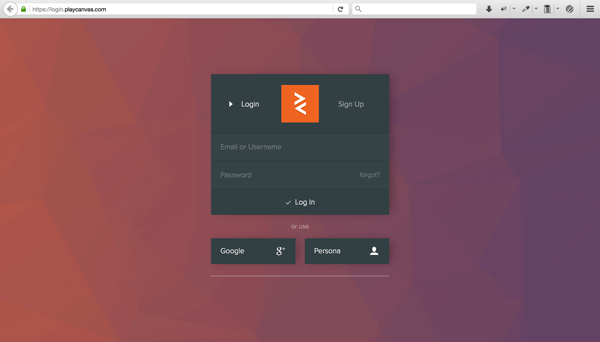

When you first sign up, you are taken straight into the editor and given a simple starter tutorial involving editing a 3D rolling ball game. You can finish this before you continue our tutorial if you like. When you are ready to continue with our tutorial, go to your canvas homepage — for example mine is `https://playcanvas.com/end3r`. Here's what the page looks like — you can create projects and manage them, change their settings etc.

## Creating a new project

Start a brand new project by clicking on the _New_ button:

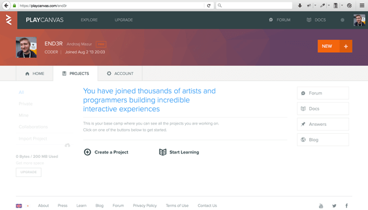

The resulting dialog box will show a few different options. There are starter kits available, but we don't want to load models or start a platform game.

1. We want to start small, so we will use the empty project — click on the Blank Project option and enter a name for it (we are using "MDN Games demo".)
2. Enter a description if you want — it is optional.
3. Click _Create_ to have it created.

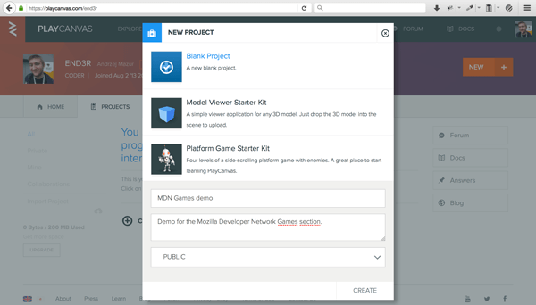

Next you'll see your project's page — there's not much yet. By clicking the _Editor_ button we'll launch the online PlayCanvas editor where we'll create our scene with the shapes. Do this now.

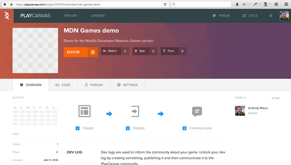

## Creating the scene

Here's how the scene looks initially in the editor. Even though it's a blank new project we don't have to start entirely from scratch — the camera and directional light are prepared already, so you don't have to worry about them.

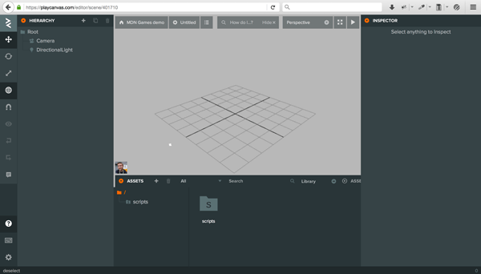

Now onto the creative part. To add an entity to the scene you have to click on the big plus button located in the top left area of the editor, next to the Hierarchy text. When hovering over that button with your mouse the label will say 'Add Entity' — that's exactly what we want to do. An Entity is any object used in the scene — it can be an object like a box, cylinder or cone, but it can also be a camera, light or sound source. After clicking the button you'll see a dropdown list containing a lot of various entities to choose from. Go ahead and click _Box_ — it will be added to the scene.

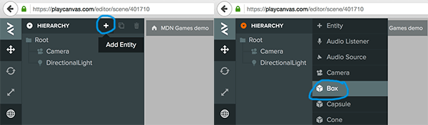

The box is created with the default values — width, height and depth are set to 1, and it is placed in the middle of the scene. You can drag it around or apply new values in the right panel.

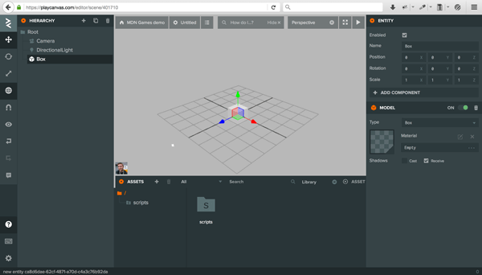

To add some colors to the scene we need a new material that will be used on the newly created box. Click on the plus button in the _Assets_ tab, and click on the _Material_ option in the dropdown list that appears to create a new material.

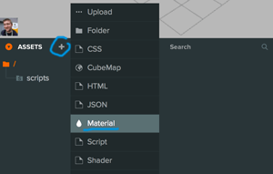

Click on your new material in the assets tab and its entity inspector will appear on the right-hand side of the display. Now edit the _Name_ text field to give it a unique name (we've chosen _boxMaterial_). A unique name will help us remember what this material is for — we will add more later!

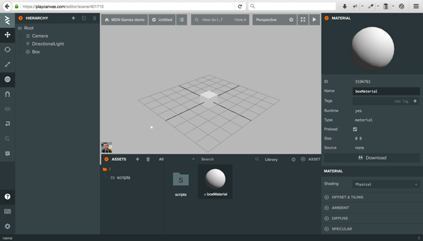

To change its color we'll use the _Diffuse_ option in the entity inspector. Click _Diffuse_, then select the colored box next to the Color label — it will open a {{glossary("color wheel")}}. From here you can click your desired color or enter it in the bottom text field as a hex value. We've chosen a blue color with a hex value of `0095DD` — enter this code in the text field and press return for it to be accepted.

> **Note:** Yes, you read that right — you need to enter the hex value without the hash/pound symbol.

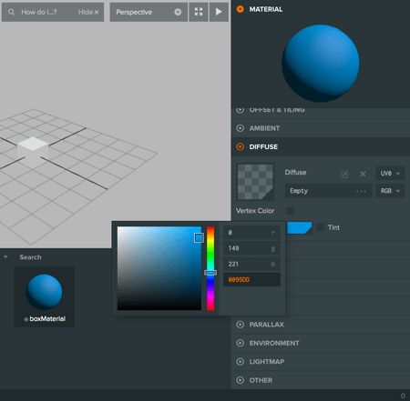

Now we can apply the colored material to the shape by clicking and dragging its icon from the bottom part of the screen (the little dot on the left-hand side of the material's name — it can be a bit fiddly to select; just persevere) onto the box on the scene.

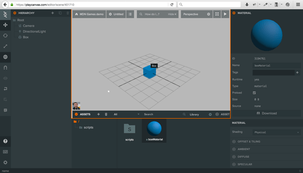

So, at this point we've created a blue box. Click on the box to bring up its entity sidebar — you'll see options for changing its position, rotation, and scale. Try applying the rotation values X: 10 and Y: 20.

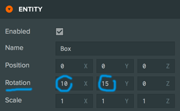

Now click on the play arrow in the top right corner of the scene to launch and render the scene — it will be opened in a separate browser tab.

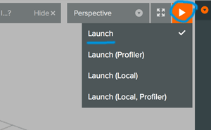

This looks great! Let's add more shapes to the scene to make it look more interesting.

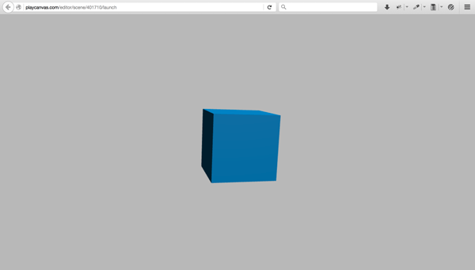

## Adding more shapes

To make way for more shapes, move the box to the left to make some room for the next shape. You can do this by giving it an X position value of -2.

Adding other shapes involves a very similar process to adding the box. Click on the Root folder in the hierarchy panel (to make sure that the new shape appears in the root, and not as a child of the Box) then Click on the big _Add Entity_ (plus) button and select cylinder from the dropdown list — it will add a new cylinder shape to the scene.

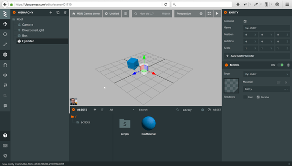Now follow the same steps as we did before when coloring the cube:

- Create a new material using the _Add Asset_ (plus) button.
- Make sure the New Material in the Assets panel is selected, to bring up the entity inspector.
- Give the material a new name, along the lines of `cylinderMaterial`.
- Click diffuse, then click the color picker — give it an orange color (we used FF9500.)
- Drag and drop the `cylinderMaterial` icon onto the cylinder object on the screen to apply that color.

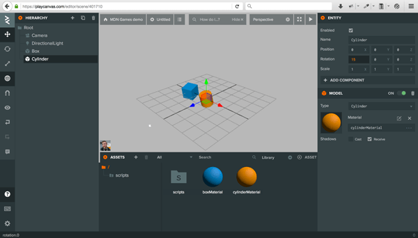

Follow the same approach again to add a cone to the scene, giving it a grayish color (we used EAEFF2.) You should now have three shapes on your scene, something like the below screenshot.

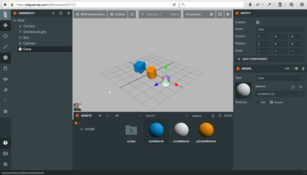

## Animating our scene

Animating 3D models might be considered an [advanced](https://developer.playcanvas.com/en/tutorials/anim-blending/) thing to do, but all we want to do is to control a few properties of a given object — we can use a script component to do that. Click on the plus button in the Assets panel, select the Script option, and name your new script file `boxAnimation.js`.


If you double click on it, you'll be moved to a code editor. As you can see, the file contains some boilerplate code already:

```js
pc.script.create("boxAnimation", function (app) {
  class BoxAnimation {
    constructor(entity) {
      this.entity = entity;
    }

    // Called once after all resources are loaded and before the first update
    initialize() {}

    // Called every frame, dt is time in seconds since last update
    update(dt) {}
  }

  return BoxAnimation;
});
```

The most interesting part is the `update()` function, which is where we can put any code that we want repeated on every frame. Add the following line inside this function, to rotate the cube on every frame:

```js
this.entity.rotate(dt * 10, dt * 20, dt * 30);
```

In the line above `this.entity` refers to the object to which the script will be attached (the box); using the `dt` variable, which contains the delta time passed since the previous frame, we can rotate the box by a different amount around all three axes.

1. Save the changes using the Save button in the top right of the code editor, then return to the main editor tab. Here, follow these steps:
2. Be sure you have the box selected on the scene.
3. Click on _Add component_, then _Script_ in the entity inspector.
4. At the bottom of the screen you can see the list of scripts available — for now there's only `boxAnimation.js` — clicking it will add the animation script to the box object.

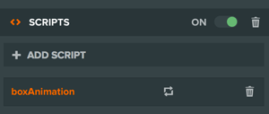

### The cylinder

Now we'll do the same steps for cylinder. First:

1. Create a new Script asset.
2. Name it `cylinderAnimation.js`.
3. Double click the script icon to launch the code editor.

This time instead of rotating the object we will try to scale it. For that we'll need a timer to store the total amount of time passed since the start of the animation. Add this code to the `initialize()` function:

```js
this.timer = 0;
```

And those two lines to the `update()` function:

```js
this.timer += dt;
this.entity.setLocalScale(1, Math.abs(Math.sin(this.timer)), 1);
```

The `setLocalScale()` method applies the given values to the X, Y and Z axes of the object. In our case we're modifying the scale of the cylinder on the Y axis, giving it as a value the `Math.sin()` of the timer, with `Math.abs()` applied to the result of that to have the values always above zero (0-1; sin values are normally between -1 and 1.) This gives us a nice scaling effect as a result.

Remember to add the `cylinderAnimation.js` file to the Cylinder object to apply the given animations.

### The cone

Time to play with the last object — the cone. Create a `coneAnimation.js` file and double click it to open it in the editor.

Next, add the following line to the `initialize()` function:

```js
this.timer = 0;
```

To move the cone up and down we will use the `setPosition()` method — add the code below to the `update()` function:

```js
this.timer += dt;
this.entity.setPosition(2, Math.sin(this.timer * 2), 0);
```

The position of the cone will be animated on each frame by being passed the `Math.sin()` value of the `timer` at each point in time — we have doubled the `this.timer` value to make it move higher.

Add the `coneAnimation.js` script to the cone object, as before.

## Test the demo out

Launch the demo to see the effects — all the shapes should animate. Congratulations, you've completed the tutorial!

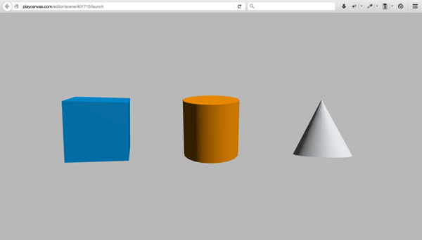

## Summary

Now you can check the [PlayCanvas engine](/en-US/docs/Games/Techniques/3D_on_the_web/Building_up_a_basic_demo_with_PlayCanvas/engine) article if you haven't seen it yet, go back to the [Building up a basic demo with PlayCanvas](/en-US/docs/Games/Techniques/3D_on_the_web/Building_up_a_basic_demo_with_PlayCanvas) page, or go back a level higher to the main [3D Games on the Web](/en-US/docs/Games/Techniques/3D_on_the_web) page.
