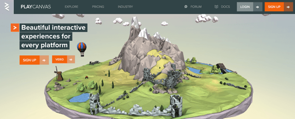
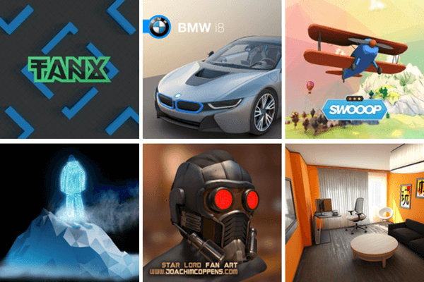

{{GamesSidebar}}

**PlayCanvas** is a popular 3D WebGL game engine, originally created by Will Eastcott and Dave Evans. It is [open sourced on GitHub](https://github.com/playcanvas/engine), with an [editor](https://developer.playcanvas.com/en/user-manual/designer/) available online and good [documentation](https://developer.playcanvas.com/en/). The online editor is free for public projects with up to two team members, but there are also [paid plans](https://playcanvas.com/plans) if you'd like to run a commercial private project with more developers.

## Games and demos

PlayCanvas has a few well-known demos published that showcase its possibilities.

- [Tanx](https://tanx.io/) is a multiplayer tank game where you can drive your tank around, shooting at other players as you go.
- [Swooop](https://playcanv.as/p/JtL2iqIH) is a flying game where you pilot your plane around a magical island, collecting jewels and fuel as you go.
- Visualizations like the [Star Lord](https://playcanv.as/b/FQbBsJTd) and [BMW i8](https://playcanv.as/p/RqJJ9oU9) also take advantage of the engine and showcase what's possible.

> **Note:** Check out the list of [featured demos](https://playcanvas.com/explore) to find more examples.

## Engine vs. editor

The engine itself can be used as a standard library by including its JavaScript file directly in your HTML, so you can start coding right away; in addition the PlayCanvas toolset comes with an online editor that you can use to drag and drop components onto the scene — a great way to create games and other apps requiring scenes if you're more of a designer than a coder. Those approaches are different but work equally well regarding achieving end goals.

## PlayCanvas engine

Built for modern browsers, PlayCanvas is a fully-featured 3D game engine with resource loading, an entity and component system, advanced graphics manipulation, collision and physics engine (built with [ammo.js](https://github.com/kripken/ammo.js/)), audio, and facilities to handle control inputs from various devices (including gamepads). That's quite an impressive list of features — let's see some in action, check out the [Building up a basic demo with PlayCanvas engine](/en-US/docs/Games/Techniques/3D_on_the_web/Building_up_a_basic_demo_with_PlayCanvas/engine) for details.

## PlayCanvas editor

Instead of coding everything from the beginning you can also use the online editor. This can be a more pleasant working environment if you are not someone who likes to code. See the [Building up a basic demo with PlayCanvas editor](/en-US/docs/Games/Techniques/3D_on_the_web/Building_up_a_basic_demo_with_PlayCanvas/editor) for details.

## Summary

Of course, it depends on your approach — designers may favor the online editor while programmers will prefer having the full control over the coding environment and will probably use the engine's source files. The good thing is that you have a choice and can pick whatever tools suit you best.
