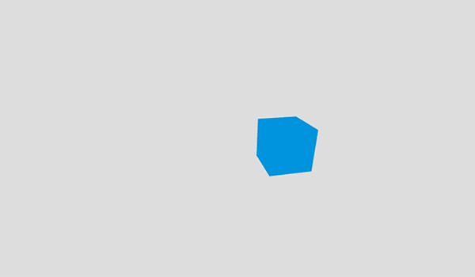

{{GamesSidebar}}

Shaders use GLSL (OpenGL Shading Language), a special OpenGL Shading Language with syntax similar to C. GLSL is executed directly by the graphics pipeline. There are [several kinds of shaders](https://www.khronos.org/opengl/wiki/Shader), but two are commonly used to create graphics on the web: Vertex Shaders and Fragment (Pixel) Shaders. Vertex Shaders transform shape positions into 3D drawing coordinates. Fragment Shaders compute the renderings of a shape's colors and other attributes.

GLSL is not as intuitive as JavaScript. GLSL is strongly typed and there is a lot of math involving vectors and matrices. It can get very complicated — very quickly. In this article we will make a simple code example that renders a cube. To speed up the background code we will be using the Three.js API.

As you may remember from the [basic theory](/en-US/docs/Games/Techniques/3D_on_the_web/Basic_theory) article, a vertex is a point in a 3D coordinate system. Vertices may, and usually do, have additional properties. The 3D coordinate system defines space and the vertices help define shapes in that space.

## Shader types

A shader is essentially a function required to draw something on the screen. Shaders run on a [GPU](https://en.wikipedia.org/wiki/GPU) (graphics processing unit), which is optimized for such operations. Using a GPU to deal with shaders offloads some of the number crunching from the CPU. This allows the CPU to focus its processing power on other tasks, like executing code.

### Vertex shaders

Vertex shaders manipulate coordinates in a 3D space and are called once per vertex. The purpose of the vertex shader is to set up the `gl_Position` variable — this is a special, global, and built-in GLSL variable. `gl_Position` is used to store the position of the current vertex.

The `void main()` function is a standard way of defining the `gl_Position` variable. Everything inside `void main()` will be executed by the vertex shader. A vertex shader yields a variable containing how to project a vertex's position in 3D space onto a 2D screen.

### Fragment shaders

Fragment (or texture) shaders define RGBA (red, green, blue, alpha) colors for each pixel being processed — a single fragment shader is called once per pixel. The purpose of the fragment shader is to set up the `gl_FragColor` variable. `gl_FragColor` is a built-in GLSL variable like `gl_Position`.

The calculations result in a variable containing the information about the RGBA color.

## Demo

Let's build a simple demo to explain those shaders in action. Be sure to read [Three.js tutorial](/en-US/docs/Games/Techniques/3D_on_the_web/Building_up_a_basic_demo_with_Three.js) first to grasp the concept of the scene, its objects, and materials.

> [!NOTE]
> Remember that you don't have to use Three.js or any other library to write your shaders — pure [WebGL](/en-US/docs/Web/API/WebGL_API) (Web Graphics Library) is more than enough. We've used Three.js here to make the background code a lot simpler and clearer to understand, so you can just focus on the shader code. Three.js and other 3D libraries abstract a lot of things for you — if you wanted to create such an example in raw WebGL, you'd have to write a lot of extra code to actually make it work.

### Environment setup

To get started with the WebGL shaders, follow the environment setup steps described in the [Building up a basic demo with Three.js](/en-US/docs/Games/Techniques/3D_on_the_web/Building_up_a_basic_demo_with_Three.js) so that you have Three.js working as expected.

### HTML structure

Here's the HTML structure we will use.

```html
<!doctype html>
<html lang="en-US">
  <head>
    <meta charset="utf-8" />
    <title>MDN Games: Shaders demo</title>
    <style>
      body {
        margin: 0;
        padding: 0;
        font-size: 0;
      }
      canvas {
        width: 100%;
        height: 100%;
      }
    </style>
    <script src="three.min.js"></script>
  </head>
  <body>
    <script id="vertexShader" type="x-shader/x-vertex">
      // vertex shader's code goes here
    </script>
    <script id="fragmentShader" type="x-shader/x-fragment">
      // fragment shader's code goes here
    </script>
    <script>
      // scene setup goes here
    </script>
  </body>
</html>
```

It contains some basic information like the document {{htmlelement("title")}}, and some CSS to set the `width` and `height` of the {{htmlelement("canvas")}} element that Three.js will insert on the page to be the full size of the viewport. The {{htmlelement("script")}} element in the {{htmlelement("head")}} includes the Three.js library in the page; we will write our code into three script tags in the {{htmlelement("body")}} tag:

1. The first one will contain the vertex shader.
2. The second one will contain the fragment shader.
3. The third one will contain the actual JavaScript code generating the scene.

Before reading on, copy this code to a new text file and save it in your working directory as `index.html`. We'll create a scene featuring a simple cube in this file to explain how the shaders work.

### The cube's source code

Instead of creating everything from scratch we can reuse the [Building up a basic demo with Three.js](/en-US/docs/Games/Techniques/3D_on_the_web/Building_up_a_basic_demo_with_Three.js) source code of the cube. Most of the components like the renderer, camera, and lights will stay the same, but instead of the basic material we will set the cube's color and position using shaders.

Go to the [cube.html file on GitHub](https://github.com/end3r/MDN-Games-3D/blob/gh-pages/Three.js/cube.html), copy all the JavaScript code from inside the second {{htmlelement("script")}} element, and paste it into the third `<script>` element of the current example. Save and load `index.html` in your browser — you should see a blue cube.

### The vertex shader code

Let's continue by writing a simple vertex shader — add the code below inside the body's first `<script>` tag:

```glsl
void main() {
  gl_Position = projectionMatrix * modelViewMatrix * vec4(position.x+10.0, position.y, position.z+5.0, 1.0);
}
```

The resulting `gl_Position` is calculated by multiplying the model-view and the projection matrices by each vector to get the final vertex position, in each case.

> [!NOTE]
> You can learn more about _model_, _view_, and _projection transformations_ from the [vertex processing paragraph](/en-US/docs/Games/Techniques/3D_on_the_web/Basic_theory#vertex_processing), and you can also check out the links at the end of this article to learn more about it.

Both `projectionMatrix` and `modelViewMatrix` are provided by Three.js and the vector is passed with the new 3D position, which results in the original cube moving 10 units along the `x` axis and 5 units along the `z` axis, translated via a shader. We can ignore the fourth parameter and leave it with the default `1.0` value; this is used to manipulate the clipping of the vertex position in the 3D space, but we don't need in our case.

### The texture shader code

Now we'll add the texture shader to the code — add the code below to the body's second `<script>` tag:

```glsl
void main() {
  gl_FragColor = vec4(0.0, 0.58, 0.86, 1.0);
}
```

This will set an RGBA color to recreate the current light blue one — the first three float values (ranging from `0.0` to `1.0`) represent the red, green, and blue channels while the fourth one is the alpha transparency (ranging from `0.0` — fully transparent — to 1.0 — fully opaque).

### Applying the shaders

To actually apply the newly created shaders to the cube, comment out the `basicMaterial` definition first:

```js
// const basicMaterial = new THREE.MeshBasicMaterial({color: 0x0095DD});
```

Then, create the [`shaderMaterial`](https://threejs.org/docs/#Reference/Materials/ShaderMaterial):

```js
const shaderMaterial = new THREE.ShaderMaterial({
  vertexShader: document.getElementById("vertexShader").textContent,
  fragmentShader: document.getElementById("fragmentShader").textContent,
});
```

This shader material takes the code from the scripts and applies it to the object the material is assigned to.

Then, in the line that defines the cube we need to replace the `basicMaterial` with the newly created `shaderMaterial`:

```js
// const cube = new THREE.Mesh(boxGeometry, basicMaterial);
const cube = new THREE.Mesh(boxGeometry, shaderMaterial);
```

Three.js compiles and runs the shaders attached to the mesh to which this material is given. In our case the cube will have both vertex and texture shaders applied. That's it — you've just created the simplest possible shader, congratulations! Here's what the cube should look like:



It looks exactly the same as the Three.js cube demo but the slightly different position and the same blue color are both achieved using the shader.

## Final code

### HTML

```html
<script src="https://end3r.github.io/MDN-Games-3D/Shaders/js/three.min.js"></script>
<script id="vertexShader" type="x-shader/x-vertex">
  void main() {
      gl_Position = projectionMatrix * modelViewMatrix * vec4(position.x+10.0, position.y, position.z+5.0, 1.0);
  }
</script>
<script id="fragmentShader" type="x-shader/x-fragment">
  void main() {
      gl_FragColor = vec4(0.0, 0.58, 0.86, 1.0);
  }
</script>
```

### JavaScript

```js
const WIDTH = window.innerWidth;
const HEIGHT = window.innerHeight;

const renderer = new THREE.WebGLRenderer({ antialias: true });
renderer.setSize(WIDTH, HEIGHT);
renderer.setClearColor(0xdddddd, 1);
document.body.appendChild(renderer.domElement);

const scene = new THREE.Scene();

const camera = new THREE.PerspectiveCamera(70, WIDTH / HEIGHT);
camera.position.z = 50;
scene.add(camera);

const boxGeometry = new THREE.BoxGeometry(10, 10, 10);

const shaderMaterial = new THREE.ShaderMaterial({
  vertexShader: document.getElementById("vertexShader").textContent,
  fragmentShader: document.getElementById("fragmentShader").textContent,
});

const cube = new THREE.Mesh(boxGeometry, shaderMaterial);
scene.add(cube);
cube.rotation.set(0.4, 0.2, 0);

function render() {
  requestAnimationFrame(render);
  renderer.render(scene, camera);
}
render();
```

### CSS

```css
body {
  margin: 0;
  padding: 0;
  font-size: 0;
}
canvas {
  width: 100%;
  height: 100%;
}
```

### Result

{{ EmbedLiveSample('Final_code', '100%', '400') }}

## Conclusion

This article has taught the very basics of shaders. Our example doesn't do much but there are many more cool things you can do with shaders — check out some really cool ones on [ShaderToy](https://www.shadertoy.com/) for inspiration and to learn from their sources.

## See also

- [Learning WebGL](https://web.archive.org/web/20180624211158/http://learningwebgl.com/blog/?page_id=1217) — for general WebGL knowledge
- [WebGL Shaders and GLSL at WebGL Fundamentals](https://webglfundamentals.org/webgl/lessons/webgl-shaders-and-glsl.html) — for GLSL specific information
