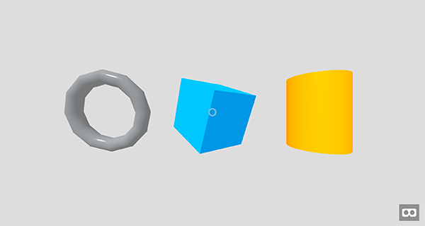

{{GamesSidebar}}

For rich gaming experiences on the web, the weapon of choice is WebGL, which is rendered on HTML {{htmlelement("canvas")}}. WebGL is basically an OpenGL ES 2.0 for the Web — it's a JavaScript API providing tools to build rich interactive animations and of course, also games. You can generate and render dynamic 3D graphics with JavaScript that is hardware accelerated.

## Documentation and browser support

The [WebGL](/en-US/docs/Web/API/WebGL_API) project documentation and specification is maintained by the [Khronos Group](https://www.khronos.org/), not the W3C as with most of the web APIs. Support on modern browsers is very good, even on mobile, so you don't have to worry about that too much. The main browsers are all supporting WebGL and all you need to focus on is optimizing the performance on the devices you use.

There's an ongoing effort on releasing WebGL 2.0 (based on OpenGL ES 3.0) in the near future, which will bring many improvements and will help developers build games for the modern web using current, powerful hardware.

## Explaining the basic 3D theory

The basics of 3D theory centers around shapes represented in a 3D space, with a coordinate system being used to calculate their positions. See our [Explaining basic 3D theory](/en-US/docs/Games/Techniques/3D_on_the_web/Basic_theory) article for all the information you need.

## Advanced concepts

You can do a lot more with WebGL. There are some advanced concepts which you should dive into and learn more about — like shaders, collision detection, or the latest hot topic: virtual reality on the web.

### Shaders

It's worth mentioning shaders, which are a separate story on their own. Shaders use GLSL, a special OpenGL shading language, with syntax similar to C, that is executed directly by the graphics pipeline. They can be split into vertex shaders and fragment shaders (or pixel shaders) — the former transforms shape positions to real 3D drawing coordinates, while the latter computes rendering colors and other attributes. You should definitely check out [GLSL Shaders](/en-US/docs/Games/Techniques/3D_on_the_web/GLSL_Shaders) article to learn more about them.

### Collision detection

It's hard to imagine a game without collision detection — we always need to work out when something is hitting something else. We have information available for you to learn from:

- [2D collision detection](/en-US/docs/Games/Techniques/2D_collision_detection)
- [3D collision detection](/en-US/docs/Games/Techniques/3D_collision_detection)

### WebVR

The concept of virtual reality is not new, but it's storming onto the web thanks to hardware advancements such as the [Oculus Rift](https://www.oculus.com/rift/), and the (currently experimental) [WebVR API](/en-US/docs/Web/API/WebVR_API) for capturing information from VR hardware and making it available for use in JavaScript applications. For more, read [WebVR — Virtual Reality for the Web](/en-US/docs/Games/Techniques/3D_on_the_web/WebVR).

There's also the [Building up a basic demo with A-Frame](/en-US/docs/Games/Techniques/3D_on_the_web/Building_up_a_basic_demo_with_A-Frame) article showing you how easy it is to build 3D environments for virtual reality using the [A-Frame](https://aframe.io/) framework.

## The rise of libraries and frameworks

Coding raw WebGL is fairly complex, but you'll want to get to grips with it in the long run, as your projects get more advanced (see our [WebGL documentation](/en-US/docs/Web/API/WebGL_API) to get started.) For real-world projects you'll probably also make use of a framework to speed up development and help you manage the project you're working on. Using a framework for 3D games also helps optimize the performance as a lot is taken care of by the tools you use, so you can focus on building the game itself.

The most popular JavaScript 3D library is [Three.js](https://threejs.org/), a multipurpose tool that makes common 3D techniques simpler to implement. There are other popular game development libraries and frameworks worth checking too; [A-Frame](https://aframe.io), [PlayCanvas](https://playcanvas.com/) and [Babylon.js](https://www.babylonjs.com/) are among the most recognizable ones with rich documentation, online editors and active communities.

### Building up a basic demo with A-Frame

A-Frame is a web framework for building 3D and VR experiences. Under the hood, it is a Three.js framework with a declarative entity-component pattern, meaning we can build scenes with just HTML. See the [Building up a basic demo with A-Frame](/en-US/docs/Games/Techniques/3D_on_the_web/Building_up_a_basic_demo_with_A-Frame) subpage for the step-by-step process of creating the demo.

### Building up a basic demo with Babylon.js

Babylon.js is one of the most popular 3D game engines used by developers. As with any other 3D library, it provides built-in functions to help you implement common 3D functionality more quickly. See the [Building up a basic demo with Babylon.js](/en-US/docs/Games/Techniques/3D_on_the_web/Building_up_a_basic_demo_with_Babylon.js) subpage for the basics of using Babylon.js, including setting up a development environment, structuring the necessary HTML, and writing the JavaScript code.

### Building up a basic demo with PlayCanvas

PlayCanvas is a popular 3D WebGL game engine open-sourced on GitHub, with an editor available online and good documentation. See the [Building up a basic demo with PlayCanvas](/en-US/docs/Games/Techniques/3D_on_the_web/Building_up_a_basic_demo_with_PlayCanvas) subpage for higher-level details, and further articles showing how to create demos using the PlayCanvas library, and the online editor.

### Building up a basic demo with Three.js

Three.js, like any other library, gives you a huge advantage: instead of writing hundreds of lines of WebGL code to build anything interesting you can use built-in helper functions to do it a lot easier and faster. See the [Building up a basic demo with Three.js](/en-US/docs/Games/Techniques/3D_on_the_web/Building_up_a_basic_demo_with_Three.js) subpage for the step-by-step process of creating the demo.

### Other tools

Both [Unity](https://unity.com/) and [Unreal](https://www.unrealengine.com/) can export your game to [WebGL](/en-US/docs/Web/API/WebGL_API) with [asm.js](/en-US/docs/Games/Tools/asm.js), so you're free to use their tools and techniques to build games that will be exported to the web.

## Where to go next

With this article we just scratched the surface of what's possible with currently available technologies. You can build immersive, beautiful and fast 3D games on the Web using WebGL, and the libraries and frameworks build on top of it.

### Source code

You can find all the source code for this series [demos on GitHub](https://end3r.github.io/MDN-Games-3D/).

### APIs

- [Canvas API](/en-US/docs/Web/API/Canvas_API)
- [WebGL API](/en-US/docs/Web/API/WebGL_API)
- [WebVR API](/en-US/docs/Web/API/WebVR_API)

### Frameworks

- [Three.js](https://threejs.org/)
- [PlayCanvas](https://playcanvas.com/)
- [Babylon.js](https://www.babylonjs.com/)
- [A-Frame](https://aframe.io/)

### Tutorials

- [Building up a basic demo with Three.js](/en-US/docs/Games/Techniques/3D_on_the_web/Building_up_a_basic_demo_with_Three.js)
- [Building up a basic demo with PlayCanvas](/en-US/docs/Games/Techniques/3D_on_the_web/Building_up_a_basic_demo_with_PlayCanvas)
- [Building up a basic demo with Babylon.js](/en-US/docs/Games/Techniques/3D_on_the_web/Building_up_a_basic_demo_with_Babylon.js)
- [Building up a basic demo with A-Frame](/en-US/docs/Games/Techniques/3D_on_the_web/Building_up_a_basic_demo_with_A-Frame)
