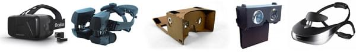

{{GamesSidebar}}

The concept of virtual reality in itself isn't new, but now we have the technology to have it working as it should be, and a JavaScript API to make use of it in web applications. This article introduced WebVR from the perspective of its use in games.

> **Note:** WebVR API is replaced by [WebXR Device API](/en-US/docs/Web/API/WebXR_Device_API). WebVR was never ratified as a standard, was implemented and enabled by default in very few browsers and supported a small number of devices.

## VR devices

With the popularity of Oculus Rift and a lot of other devices in production coming soon to the market, the future looks bright — we already have sufficient technology to make the VR experience "good enough" for playing games. There are many devices to chose from: desktop ones like Oculus Rift or HTC Vive, through consoles with Playstation VR (which admittedly doesn't support WebVR at this time), to mobile experiences like Gear VR or Google Cardboard.



> **Note:** For more information, read our [WebVR Concepts](/en-US/docs/Web/API/WebVR_API/Concepts) article.

## The WebVR API

The [WebVR API](/en-US/docs/Web/API/WebVR_API) is the central API for capturing information on VR Devices connected to a computer and headset position/orientation/velocity/acceleration information, and converting that into useful data you can use in your games and other applications.

> **Note:** There are of course other APIs useful for creating games, for example [The Gamepad API](/en-US/docs/Web/API/Gamepad_API) for control inputs, and the [Device Orientation API](/en-US/docs/Web/Events/Detecting_device_orientation) for handling display orientation on mobile.

### Browser support and spec status

Currently browser support for the WebVR API is still experimental — it works in [nightly builds of Firefox](https://www.mozilla.org/en-US/firefox/channel/desktop/) and [experimental builds of Chrome](https://drive.google.com/folderview?id=0BzudLt22BqGRbW9WTHMtOWMzNjQ&usp=sharing#list) (Mozilla and Google teamed up to work on the implementation together), but sooner rather than later we'll see it in regular builds.

The [WebVR spec](https://mozvr.github.io/webvr-spec/webvr.html) is in Editor's Draft status which means it is still subject to change. The development is led by [Vladimir Vukicevic](https://twitter.com/vvuk) from Mozilla and [Brandon Jones](https://twitter.com/tojiro) from Google. For more info be sure to visit the <https://mixedreality.mozilla.org/> and [WebVR.info](https://webvr.info/) websites.

### Using the WebVR API

The WebVR API is based on two concepts — sending [stereoscopic images](/en-US/docs/Web/API/WebVR_API/Concepts#stereoscopic_vision) to both lenses in your headset and receiving positional data for your head from the sensor, and those two are handled by {{domxref("HMDVRDevice")}} (head-mounted display virtual reality device) and {{domxref("PositionSensorVRDevice")}}.

### Get the devices

To get information about devices connected to your computer, you can use the {{domxref("Navigator/getVRDisplays")}} method:

```js
navigator.getVRDevices().then((devices) => {
  for (let i = 0; i < devices.length; ++i) {
    if (devices[i] instanceof HMDVRDevice) {
      gHMD = devices[i];
      break;
    }
  }
  if (gHMD) {
    for (let i = 0; i < devices.length; ++i) {
      if (
        devices[i] instanceof PositionSensorVRDevice &&
        devices[i].hardwareUnitId === gHMD.hardwareUnitId
      ) {
        gPositionSensor = devices[i];
        break;
      }
    }
  }
});
```

This code will loop through the available devices and assign proper sensors to the headsets — the first `devices` array contains the connected devices, and a check is done to find the {{domxref("HMDVRDevice")}}, and assign it to the `gHMD` variable — using this you can set up the scene, getting the eye parameters, setting the field of view, etc. For example:

```js
function setCustomFOV(up, right, down, left) {
  const testFOV = new VRFieldOfView(up, right, down, left);

  gHMD.setFieldOfView(testFOV, testFOV, 0.01, 10000.0);
}
```

The `gPositionSensor` variable holds the {{domxref("PositionSensorVRDevice")}} — using this you can get the current position or orientation state (for example to update the scene view on every frame), or reset the sensor. For example, the below code outputs position information on the screen:

```js
function setView() {
  const posState = gPositionSensor.getState();

  if (posState.hasPosition) {
    const format = (axis) => `${axis}${roundToTwo(posState.position[axis])}`;
    posPara.textContent = `Position: ${axis("x")} ${axis("y")} ${axis("x")}`;
    xPos = -posState.position.x * WIDTH * 2;
    yPos = posState.position.y * HEIGHT * 2;
    zPos = -posState.position.z > 0.01 ? -posState.position.z : 0.01;
  }

  // …
}
```

For a full explanation and more details of the demo this is taken from, see [Using the WebVR API](/en-US/docs/Web/API/WebVR_API/Using_the_WebVR_API).

## Tools and techniques

The first WebVR experiments and demos used Three.js as it's probably the most popular 3D engine for the web. See the [VREffect](https://github.com/mrdoob/three.js/blob/ca521eb4af7554e760f14d8fe8b451c8ff34deb8/examples/js/effects/VREffect.js) and [VRControls](https://github.com/mrdoob/three.js/blob/abdd1713c606135bc35028c6021698b52f27872b/examples/js/controls/VRControls.js) functions available on the Three.js GitHub to help you implement and handle WebVR with Three.js.


Boris Smus has written about the concept of [Responsive WebVR](https://smus.com/responsive-vr/), where a single web game can be played on various devices like laptops without VR hardware, PCs with Oculus Rift, or smartphones inside Google Cardboard and still deliver a unique and valuable experience across all of them. It's like responsive design but applied to the VR world — write once and run in any VR headset, or without it. You can check the [WebVR Boilerplate](https://github.com/borismus/webvr-boilerplate) sources — it's a good example to start learning WebVR from, and a starting point for any web-based VR experience.

There's also a markup framework called [A-Frame](https://aframe.io/) that offers simple building blocks for WebVR, so you can rapidly build and experiment with VR websites and games: read the [Building up a basic demo with A-Frame](/en-US/docs/Games/Techniques/3D_on_the_web/Building_up_a_basic_demo_with_A-Frame) tutorial for more details.

Immersion is more important than gameplay or graphics - you have to feel you're "inside" the experience. It's not easy to achieve, but it doesn't require realistic images. Quite the contrary as having a basic shapes flying around in high frame rate can make a lot. Remember: experimenting is key - see what works for your game in particular.

## The future of WebVR

It's happening — consumer devices are reaching the market right now, and we already have JavaScript APIs to support them on the Web. All we need now is a stable specification, good UX and UI, better hardware and more tools and libraries — and all of that is on the horizon. It's the perfect time to dive in and experiment with WebVR.

## See also

- [WebVR API](/en-US/docs/Web/API/WebVR_API)
- [WebVR concepts](/en-US/docs/Web/API/WebVR_API/Concepts)
- [Using the WebVR API](/en-US/docs/Web/API/WebVR_API/Using_the_WebVR_API)
- [Building up a basic demo with A-Frame](/en-US/docs/Games/Techniques/3D_on_the_web/Building_up_a_basic_demo_with_A-Frame)
