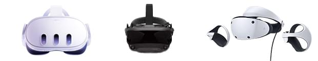

{{GamesSidebar}}

The concepts of virtual reality (VR) and augmented reality (AR) aren't new, but the technology is more accessible than ever. We can also use a JavaScript API to make use of it in web applications. This article introduces WebXR from the perspective of its use in games.

> **Note:** You may see references to the older WebVR (with a V) API across the Internet. WebVR was replaced by [WebXR Device API](/en-US/docs/Web/API/WebXR_Device_API). WebVR was never ratified as a standard, was implemented and enabled by default in very few browsers, and supported only a small number of devices.

## VR devices

With the popularity of existing VR headsets such as Meta Quest, Valve Index, and PlayStation VR, the future looks bright — we already have sufficient technology to create meaningful VR gaming experiences.

### History of the WebVR spec

The [WebVR spec](https://mozvr.github.io/webvr-spec/webvr.html), led by [Vladimir Vukicevic](https://twitter.com/vvuk) from Mozilla and [Brandon Jones](https://twitter.com/tojiro) from Google, is being replaced by the [WebXR Device API](/en-US/docs/Web/API/WebXR_Device_API). WebVR may still be available in some browsers while WebXR is finalized.
For more info, see the <https://mixedreality.mozilla.org/> and [WebVR.info](https://webvr.info/) websites.

## The WebXR API

The core of any WebXR experience is built on top of two foundational concepts:

1. The application must receive real-time data about your headset's position and your controllers' positions in three-dimensional space
2. The application must render a real-time, stereoscopic view to the headset's display(s) according to that positional data

The [WebXR API](/en-US/docs/Web/API/WebXR_Device_API) is the central API for capturing information about XR devices connected to a computer. The API can capture headset and controller position, orientation, velocity, acceleration, and other information that you can use in your games.

There are other APIs useful for creating games such as [the Gamepad API](/en-US/docs/Web/API/Gamepad_API) for non-XR controller inputs and the [Device Orientation API](/en-US/docs/Web/API/Device_orientation_events/Detecting_device_orientation) for handling display orientation.

### Using the WebXR API

The best place to start with the WebXR API is with our [Fundamentals of WebXR](/en-US/docs/Web/API/WebXR_Device_API/Fundamentals) guide. After that, see [Starting up and shutting down a WebXR session](/en-US/docs/Web/API/WebXR_Device_API/Startup_and_shutdown).

## Tools and techniques

The first WebVR experiments and demos used Three.js as it's probably the most popular 3D engine for the web. Its popularity continues today, and it can be used for WebXR games. Check out Three.js' [How to create VR content](https://threejs.org/docs/#manual/en/introduction/How-to-create-VR-content) documentation to help you make WebXR games with Three.js.

There's also a markup framework called [A-Frame](https://aframe.io/) that offers simple building blocks for WebXR, so you can rapidly build and experiment with VR websites and games: read the [Building up a basic demo with A-Frame](/en-US/docs/Games/Techniques/3D_on_the_web/Building_up_a_basic_demo_with_A-Frame) tutorial for more details.

Immersion is more important than gameplay or graphics - you have to feel you're "inside" the experience. It's not easy to achieve, but it doesn't require realistic images. Quite the contrary, as having a basic shapes flying around with a high frame rate can make for a compelling experience. Remember: experimenting is key - see what works for your game in particular.

## The future of WebXR

It's happening — consumer devices are on the market right now, and we already have JavaScript APIs to support them on the web. All we need now is a widely-adopted, stable specification, good UX and UI, better hardware, and more tools and libraries — and all of that is on the horizon. It's the perfect time to dive in and experiment with WebXR.

## See also

- [WebVR Device API](/en-US/docs/Web/API/WebXR_Device_API)
- [Fundamentals of WebXR](/en-US/docs/Web/API/WebXR_Device_API/Fundamentals)
- [Building up a basic demo with A-Frame](/en-US/docs/Games/Techniques/3D_on_the_web/Building_up_a_basic_demo_with_A-Frame)
