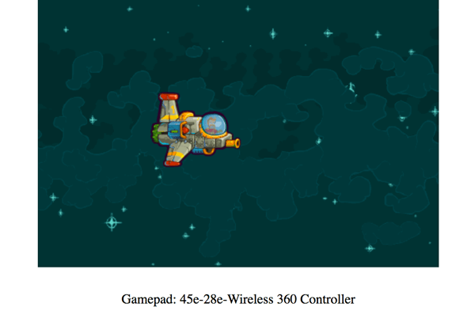
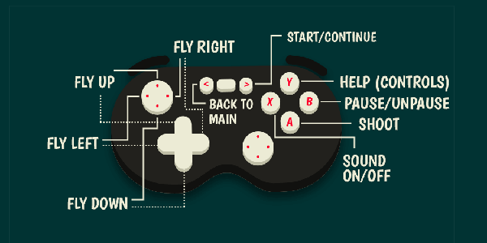

{{GamesSidebar}}

{{PreviousMenuNext("Games/Techniques/Control_mechanisms/Desktop_with_mouse_and_keyboard", "Games/Techniques/Control_mechanisms/Other", "Games/Techniques/Control_mechanisms")}}

Now we'll look at adding something extra — support for gamepad controls, via the Gamepad API. It brings a console-like experience to your web games.

The Gamepad API gives you the ability to connect a gamepad to your computer and detect pressed buttons directly from the JavaScript code thanks to the browsers implementing such feature. An API exposes all the information you need to hook up your game's logic and successfully control the user interface and gameplay.

## API status, browser and hardware support

The [Gamepad API](/en-US/docs/Web/API/Gamepad_API) is still in Working Draft status, although browser support is already quite good — around 63% global coverage, according to [caniuse.com](https://caniuse.com/#search=gamepad). The list of supported devices is also quite extensive — most popular gamepads (e.g. XBox 360 or PS3) should be suitable for web implementations.

## Pure JavaScript approach

Let's think about implementing pure JavaScript gamepad controls in our [little controls demo](https://github.com/end3r/JavaScript-Game-Controls/) first to see how it would work. First, we need an event listener to listen for the connection of the new device:

```js
window.addEventListener("gamepadconnected", gamepadHandler);
```

It's executed once, so we can create some variables we will need later on for storing the controller info and the pressed buttons:

```js
let controller = {};
let buttonsPressed = [];
function gamepadHandler(e) {
  controller = e.gamepad;
  output.textContent = `Gamepad: ${controller.id}`;
}
```

The second line in the `gamepadHandler` function shows up on the screen when the device is connected:



We can also show the `id` of the device — in the case above we're using the XBox 360 wireless controller.

To update the state of the gamepad's currently pressed buttons we will need a function that will do exactly that on every frame:

```js
function gamepadUpdateHandler() {
  buttonsPressed = [];
  if (controller.buttons) {
    for (let b = 0; b < controller.buttons.length; b++) {
      if (controller.buttons[b].pressed) {
        buttonsPressed.push(b);
      }
    }
  }
}
```

We first reset the `buttonsPressed` array to get it ready to store the latest info we'll write to it from the current frame. Then, if the buttons are available we loop through them; if the `pressed` property is set to `true`, then we add them to the `buttonsPressed` array for later processing. Next, we'll consider the `gamepadButtonPressedHandler()` function:

```js
function gamepadButtonPressedHandler(button) {
  let press = false;
  for (let i = 0; i < buttonsPressed.length; i++) {
    if (buttonsPressed[i] === button) {
      press = true;
    }
  }
  return press;
}
```

The function takes a button as a parameter; in the loop it checks if the given button's number is among the currently pressed buttons available in the `buttonsPressed` array. If it is, then the function returns `true`; `false` otherwise.

Next, in the `draw()` function we do two things — execute the `gamepadUpdateHandler()` function to get the current state of pressed buttons on every frame, and use the `gamepadButtonPressedHandler()` function to check the buttons we are interested to see whether they are pressed, and do something if they are:

```js
function draw() {
  ctx.clearRect(0, 0, canvas.width, canvas.height);

  // …

  gamepadUpdateHandler();
  if (gamepadButtonPressedHandler(0)) {
    playerY -= 5;
  } else if (gamepadButtonPressedHandler(1)) {
    playerY += 5;
  }
  if (gamepadButtonPressedHandler(2)) {
    playerX -= 5;
  } else if (gamepadButtonPressedHandler(3)) {
    playerX += 5;
  }
  if (gamepadButtonPressedHandler(11)) {
    alert("BOOM!");
  }

  // …

  ctx.drawImage(img, playerX, playerY);
  requestAnimationFrame(draw);
}
```

In this case, we are checking the four D-Pad buttons (0-3) and the A button (11).

> [!NOTE]
> Please remember that different devices may have different key mappings, i.e. the D-Pad Right button have an index of 3 on the wireless XBox 360, but may have a different one on another device.

You could also create a helper function that would assign proper names to the listed buttons, so for example instead of checking out if `gamepadButtonPressedHandler(3)` is pressed, you could do a more descriptive check: `gamepadButtonPressedHandler('DPad-Right')`.

You can see a [live demo](https://end3r.github.io/JavaScript-Game-Controls/) in action — try connecting your gamepad and pressing the buttons.

## Phaser approach

Let's move on to the final Gamepad API implementation in the [Captain Rogers: Battle at Andromeda](https://rogers2.enclavegames.com/demo/) game we created with Phaser. This is pure JavaScript code however too, so can be used in any other project no matter what framework was used.

First off, we'll create a small library that will take care of handling the input for us. Here's the `GamepadAPI` object, which contains useful variables and functions:

```js
const GamepadAPI = {
  active: false,
  controller: {},
  connect(event) {},
  disconnect(event) {},
  update() {},
  buttons: {
    layout: [],
    cache: [],
    status: [],
    pressed(button, state) {},
  },
  axes: {
    status: [],
  },
};
```

The `controller` variable stores the information about the connected gamepad, and there's an `active` boolean variable we can use to know if the controller is connected or not. The `connect()` and `disconnect()` functions are bound to the following events:

```js
window.addEventListener("gamepadconnected", GamepadAPI.connect);
window.addEventListener("gamepaddisconnected", GamepadAPI.disconnect);
```

They are fired when the gamepad is connected and disconnected respectively. The next function is `update()`, which updates the information about the pressed buttons and axes.

The `buttons` variable contains the `layout` of a given controller (for example which buttons are where, because an XBox 360 layout may be different to a generic one), the `cache` containing the information about the buttons from the previous frame and the `status` containing the information from the current frame.

The `pressed()` function gets the input data and sets the information about it in our object, and the `axes` property stores the array containing the values signifying the amount an axis is pressed in the `x` and `y` directions, represented by a float in the `(-1, 1)` range.

After the gamepad is connected, the information about the controller is stored in the object:

```js
connect(event) {
    GamepadAPI.controller = event.gamepad;
    GamepadAPI.active = true;
},
```

The `disconnect` function removes the information from the object:

```js
disconnect(event) {
    delete GamepadAPI.controller;
    GamepadAPI.active = false;
},
```

The `update()` function is executed in the update loop of the game on every frame, so it contains the latest information on the pressed buttons:

```js
update() {
  GamepadAPI.buttons.cache = [];
  for (let k = 0; k < GamepadAPI.buttons.status.length; k++) {
    GamepadAPI.buttons.cache[k] = GamepadAPI.buttons.status[k];
  }
  GamepadAPI.buttons.status = [];
  const c = GamepadAPI.controller || {};
  const pressed = [];
  if (c.buttons) {
    for (let b = 0; b < c.buttons.length; b++) {
      if (c.buttons[b].pressed) {
        pressed.push(GamepadAPI.buttons.layout[b]);
      }
    }
  }
  const axes = [];
  if (c.axes) {
    for (let a = 0; a < c.axes.length; a++) {
      axes.push(c.axes[a].toFixed(2));
    }
  }
  GamepadAPI.axes.status = axes;
  GamepadAPI.buttons.status = pressed;
  return pressed;
},
```

The function above clears the buttons cache, and copies their status from the previous frame to the cache. Next, the button status is cleared and the new information is added. The same goes for the axes' information — looping through axes adds the values to the array. Received values are assigned to the proper objects and returns the pressed info for debugging purposes.

The `button.pressed()` function detects the actual button presses:

```js
pressed(button, hold) {
  let newPress = false;
  for (let i = 0; i < GamepadAPI.buttons.status.length; i++) {
    if (GamepadAPI.buttons.status[i] === button) {
      newPress = true;
      if (!hold) {
        for (let j = 0; j < GamepadAPI.buttons.cache.length; j++) {
          if (GamepadAPI.buttons.cache[j] === button) {
            newPress = false;
          }
        }
      }
    }
  }
  return newPress;
},
```

It loops through pressed buttons and if the button we're looking for is pressed, then the corresponding boolean variable is set to `true`. If we want to check the button is not held already (so it's a new press), then looping through the cached states from the previous frame does the job — if the button was already pressed, then we ignore the new press and set it to `false`.

## Implementation

We now know what the `GamepadAPI` object looks like and what variables and functions it contains, so let's learn how all this is actually used in the game. To indicate that the gamepad controller is active we can show the user some custom text on the game's main menu screen.

The `textGamepad` object holds the text saying a gamepad has been connected, and is hidden by default. Here's the code we've prepared in the `create()` function that is executed once when the new state is created:

```js
create() {
  // …
  const message = 'Gamepad connected! Press Y for controls';
  const textGamepad = this.add.text(0, 0, message);
  textGamepad.visible = false;
}
```

In the `update()` function, which is executed every frame, we can wait until the controller is actually connected, so the proper text can be shown. Then we can keep the track of the information about pressed buttons by using the `Gamepad.update()` method, and react to the given information:

```js
update() {
  // …
  if (GamepadAPI.active) {
    this.textGamepad.visible = true;

    GamepadAPI.update();
    if (GamepadAPI.buttons.pressed('Start')) {
      // start the game
    }
    if (GamepadAPI.buttons.pressed('X')) {
      // turn on/off the sounds
    }

    this.screenGamepadHelp.visible = GamepadAPI.buttons.pressed('Y', 'hold');
  }
}
```

When pressing the `Start` button the relevant function will be called to begin the game, and the same approach is used for turning the audio on and off. There's an option wired up to show `screenGamepadHelp`, which holds an image with all the button controls explained — if the `Y` button is pressed and held, the help becomes visible; when it is released the help disappears.



## On-screen instructions

When the game is started, some introductory text is shown that shows you available controls — we are already detecting if the game is launched on desktop or mobile then showing a relevant message for the device, but we can go even further, to allow for the presence of a gamepad:

```js
create() {
  // …
  if (this.game.device.desktop) {
    if (GamepadAPI.active) {
      moveText = 'DPad or left Stick\nto move';
      shootText = 'A to shoot,\nY for controls';
    } else {
      moveText = 'Arrow keys\nor WASD to move';
      shootText = 'X or Space\nto shoot';
    }
  } else {
    moveText = 'Tap and hold to move';
    shootText = 'Tap to shoot';
  }
}
```

When on desktop, we can check if the controller is active and show the gamepad controls — if not, then the keyboard controls will be shown.

## Gameplay controls

We can offer even more flexibility to the player by giving him main and alternative gamepad movement controls:

```js
if (GamepadAPI.buttons.pressed("DPad-Up", "hold")) {
  // move player up
} else if (GamepadAPI.buttons.pressed("DPad-Down", "hold")) {
  // move player down
}

if (GamepadAPI.buttons.pressed("DPad-Left", "hold")) {
  // move player left
}

if (GamepadAPI.buttons.pressed("DPad-Right", "hold")) {
  // move player right
}

if (GamepadAPI.axes.status) {
  if (GamepadAPI.axes.status[0] > 0.5) {
    // move player up
  } else if (GamepadAPI.axes.status[0] < -0.5) {
    // move player down
  }

  if (GamepadAPI.axes.status[1] > 0.5) {
    // move player left
  } else if (GamepadAPI.axes.status[1] < -0.5) {
    // move player right
  }
}
```

They can now move the ship on the screen by using the `DPad` buttons, or the left stick axes.

Have you noticed that the current value of the axes is evaluated against `0.5`? It's because axes are having floating point values while buttons are booleans. After a certain threshold is reached we can assume the input is done deliberately by the user and can act accordingly.

For the shooting controls, we used the `A` button — when it is held down, a new bullet is spawned, and everything else is handled by the game:

```js
if (GamepadAPI.buttons.pressed("A", "hold")) {
  this.spawnBullet();
}
```

Showing the screen with all the controls looks exactly the same as in the main menu:

```js
this.screenGamepadHelp.visible = GamepadAPI.buttons.pressed("Y", "hold");
```

If the `B` button is pressed, the game is paused:

```js
if (gamepadAPI.buttonPressed("B")) {
  this.managePause();
}
```

## The paused and game-over states

We already learned how to control the whole lifecycle of the game: pausing the gameplay, restarting it, or getting back to the main menu. It works smooth on mobile and desktop, and adding gamepad controls is just as straightforward — in the `update()` function, we check to see if the current state status is "paused" — if so, the relevant actions are enabled:

```js
if (GamepadAPI.buttons.pressed("Start")) {
  this.managePause();
}

if (GamepadAPI.buttons.pressed("Back")) {
  this.stateBack();
}
```

Similarly, when the "game-over" state status is active, then we can allow the user to restart the game instead of continuing it:

```js
if (GamepadAPI.buttons.pressed("Start")) {
  this.stateRestart();
}
if (GamepadAPI.buttons.pressed("Back")) {
  this.stateBack();
}
```

When the game over screen is visible, the `Start` button restarts the game while the `Back` button helps us get back to the main menu. The same goes for when the game is paused: the `Start` button unpauses the game and the `Back` button goes back, just like before.

## Summary

That's it! We have successfully implemented gamepad controls in our game — try connecting any popular controller like the XBox 360 one and see for yourself how fun it is to avoid the asteroids and shoot the aliens with a gamepad.

Now we can move on and explore new, even more unconventional ways to control the HTML game like waving your hand in front of the laptop or screaming into your microphone.

{{PreviousMenuNext("Games/Techniques/Control_mechanisms/Desktop_with_mouse_and_keyboard", "Games/Techniques/Control_mechanisms/Other", "Games/Techniques/Control_mechanisms")}}
