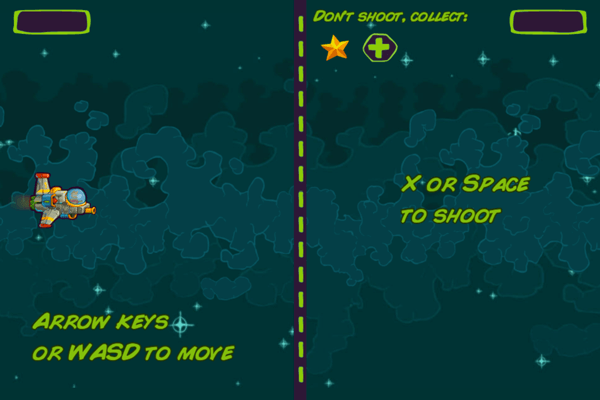

{{GamesSidebar}}

{{PreviousMenuNext("Games/Techniques/Control_mechanisms/Mobile_touch", "Games/Techniques/Control_mechanisms/Desktop_with_gamepad", "Games/Techniques/Control_mechanisms")}}

Now, when we have our mobile controls in place and the game is playable on touch-enabled devices, it would be good to add mouse and keyboard support so the game can be playable on desktop also. That way we can broaden the list of supported platforms. We'll look at this below.

It's also easier to test control-independent features like gameplay on desktop if you develop it there, so you don't have to push the files to a mobile device every time you make a change in the source code.

> **Note:** the [Captain Rogers: Battle at Andromeda](https://rogers2.enclavegames.com/demo/) is built with Phaser and managing the controls is Phaser-based, but it could also be done in pure JavaScript. The good thing about using Phaser is that it offers helper variables and functions for easier and faster development, but it's totally up to you which approach you chose.

## Pure JavaScript approach

Let's think about implementing pure JavaScript keyboard/mouse controls in the game first, to see how it would work. First, we'd need an event listener to listen for the pressed keys:

```js
document.addEventListener("keydown", keyDownHandler, false);
document.addEventListener("keyup", keyUpHandler, false);
```

Whenever any key is pressed down, we're executing the `keyDownHandler` function, and when press finishes we're executing the `keyUpHandler` function, so we know when it's no longer pressed. To do that, we'll hold the information on whether the keys we are interested in are pressed or not:

```js
let rightPressed = false;
let leftPressed = false;
let upPressed = false;
let downPressed = false;
```

Then we will listen for the `keydown` and `keyup` events and act accordingly in both handler functions. Inside them we can get the code of the key that was pressed from the [keyCode](/en-US/docs/Web/API/KeyboardEvent/keyCode) property of the event object, see which key it is, and then set the proper variable. There are no helpers so you have to remember what the given codes are (or [look them up](/en-US/docs/Web/API/KeyboardEvent/keyCode#value_of_keycode)); `37` is the left arrow:

```js
function keyDownHandler(event) {
  if (event.keyCode === 39) {
    rightPressed = true;
  } else if (event.keyCode === 37) {
    leftPressed = true;
  }
  if (event.keyCode === 40) {
    downPressed = true;
  } else if (event.keyCode === 38) {
    upPressed = true;
  }
}
```

The `keyUpHandler` looks almost exactly the same as the `keyDownHandler` above, but instead of setting the pressed variables to `true`, we would set them to `false`. If the left arrow is pressed (<kbd>⬅︎</kbd>; key code 37), we can set the `leftPressed` variable to `true` and in the `draw` function perform the action assigned to it — move the ship left:

```js
function draw() {
  ctx.clearRect(0, 0, canvas.width, canvas.height);
  if (rightPressed) {
    playerX += 5;
  } else if (leftPressed) {
    playerX -= 5;
  }

  if (downPressed) {
    playerY += 5;
  } else if (upPressed) {
    playerY -= 5;
  }

  ctx.drawImage(img, playerX, playerY);
  requestAnimationFrame(draw);
}
```

The `draw` function first clears the whole Canvas — we draw everything from scratch on every single frame. Then the pressed key variables are checked and the `playerX` and `playerY` variables (that we define earlier just after `leftPressed` and the others) holding the position of the ship are adjusted by a given amount, let's say 5 pixels. Then the player's ship is drawn on the screen and the next draw is called from within the [requestAnimationFrame](/en-US/docs/Web/API/window/requestAnimationFrame).

We could write our own `KeyCode` object containing the key codes. For example:

```js
const KeyboardHelper = { left: 37, up: 38, right: 39, down: 40 };
```

That way instead of using the codes to compare the input in the handler functions, we could do something like this, which is arguably easier to remember:

```js
leftPressed = event.keyCode === KeyboardHelper.left;
```

> **Note:** You can also find a list of the different keycodes and what keys they relate to in the [keyCode](/en-US/docs/Web/API/KeyboardEvent/keyCode) reference page.


You can see this example in action online at [end3r.github.io/JavaScript-Game-Controls](https://end3r.github.io/JavaScript-Game-Controls/) and the full source code can be found at [github.com/end3r/JavaScript-Game-Controls](https://github.com/end3r/JavaScript-Game-Controls/).

## Phaser approach

As I mentioned before, you can write everything on your own, but you can also take advantage of built-in functions in frameworks like Phaser. These will make your life easier and development a lot faster. All the edge cases--differences between browser implementations, etc.--are handled by the framework, so you can focus on the actual task you want to do.

### Mouse

The mouse interactions in the game are focused on clicking the buttons. In Phaser, the buttons you create will take any type of input, whether it's a touch on mobile or a click on desktop. That way, if you already implemented the buttons as shown in the [Mobile touch controls](/en-US/docs/Games/Techniques/Control_mechanisms/Mobile_touch) article, it will work out of the box on the desktop too:

```js
const buttonEnclave = this.add.button(
  10,
  10,
  "logo-enclave",
  this.clickEnclave,
  this,
);
```

The button will be placed ten pixels from the top left corner of the screen, use the `logo-enclave` image, and will execute the `clickEnclave()` function when clicked. We can assign actions directly to the buttons:

```js
this.buttonShoot = this.add.button(
  this.world.width * 0.5,
  0,
  "button-alpha",
  null,
  this,
);
this.buttonShoot.onInputDown.add(this.shootingPressed, this);
this.buttonShoot.onInputUp.add(this.shootingReleased, this);
```

The button used for shooting works perfectly fine on both the mobile and desktop approach.

If you want to use the mouse's cursor position on the screen, you can do so with `this.game.input.mousePointer`. Let's assume you'd like to shoot a bullet when the right half of the screen is clicked with a mouse, it would be done something like this:

```js
if (this.game.input.mousePointer.isDown) {
  if (this.game.input.mousePointer.x > this.world.width * 0.5) {
    // shoot
  }
}
```

If you'd like to differentiate the mouse buttons being pressed, there are three defaults you can pick from:

```js
this.game.input.mousePointer.leftButton.isDown;
this.game.input.mousePointer.middleButton.isDown;
this.game.input.mousePointer.rightButton.isDown;
```

Keep in mind that instead of `mousePointer`, it's better to use `activePointer` for platform-independent input, if you want to keep the support for mobile touch interactions.

### Keyboard

The whole game can be controlled with just the keyboard and nothing else. The built-in `this.game.input.keyboard` object manages the input from the keyboard, and has [a few helpful methods](https://phaser.io/docs/2.6.1/Phaser.Keyboard.html#methods) like `addKey()` and `isDown()`. There's also the [Phaser.KeyCode](https://phaser.io/docs/2.6.1/Phaser.KeyCode.html#members) object, which contains all the available keyboard keys:


In the main menu of the game, we can add an extra way to begin playing. The Start button can be clicked to do so, but we can use the <kbd>Enter</kbd> key to do the same:

```js
const keyEnter = this.game.input.keyboard.addKey(Phaser.KeyCode.ENTER);
keyEnter.onDown.add(this.clickStart, this);
```

You can use `addKey()` to add any key the `Phaser.KeyCode` object has to offer. The `onDown()` function is executed whenever the <kbd>Enter</kbd> key is pressed. It will launch the `clickStart()` method, which starts a new game.

It's useful to provide an option to play the game on desktop without using a mouse, so you don't have to take your hands off the keyboard.

### Controlling the game

We can support keyboard input in games built with Phaser by enabling the basic cursor keys in the `create()` function using the `createCursorKeys()` function:

```js
this.cursors = this.input.keyboard.createCursorKeys();
```

This creates four directional arrow keys for us:

```js
this.cursors.left;
this.cursors.right;
this.cursors.up;
this.cursors.down;
```

You can also define the keys on your own and offer an alternative, <kbd>W</kbd> <kbd>A</kbd> <kbd>S</kbd> <kbd>D</kbd> control mechanism. For example:

```js
this.keyLeft = this.input.keyboard.addKey(Phaser.KeyCode.A);
this.keyRight = this.input.keyboard.addKey(Phaser.KeyCode.D);
this.keyUp = this.input.keyboard.addKey(Phaser.KeyCode.W);
this.keyDown = this.input.keyboard.addKey(Phaser.KeyCode.S);
```

To support both the cursor and <kbd>W</kbd> <kbd>A</kbd> <kbd>S</kbd> <kbd>D</kbd> keys, we need to do this:

```js
if (this.cursors.left.isDown || this.keyLeft.isDown) {
  // move left
} else if (this.cursors.right.isDown || this.keyRight.isDown) {
  // move right
}

if (this.cursors.up.isDown || this.keyUp.isDown) {
  // move up
} else if (this.cursors.down.isDown || this.keyDown.isDown) {
  // move down
}
```

In the `update()` function we can now move the player's ship in any direction using one of the two sets of movement key options.

We can also offer firing control alternatives. For cursor keys the natural shooting button would be on the other side of the keyboard, so the player can use the other hand — for example the <kbd>X</kbd> key. For <kbd>W</kbd> <kbd>A</kbd> <kbd>S</kbd> <kbd>D</kbd> keys it can be the Space bar:

```js
this.keyFire1 = this.input.keyboard.addKey(Phaser.KeyCode.X);
this.keyFire2 = this.input.keyboard.addKey(Phaser.KeyCode.SPACEBAR);
```

In the `update()` function we can easily check if any of those two were pressed on each frame:

```js
if (this.keyFire1.isDown || this.keyFire2.isDown) {
  // fire the weapon
}
```

If yes, then it's time to shoot some bullets!

We can even define a secret cheat button:

```js
this.keyCheat = this.input.keyboard.addKey(Phaser.KeyCode.C);
```

And then in the `update()` function, whenever <kbd>C</kbd> is pressed we'll do this:

```js
if (this.keyCheat.isDown) {
  this.player.health = this.player.maxHealth;
}
```

We can set the health of the player to maximum. Remember: it's a secret, so _don't tell anyone_!

### How to play

We've implemented the controls, and now we should inform the player about their options to control the game. They wouldn't know about them otherwise! When showing the how to play screen where the various ways to control the ship in the game are shown, instead of showing them all to everyone, we can detect whether the game is launched on desktop or mobile and just show the appropriate controls for the device:

```js
if (this.game.device.desktop) {
  moveText = "Arrow keys or WASD to move";
  shootText = "X or Space to shoot";
} else {
  moveText = "Tap and hold to move";
  shootText = "Tap to shoot";
}
```

If the game is running on desktop, the cursor and <kbd>W</kbd> <kbd>A</kbd> <kbd>S</kbd> <kbd>D</kbd> keys message will be shown. If not, then the mobile touch controls message will be.



To skip the how to play screen, we can listen for any key being pressed and move on:

```js
this.input.keyboard.onDownCallback = function () {
  if (this.stateStatus === "intro") {
    this.hideIntro();
  }
};
```

This hides the intro and starts the actual game without us having to set up another new key control just for this.

### Pause and game over screens

To make the game fully playable with the keyboard, it should be possible to go back to the main menu, continue playing, or restart the game from the pause and game over screens. It can be done exactly the same as before, by capturing key codes and performing actions. For example, by specifying `Phaser.KeyCode.Backspace` or `Phaser.KeyCode.Delete` you can hook up an action to fire when the `Delete/Backspace` button is pressed.

## Summary

Ok, we've dealt with touch, keyboard, and mouse controls. Now let's move on to look at how to set up the game to be controlled using a console gamepad, using the [Gamepad API](/en-US/docs/Web/API/Gamepad_API).

{{PreviousMenuNext("Games/Techniques/Control_mechanisms/Mobile_touch", "Games/Techniques/Control_mechanisms/Desktop_with_gamepad", "Games/Techniques/Control_mechanisms")}}
