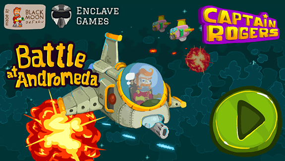
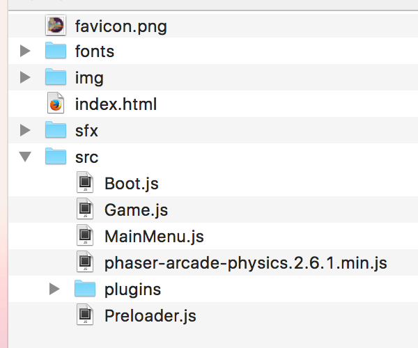

{{GamesSidebar}}

One of HTML5's main advantages as a game development platform is the ability to run on various platforms and devices. Streamlining cross device differences creates multiple challenges, not least when providing appropriate controls for different contexts. In this series of articles we will show you how you can approach building a game that can be played using touchscreen smartphones, mouse and keyboard, and also less common mechanisms such as gamepads.

## Case study

We'll be using the [Captain Rogers: Battle at Andromeda demo](https://rogers2.enclavegames.com/demo/) as an example.



Captain Rogers was created using the [Phaser](https://phaser.io/) framework, the most popular tool for simple 2D game development in JavaScript right now, but it should be fairly easy to reuse the knowledge contained within these articles when building games in pure JavaScript or any other framework. If you're looking for a good introduction to Phaser, then check the [2D breakout game using Phaser](/en-US/docs/Games/Tutorials/2D_breakout_game_Phaser) tutorial.

In the following articles we will show how to implement various different control mechanisms for Captain Rogers to support different platforms — from touch on mobile, through keyboard/mouse/gamepad on desktop, to more unconventional ones like TV remote, shouting to or waving your hand in front of the laptop, or squeezing bananas.

## Setting up the environment

Let's start with a quick overview of the game's folder structure, JavaScript files and in-game states, so we know what's happening where. The game's folders look like this:



As you can see there are folders for images, JavaScript files, fonts and sound effects. The `src` folder contains the JavaScript files split as a separate states — `Boot.js`, `Preloader.js`, `MainMenu.js` and `Game.js` — these are loaded into the index file in this exact order. The first one initializes Phaser, the second preloads all the assets, the third one controls the main menu welcoming the player, and the fourth controls the actual gameplay.

Every state has its own default methods: `preload()`, `create()`, and `update()`. The first one is needed for preloading required assets, `create()` is executed once the state had started, and `update()` is executed on every frame.

For example, you can define a button in the `create()` function:

```js
create() {
  // …
  const buttonEnclave = this.add.button(10, 10, 'logo-enclave', this.clickEnclave, this);
  // …
}
```

It will be created once at the start of the game, and will execute `this.clickEnclave()` action assigned to it when clicked, but you can also use the mouse's pointer value in the `update()` function to make an action:

```js
update() {
  // …
  if (this.game.input.mousePointer.isDown) {
      // do something
  }
  // …
}
```

This will be executed whenever the mouse button is pressed, and it will be checked against the input's `isDown` boolean variable on every frame of the game.

That should give you some understanding of the project structure. We'll be playing mostly with the `MainMenu.js` and `Game.js` files, and we'll explain the code inside the `create()` and `update()` methods in much more detail in later articles.

## Pure JavaScript demo

There's also a [small online demo](https://end3r.github.io/JavaScript-Game-Controls/) with full source code [available on GitHub](https://github.com/end3r/JavaScript-Game-Controls/) where the basic support for the control mechanisms described in the articles is implemented in pure JavaScript. It will be explained in the given articles themselves below, but you can play with it already, and use the code however you want for learning purposes.

## The articles

JavaScript is the perfect choice for mobile gaming because of HTML being truly multiplatform; all of the following articles focus on the APIs provided for interfacing with different control mechanisms:

1. [Mobile touch controls](/en-US/docs/Games/Techniques/Control_mechanisms/Mobile_touch) — The first article will kick off with touch, as the mobile first approach is very popular.
2. [Desktop mouse and keyboard controls](/en-US/docs/Games/Techniques/Control_mechanisms/Desktop_with_mouse_and_keyboard) — When playing on a desktop/laptop computer, providing keyboard and mouse controls is essential to provide an acceptable level of accessibility for the game.
3. [Desktop gamepad controls](/en-US/docs/Games/Techniques/Control_mechanisms/Desktop_with_gamepad) — The Gamepad API rather usefully allows gamepads to be used for controlling web apps on desktop/laptop, for that console feel.
4. [Unconventional controls](/en-US/docs/Games/Techniques/Control_mechanisms/Other) — The final article showcases some unconventional control mechanisms, from the experimental to the slightly crazy, which you might not believe could be used to play the game.
