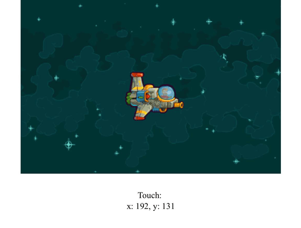

{{GamesSidebar}}

{{NextMenu("Games/Techniques/Control_mechanisms/Desktop_with_mouse_and_keyboard", "Games/Techniques/Control_mechanisms")}}

The future of mobile gaming is definitely web, and many developers choose the [mobile first](/en-US/docs/Web/Apps/Mobile_First) approach in their game development process — in the modern world, this generally also involves implementing touch controls. In this tutorial, we will see how easy it is to implement mobile controls in an HTML game, and enjoy playing on a mobile touch-enabled device.

> **Note:** The game [Captain Rogers: Battle at Andromeda](https://rogers2.enclavegames.com/demo/) is built with Phaser and managing the controls is Phaser-based, but it could also be done in pure JavaScript. The good thing about using Phaser is that it offers helper variables and functions for easier and faster development, but it's entirely up to you which approach you to choose.

## Pure JavaScript approach

We could implement touch events on our own — setting up event listeners and assigning relevant functions to them would be quite straightforward:

```js
const el = document.querySelector("canvas");
el.addEventListener("touchstart", handleStart);
el.addEventListener("touchmove", handleMove);
el.addEventListener("touchend", handleEnd);
el.addEventListener("touchcancel", handleCancel);
```

This way, touching the game's {{htmlelement("canvas")}} on the mobile screen would emit events, and thus we could manipulate the game in any way we want (for example, moving the spaceship around). The events are as follows:

- [touchstart](/en-US/docs/Web/API/Element/touchstart_event) is fired when the user puts a finger on the screen.
- [touchmove](/en-US/docs/Web/API/Element/touchmove_event) is fired when they move the finger on the screen while touching it
- [touchend](/en-US/docs/Web/API/Element/touchend_event) is fired when the user stops touching the screen
- [touchcancel](/en-US/docs/Web/API/Element/touchcancel_event) is fired when a touch is cancelled, for example when the user moves their finger out of the screen.

> **Note:** The [touch events](/en-US/docs/Web/API/Touch_events) reference article provides more examples and information.

### Pure JavaScript demo

Let's implement the mobile support in a [little demo](https://github.com/end3r/JavaScript-Game-Controls/) available on GitHub, so we can move the player's ship by touching the screen on a mobile device.

We will use two events: `touchstart` and,`touchmove` both handled by one function. Why? The function `touchHandler` will assign proper variables to the ship's position so that we can use it for both cases: when the player touches the screen but doesn't move it (`touchstart`), and when the finger is moved on the screen (`touchmove`):

```js
document.addEventListener("touchstart", touchHandler);
document.addEventListener("touchmove", touchHandler);
```

The `touchHandler` function looks like this:

```js
function touchHandler(e) {
  if (e.touches) {
    playerX = e.touches[0].pageX - canvas.offsetLeft - playerWidth / 2;
    playerY = e.touches[0].pageY - canvas.offsetTop - playerHeight / 2;
    output.textContent = `Touch:  x: ${playerX}, y: ${playerY}`;
    e.preventDefault();
  }
}
```

If the touch occurs (`touches` object is not empty), then we will have all the info we need in that object. We can get the first touch (`e.touches[0]`, our example is not multitouch-enabled), extract the `pageX` and `pageY` variables and set the player's ship position on the screen by subtracting the Canvas offset (distance from the Canvas and the edge of the screen) and half the player's width and height.



To see if it's working correctly we can output the `x` and `y` positions using the `output` element. The `preventDefault()` function is needed to prevent the browser from moving — without it, you'd have the default behavior, and the Canvas would be dragged around the page, which would show the browser scroll bars and look messy.

## Touch events in Phaser

We don't have to do this on our own; frameworks like Phaser offer systems for managing touch events for us — see [managing the touch events](https://phaser.io/docs/2.6.1/Phaser.Touch.html).

### Pointer theory

A [pointer](https://phaser.io/docs/2.6.1/Phaser.Pointer.html) represents a single finger on the touch screen. Phaser starts two pointers by default, so two fingers can perform an action at once. Captain Rogers is a simple game — it can be controlled by two fingers, the left one moving the ship and the right one controlling the ship's gun. There's no multitouch or gestures — everything is handled by single pointer inputs.

You can add more pointers to the game by using; `this.game.input.addPointer` up to ten pointers can be managed simultaneously. The most recently used pointer is available in the `this.game.input.activePointer` object — the most recent finger active on the screen.

If you need to access a specific pointer, they are all available at, `this.game.input.pointer1`, `this.game.input.pointer2`, etc. They are assigned dynamically, so if you put three fingers on the screen, then, `pointer1`, `pointer2`, and `pointer3` will be active. Removing the second finger, for example, won't affect the other two, and setting it back again will use the first available property, so `pointer2` will be used again.

You can quickly get the coordinates of the most recently active pointer via the `this.game.input.x` and `this.game.input.y` variables.

### Input events

Instead of using the pointers directly it is also possible to listen for `this.game.input` events, like `onDown`, `onUp`, `onTap` and `onHold`:

```js
this.game.input.onDown.add(itemTouched, this);

function itemTouched(pointer) {
  // Do something
}
```

The `itemTouched()` function will be executed when the `onDown` event is dispatched by touching the screen. The `pointer` variable will contain the information about the pointer that activated the event.

This approach uses the generally available `this.game.input` object, but you can also detect the actions on any game objects like sprites or buttons by using `onInputOver`, `onInputOut`, `onInputDown`, `onInputUp`, `onDragStart`, or `onDragStop`:

```js
this.button.events.onInputOver.add(itemTouched, this);

function itemTouched(button, pointer) {
  // Do something
}
```

That way you'll be able to attach an event to any object in the game, like the player's ship, and react to the actions performed by the user.

An additional advantage of using Phaser is that the buttons you create will take any type of input, whether it's a touch on mobile or a click on desktop — the framework sorts this out in the background for you.

### Implementation

The easiest way to add an interactive object that will listen for user input is to create a button:

```js
const buttonEnclave = this.add.button(
  10,
  10,
  "logo-enclave",
  this.clickEnclave,
  this
);
```

This one is formed in the `MainMenu` state — it will be placed ten pixels from the top left corner of the screen, use the `logo-enclave` image, and execute the `clickEnclave()` function when it is touched. This will work on mobile and desktop out of the box. There are a few buttons in the main menu, including the one that will start the game.

For the actual gameplay, instead of creating more buttons and covering the small mobile screen with them, we can use something a little different: we'll create invisible areas which respond to the given action. From a design point of view, it is better to make the field of activity bigger without covering half of the screen with button images. For example, tapping on the right side of the screen will fire the weapon:

```js
this.buttonShoot = this.add.button(
  this.world.width * 0.5,
  0,
  "button-alpha",
  null,
  this
);
this.buttonShoot.onInputDown.add(this.goShootPressed, this);
this.buttonShoot.onInputUp.add(this.goShootReleased, this);
```

The code above will create a new button using a transparent image that covers the right half of the screen. You can assign functions on input down and input up separately if you'd like to perform more complicated actions, but in this game touching the right side of the screen will fire the bullets to the right — this is all we need in this case.

Moving the player could be managed by creating the four directional buttons, but we can take the advantage of touch screens and drag the player's ship around:

```js
const player = this.game.add.sprite(30, 30, "ship");
player.inputEnabled = true;
player.input.enableDrag();
player.events.onDragStart.add(onDragStart, this);
player.events.onDragStop.add(onDragStop, this);

function onDragStart(sprite, pointer) {
  // Do something when dragging
}
```

We can pull the ship around and do something in the meantime, and react when the drag is stopped. Hauling in Phaser, if enabled, will work out of the box — you don't have to set the position of the sprite yourself manually, so you could leave the `onDragStart()` function empty, or place some debug output to see if it's working correctly. The `pointer` element contains the `x` and `y` variables storing the current position of the dragged element.

### Dedicated plugins

You could go even further and use dedicated plugins like [Virtual Joystick](https://phaser.io/shop/plugins/virtualjoystick) — this is a paid, official Phaser plugin, but you can find free and [open source alternatives](https://github.com/Gamegur-us/phaser-touch-control-plugin). The initialization of Virtual Joystick looks like this:

```js
this.pad = this.game.plugins.add(Phaser.VirtualJoystick);
this.stick = this.pad.addStick(30, 30, 80, "generic");
```

In the `create()` function of the `Game` state we're creating a virtual pad and a generic stick that has four directional virtual buttons by default. This is placed 30 pixels from the top and left edges of the screen and is 80 pixels wide.

The stick being pressed can be handled during the gameplay in the `update` function like so:

```js
if (this.stick.isDown) {
  // Move the player
}
```

We can adjust the player's velocity based on the current angle of the stick and move him appropriately.

## Summary

That covers adding touch controls for mobile; in the next article we'll see how to add keyboard and mouse support.

{{NextMenu("Games/Techniques/Control_mechanisms/Desktop_with_mouse_and_keyboard", "Games/Techniques/Control_mechanisms")}}
