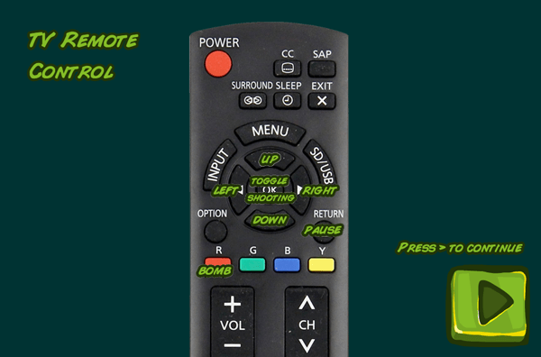
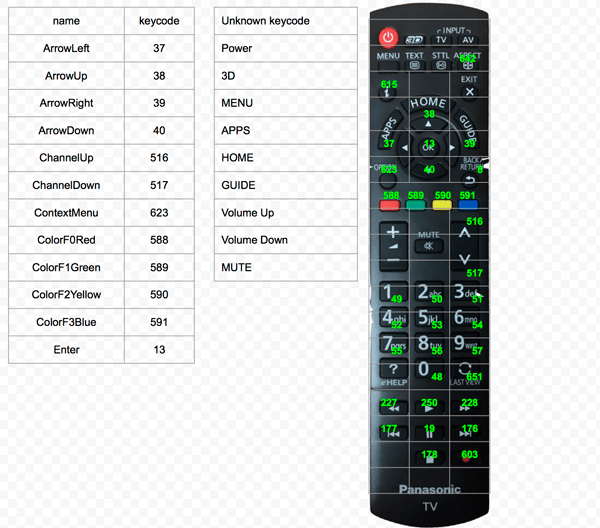
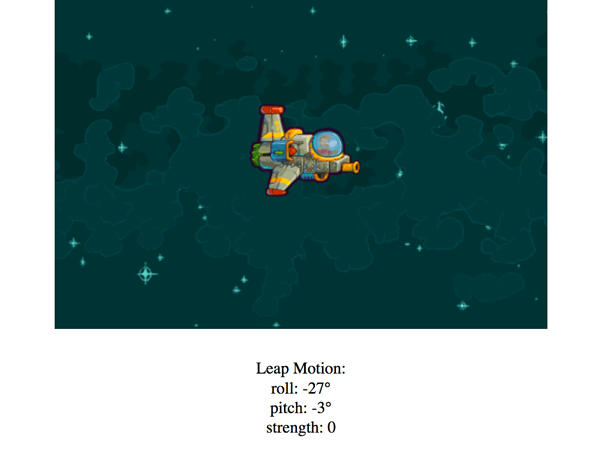
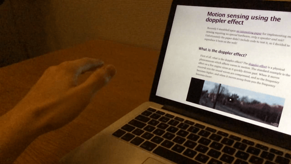
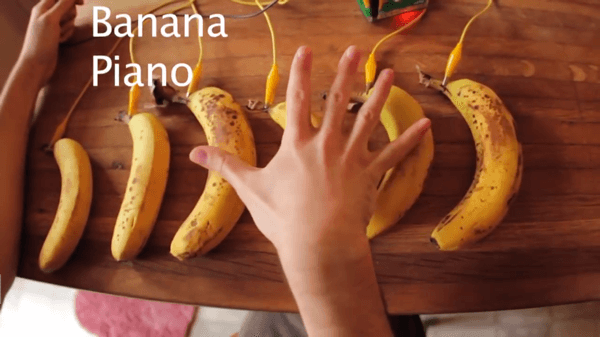

{{GamesSidebar}}

{{PreviousMenu("Games/Techniques/Control_mechanisms/Desktop_with_gamepad", "Games/Techniques/Control_mechanisms")}}

Having different control mechanisms in your game helps reach broader audiences. Implementing mobile and desktop controls is recommended is a must, and gamepad controls add that extra experience. But imagine going even further — in this article we will explore various unconventional ways to control your web game, some more unconventional than others.

## TV remote

Playing games on a TV screen doesn't always have to be done through consoles. There's already a Gamepad API working on the desktop computers, so we can imitate the experience, but we can go even further. Modern smart TVs can handle HTML games, because they have a built-in browser that can be used as a gaming platform. Smart TVs are shipped with remote controls, which can be used to control your games if you know how.

The earliest demo of [Captain Rogers: Battle at Andromeda](https://rogers2.enclavegames.com/demo/) was adjusted to work on a huge TV. Interestingly enough, the first Captain Rogers game (Asteroid Belt of Sirius) was optimized for low-end, small-screen, cheap smartphones running Firefox OS, so you can see the difference three years can make — you can read the whole story in our [Building games for Firefox OS TV](https://hacks.mozilla.org/2016/01/building-games-for-firefox-os-tv/) Hacks post.



Using a TV remote to control the game ended up being surprisingly easy, because the events fired by the controller are emulating conventional keyboard keys. Captain Rogers had the keyboard controls implemented already:

```js
this.cursors = this.input.keyboard.createCursorKeys();
// …
if (this.cursors.right.isDown) {
  // move player right
}
```

It works out of the box. The cursors are the four directional arrow keys on the keyboard, and these have exactly the same key codes as the arrow keys on the remote. How do you know the codes for the other remote keys? You can check them by printing the responses out in the console:

```js
window.addEventListener(
  "keydown",
  (event) => {
    console.log(event.keyCode);
  },
  true,
);
```

Every key pressed on the remote will show its key code in the console. You can also check this handy cheat sheet seen below if you're working with Panasonic TVs running Firefox OS:



You can add moving between states, starting a new game, controlling the ship and blowing stuff up, pausing and restarting the game. All that is needed is checking for key presses:

```js
window.addEventListener(
  "keydown",
  (event) => {
    switch (event.keyCode) {
      case 8: {
        // Pause the game
        break;
      }
      case 588: {
        // Detonate bomb
        break;
      }
      // …
    }
  },
  true,
);
```

You can see it in action by watching [this video](https://www.youtube.com/watch?v=Bh11sP0bcTY).

## Leap Motion

Have you ever thought about controlling a game only with your hands? It's possible with [Leap Motion](https://www.ultraleap.com/), an immersive controller for games and apps.

Leap Motion is becoming more and more popular due to very good integration with VR headsets — demoing [Rainbow Membrane](https://mozilla.github.io/rainbow/) on an Oculus Rift with Leap Motion attached to it was voted one of the best WebVR experiences by JavaScript developers visiting demo booths at conferences around the world.

As well as being great for virtual interfaces, it can also be used for a casual 2D gaming experiences. It would be very difficult to do everything with only your hands, but it's totally doable for the simple Captain Roger's gameplay — steering the ship and shooting the bullets.

To get the Leap Motion working on your computer you have to first install it by following the steps at [docs.ultraleap.com](https://docs.ultraleap.com/hand-tracking/getting-started.html#installation-guides). When everything is installed and the controller is connected to your computer we can proceed with implementing support in our [little demo](https://github.com/end3r/JavaScript-Game-Controls/). First, we add a `<script>` tag with the `url` pointing at [this file](https://js.leapmotion.com/leap-0.6.4.min.js), and add `<div id="output"></div>` just before the closing `</body>` tag for outputting diagnostic information.

We will need a few helper variables for our code to work — one for the purpose of calculating the degrees from radians, two for holding the horizontal and vertical amount of degrees our hand is leaning above the controller, one for the threshold of that lean, and one for the state of our hand's grab status. We next add these lines after all the event listeners for keyboard and mouse, but before the `draw` method:

```js
const toDegrees = 1 / (Math.PI / 180);
let horizontalDegree = 0;
let verticalDegree = 0;
const degreeThreshold = 30;
let grabStrength = 0;
```

Right after that we use the Leap's `loop` method to get the information held in the `hand` variable on every frame:

```js
Leap.loop({
  hand(hand) {
    horizontalDegree = Math.round(hand.roll() * toDegrees);
    verticalDegree = Math.round(hand.pitch() * toDegrees);
    grabStrength = hand.grabStrength;
    output.innerText = `Leap Motion:
  roll: ${horizontalDegree}°
  pitch: ${verticalDegree}°
  strength: ${grabStrength}
`;
  },
});
```

The code above is calculating and assigning the `horizontalDegree`, `verticalDegree` and `grabStrength` values that we will use later on, and outputting it in HTML so we can see the actual values. When those variables are up-to-date, we can use them in the `draw()` function to move the ship:

```js
function draw() {
  ctx.clearRect(0, 0, canvas.width, canvas.height);

  // …

  if (horizontalDegree > degreeThreshold) {
    playerX -= 5;
  } else if (horizontalDegree < -degreeThreshold) {
    playerX += 5;
  }
  if (verticalDegree > degreeThreshold) {
    playerY += 5;
  } else if (verticalDegree < -degreeThreshold) {
    playerY -= 5;
  }
  if (grabStrength === 1) {
    alert("BOOM!");
  }

  ctx.drawImage(img, playerX, playerY);
  requestAnimationFrame(draw);
}
```

If the `horizontalDegree` value is greater than our `degreeThreshold`, which is 30 in this case, then the ship will be moved left 5 pixels on every frame. If its value is lower than the threshold's negative value, then the ship is moved right. Up/down movement works in the same sort of way. The last value is `grabStrength`, which is a float between 0 and 1 — when reaching 1 (fist fully clenched), we show an alert for now (in a full game this could be replaced with the shooting logic).



That's it — everything you needed for a working Leap Motion example in JavaScript is here already. You can explore the `hand`'s properties and implement any behavior you like right inside your game.

## Doppler effect

There's a very interesting article available on [Motion sensing using the doppler effect](https://danielrapp.github.io/doppler/), which mixes together waving your hand and using the microphone. This time it's about detecting sound waves bouncing off objects and returning to the microphone.



If the frequency of the bounced sound is shifted from the original one, then we can detect that the movement of that object occurred. That way we can detect a hand movement by using only a built-in microphone!

This can be accomplished using [a small library](https://github.com/DanielRapp/doppler) created by Daniel Rapp — it can be as simple as calculating the difference between two frequencies:

```js
doppler.init((bandwidth) => {
  const diff = bandwidth.left - bandwidth.right;
});
```

The `diff` would be the difference between the initial position of the hand and the final one.

This approach won't give us the full flexibility of using a Gamepad, or even Leap Motion, but it's definitely an interesting, unconventional alternative. You can use it to scroll a page hands-free, or play theremin, but it should also be enough to move the ship up and down the screen if implemented correctly.

## Makey Makey

If you want to go completely bananas you can use [Makey Makey](https://makeymakey.com/), a board that can turn anything into a controller — it's all about connecting real-world, conductive objects to a computer and using them as touch interfaces.



Check out the [banana piano video](https://www.youtube.com/watch?v=_DWQ6ce2Ags), and be sure to visit the [quick start guide](https://learn.sparkfun.com/tutorials/makey-makey-quickstart-guide) for all the needed info.

There's even a [Cylon.js-supported Makey Button functionality](https://cylonjs.com/documentation/drivers/makey-button/) inspired by the Makey Makey board, so you can use the popular Cylon robotics framework for your experiments with Arduino or Raspberry Pi. Connecting the boards and using them may look like this:

```js
const Cylon = require("cylon");
Cylon.robot({
  connections: {
    arduino: { adaptor: "firmata", port: "/dev/ttyACM0" },
  },
  devices: {
    makey: { driver: "makey-button", pin: 2 },
  },
  work(my) {
    my.makey.on("push", () => {
      console.log("Button pushed!");
    });
  },
}).start();
```

As the description says: this GPIO driver allows you to connect a 10 MOhm resistor to a digital pin on your Arduino or Raspberry Pi to control your robots with bananas, clay, or drawable circuitry.

## Summary

I hope you liked the experiments — if you have any others that you think might interest other people, feel free to add details of them here.

And remember: have fun making games!

{{PreviousMenu("Games/Techniques/Control_mechanisms/Desktop_with_gamepad", "Games/Techniques/Control_mechanisms")}}
