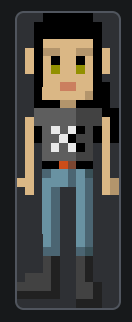

This article discusses a useful technique for giving your canvas/WebGL games a crisp pixel art look, even on high definition monitors.

## The concept

Retro [pixel art](https://en.wikipedia.org/wiki/Pixel_art) aesthetics are getting popular, especially in [indie games](https://en.wikipedia.org/wiki/Indie_game) or [game jam](https://en.wikipedia.org/wiki/Game_jam) entries. But since today's screens render content at high resolutions, there is a problem with making sure the pixel art does not look blurry. Here's an original image that an actual arcade game may have used:


We can manually scale it up in an image editor, expanding each pixel into a 4x4 block of pixels. The image editor can leverage algorithms like [nearest-neighbor interpolation](https://en.wikipedia.org/wiki/Nearest-neighbor_interpolation) to achieve crisp edges.


Two downsides to this method are larger file sizes and [compression artifacts](https://en.wikipedia.org/wiki/Compression_artifact), because the image actually contains more pixels.

The idea of producing crisp pixel art is simple: we want to have a single pixel in the original image map to a block of pixels on the screen, without any smoothing or blending between them. The example above achieves this by manually doing that mapping in an image editor. But we can also achieve this effect in the browser using CSS.

## Up-scaling \ with CSS

An image has an intrinsic size, which is its actual pixel dimensions. It also has a rendered size, which is set by HTML or CSS. If the rendered size is larger than the intrinsic size, the browser will automatically scale up the image to fit the rendered size.

```html

```

```css
img {
  width: 48px;
  height: 136px;
}
```


But as you can see in the image above, the browser's default scaling algorithm makes the image look blurry. This is because it uses a smoothing algorithm that averages the colors of pixels to create a smooth transition between them.

To fix this, we can use the CSS property {{cssxref("image-rendering")}} to tell the browser to use a different scaling algorithm that preserves the hard edges of pixel art.

```html

```

```css
img {
  width: 48px;
  height: 136px;
  image-rendering: pixelated;
}
```


There are also the `crisp-edges` and `-webkit-optimize-contrast` values that work on some browsers. Check out the {{cssxref("image-rendering")}} article for more information on the differences between these values, and which values to use depending on the browser.

`image-rendering: pixelated` is not without its problems as a crisp-edge-preservation technique. When CSS pixels don't align with device pixels (if the {{domxref("Window/devicePixelRatio", "devicePixelRatio")}} is not an integer), certain pixels may be drawn larger than others, resulting in a non-uniform appearance. For example, in Chrome and Firefox, when you zoom in or out, the `devicePixelRatio` changes. This can cause the pixel art to appear distorted or uneven. The screenshot below is taken at 110% page zoom in Chrome. If you look closely, you can see that the left edge of the character's face and leg appears uneven.



This is not an easy problem to solve, however, because it is impossible to fill device pixels precisely when the CSS pixels cannot accurately map to them.

## Crisp pixel art in canvas

Many games render inside a {{htmlelement("canvas")}} element, which can use the same `image-rendering` technique because canvases are also raster images. The steps to achieve this are:

- Create a {{htmlelement("canvas")}} element and set its `width` and `height` attributes to the original, smaller resolution.
- Set its CSS {{cssxref("width")}} and {{cssxref("height")}} properties to be any value you want, but stretched equally to preserve the aspect ratio. If the canvas was created with a 128 pixel width, for example, we would set the CSS `width` to `512px` if we wanted a 4x scale.
- Set the {{htmlelement("canvas")}} element's `image-rendering` CSS property to `pixelated`.

Let's have a look at an example. The original image we want to upscale looks like this:


Here's some HTML to create a simple canvas:

```html
<canvas id="game" width="128" height="128">A cat</canvas>
```

CSS to size the canvas and render a crisp image:

```css
canvas {
  width: 512px;
  height: 512px;
  image-rendering: pixelated;
}
```

And some JavaScript to set up the canvas and load the image:

```js
// Get canvas context
const ctx = document.getElementById("game").getContext("2d");

// Load image
const image = new Image();
image.onload = () => {
  // Draw the image into the canvas
  ctx.drawImage(image, 0, 0);
};
image.src = "cat.png";
```

This code used together produces the following result:

{{EmbedLiveSample("Crisp pixel art in canvas", "", 520)}}

> [!NOTE]
> Canvas content is not accessible to screen readers. Include descriptive text as the value of the [`aria-label`](/en-US/docs/Web/Accessibility/ARIA/Reference/Attributes/aria-label) attribute directly on the canvas element itself or include fallback content placed within the opening and closing canvas tag. Canvas content is not part of the DOM, but nested fallback content is.

## Arbitrarily scaling images in canvas

For the character example with a plain ``, you can set the scale factor to any value you want, and `image-rendering: pixelated` will do its best to preserve crisp edges. For example, you can scale the image by 5.7x:

```css
img {
  /* 5.7x scale factor */
  width: 68.4px;
  height: 193.8px;
  image-rendering: pixelated;
}
```


Previously, we said that `image-rendering: pixelated` works at the stage of mapping image pixels to CSS pixels. But if we are drawing the image into a canvas, we have two layers of mapping: from image pixels to canvas pixels, and then from canvas pixels to CSS pixels. The second step works the same way as image scaling with ``, so you can also use arbitrary scale factors when scaling the canvas with CSS:

```html hidden live-sample___canvas_arbitrary_scale
<canvas id="game" width="128" height="128">A cat</canvas>
```

```css live-sample___canvas_arbitrary_scale
canvas {
  /* 3.7x scale factor */
  width: 473.6px;
  height: 473.6px;
  image-rendering: pixelated;
}
```

```js hidden live-sample___canvas_arbitrary_scale
// Get canvas context
const ctx = document.getElementById("game").getContext("2d");

// Load image
const image = new Image();
image.onload = () => {
  // Draw the image into the canvas
  ctx.drawImage(image, 0, 0);
};
image.src = "cat.png";
```

{{EmbedLiveSample("Canvas arbitrary scale", "", 520)}}

But we need to be careful with how the image pixels are aligned with the canvas pixels. By default the image pixels are drawn 1:1 to canvas pixels; however, if you use the extra arguments of {{domxref("CanvasRenderingContext2D/drawImage", "drawImage()")}} to draw the image at a different size in the canvas, you may end up with a non-integer scale factor. For example, if you draw a 128x128 pixel image into a 100x100 pixel area on the canvas, each image pixel will be drawn as 0.78x0.78 canvas pixels, which can lead to blurriness.

```html hidden live-sample___canvas_image_scale
<canvas id="game" width="128" height="128">A cat</canvas>
```

```css hidden live-sample___canvas_image_scale
canvas {
  width: 512px;
  height: 512px;
  image-rendering: pixelated;
}
```

```js example-bad live-sample___canvas_image_scale
// Get canvas context
const ctx = document.getElementById("game").getContext("2d");

// Load image
const image = new Image();
image.onload = () => {
  // Extract the image pixels from (0,0) to (128,128) (full size)
  // and draw them into the canvas at (0,0) to (100,100)
  ctx.drawImage(image, 0, 0, 128, 128, 0, 0, 100, 100);
};
image.src = "cat.png";
```

{{EmbedLiveSample("Canvas image scale", "", 520)}}

The same happens if you use {{domxref("CanvasRenderingContext2D/scale", "scale()")}} to scale the canvas grid. In this case, a unit of 1 when calling canvas methods would be interpreted as a non-integer number of canvas pixels, leading to blurriness.

```html hidden live-sample___canvas_context_scale
<canvas id="game" width="128" height="128">A cat</canvas>
```

```css hidden live-sample___canvas_context_scale
canvas {
  width: 512px;
  height: 512px;
  image-rendering: pixelated;
}
```

```js example-bad live-sample___canvas_context_scale
// Get canvas context
const ctx = document.getElementById("game").getContext("2d");
// Scaling the context by 0.8, so each image pixel is drawn as 0.8x0.8 canvas pixels
ctx.scale(0.8, 0.8);

// Load image
const image = new Image();
image.onload = () => {
  ctx.drawImage(image, 0, 0);
};
image.src = "cat.png";
```

{{EmbedLiveSample("Canvas context scale", "", 520)}}

To fix this, you have to ensure that the image pixels are always drawn at integer multiples of canvas pixels. That is, when you call `drawImage(image, sx, sy, sWidth, sHeight, dx, dy, dWidth, dHeight)`, `dWidth` needs to be equal to `sWidth / xScale * n`, where `xScale` is the x scale factor for the context (1.0 if you haven't called `scale()`), and `n` is an integer (1, 2, 3, ...). The same applies to `dHeight`. So if you want to draw a 128x128 pixel image on a canvas that has been scaled by 0.8, you can only draw it at sizes like 160 (128 / 0.8 × 1), 320 (128 / 0.8 × 2), etc.

```html hidden live-sample___canvas_context_scale_correct
<canvas id="game" width="128" height="128">A cat</canvas>
```

```css hidden live-sample___canvas_context_scale_correct
canvas {
  width: 512px;
  height: 512px;
  image-rendering: pixelated;
}
```

```js example-good live-sample___canvas_context_scale_correct
// Get canvas context
const ctx = document.getElementById("game").getContext("2d");
// Scaling the context by 0.8, so each image pixel is drawn as 0.8x0.8 canvas pixels
ctx.scale(0.8, 0.8);

// Load image
const image = new Image();
image.onload = () => {
  ctx.drawImage(image, 0, 0, 128, 128, 0, 0, 128 / 0.8, 128 / 0.8);
};
image.src = "cat.png";
```

{{EmbedLiveSample("Canvas context scale correct", "", 520)}}

See the canvas [drawing shapes](/en-US/docs/Web/API/Canvas_API/Tutorial/Drawing_shapes#seeing_blurry_edges) guide for more information about how canvas pixels work.
