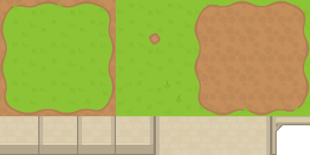

{{GamesSidebar}}

Tilemaps are a very popular technique in 2D game development, consisting of building the game world or level map out of small, regular-shaped images called **tiles**. This results in performance and memory usage gains — big image files containing entire level maps are not needed, as they are constructed by small images or image fragments multiple times. This set of articles covers the basics of creating tile maps using [JavaScript](/en-US/docs/Web/JavaScript) and [Canvas](/en-US/docs/Web/API/Canvas_API) (although the same high level techniques could be used in any programming language.)

Besides the performance gains, tilemaps can also be mapped to a logical grid, which can be used in other ways inside the game logic (for example creating a path-finding graph, or handling collisions) or to create a level editor.

Some popular games that use this technique are _Super Mario Bros_, _Pacman_, _Zelda: Link's Awakening_, _Starcraft_, and _Sim City 2000_. Think about any game that uses regularly repeating squares of background, and you'll probably find it uses tilemaps.

## The tile atlas

The most efficient way to store the tile images is in an atlas or spritesheet. This is all of the required tiles grouped together in a single image file. When it's time to draw a tile, only a small section of this bigger image is rendered on the game canvas. The below images shows a tile atlas of 8 x 4 tiles:



Using an atlas also has the advantage of naturally assigning every tile an **index**. This index is perfect to use as the tile identifier when creating the tilemap object.

## The tilemap data structure

It is common to group all the information needed to handle tilemaps into the same data structure or object. These data objects ([map object example](https://github.com/mozdevs/gamedev-js-tiles/blob/gh-pages/square/no-scroll.js#L1-L18)) should include:

- **Tile size**: The size of each tile in pixels across / pixels down.
- **Image atlas**: The Image atlas that will be used (one or many.)
- **Map dimensions**: The dimensions of the map, either in tiles across / tiles down, or pixels across / pixels down.
- **Visual grid**: Includes indices showing what type of tile should be placed on each position in the grid.
- **Logic grid**: This can be a collision grid, a path-finding grid, etc., depending on the type of game.

> [!NOTE]
> For the visual grid, a special value (usually a negative number, `0` or `null`) is needed to represent empty tiles.

## Square tiles

Square-based tilemaps are the most simple implementation. A more generic case would be rectangular-based tilemaps — instead of square — but they are far less common. Square tiles allow for two **perspectives**:

- Top-down (like many RPG's or strategy games like _Warcraft 2_ or _Final Fantasy_'s world view.)
- Side-view (like platformers such as _Super Mario Bros_.)

### Static tilemaps

A tilemap can either fit into the visible screen area screen or be larger. In the first case, the tilemap is **static** — it doesn't need to be scrolled to be fully shown. This case is very common in arcade games like _Pacman_, _Arkanoid_, or _Sokoban_.

Rendering static tilemaps is easy, and can be done with a nested loop iterating over columns and rows. A high-level algorithm could be:

```js
for (let column = 0; column < map.columns; column++) {
  for (let row = 0; row < map.rows; row++) {
    const tile = map.getTile(column, row);
    const x = column * map.tileSize;
    const y = row * map.tileSize;
    drawTile(tile, x, y);
  }
}
```

You can read more about this and see an example implementation in [Square tilemaps implementation: Static maps](/en-US/docs/Games/Techniques/Tilemaps/Square_tilemaps_implementation:_Static_maps).

### Scrolling tilemaps

**Scrolling** tilemaps only show a small portion of the world at a time. They can follow a character — like in platformers or RPGs — or allow the player to control the camera — like in strategy or simulation games.

#### Positioning and camera

In all scrolling games, we need a translation between **world coordinates** (the position where sprites or other elements are located in the level or game world) and **screen coordinates** (the actual position where those elements are rendered on the screen). The world coordinates can be expressed in terms of tile position (row and column of the map) or in pixels across the map, depending on the game. To be able to transform world coordinates into screen coordinates, we need the coordinates of the camera, since they determine which section of the world is being displayed.

Here are examples showing how to translate from world coordinates to screen coordinates and back again:

```js
// these functions assume that the camera points to the top left corner

function worldToScreen(x, y) {
  return { x: x - camera.x, y: y - camera.y };
}

function screenToWorld(x, y) {
  return { x: x + camera.x, y: y + camera.y };
}
```

#### Rendering

A trivial method for rendering would just be to iterate over all the tiles (like in static tilemaps) and draw them, subtracting the camera coordinates (like in the `worldToScreen()` example shown above) and letting the parts that fall outside the view window sit there, hidden. Drawing all the tiles that can not be seen is wasteful, however, and can take a toll on performance. **Only tiles that are at visible should be rendered** ideally — see the [Performance](#performance) section for more ideas on improving rendering performance.

You can read more about implementing scrolling tilemaps and see some example implementations in [Square tilemaps implementation: Scrolling maps](/en-US/docs/Games/Techniques/Tilemaps/Square_tilemaps_implementation:_Scrolling_maps).

### Layers

The visual grid is often made up of several layers. This allows us to have a richer game world with fewer tiles, since the same image can be used with different backgrounds. For instance, a rock that could appear on top of several terrain types (like grass, sand or brick) could be included on its own separate tile which is then rendered on a new layer, instead of several rock tiles, each with a different background terrain.

If characters or other game sprites are drawn in the middle of the layer stack, this allows for interesting effects such as having characters walking behind trees or buildings.

The following screenshot shows an example of both points: a character appearing _behind_ a tile (the knight appearing behind the top of a tree) and a tile (the bush) being rendered over different terrain types.


### The logic grid

Since tilemaps are an actual grid of visual tiles, it is common to create a mapping between this visual grid and a logic grid. The most common case is to use this logic grid to handle collisions, but other uses are possible as well: character spawning points, detecting whether some elements are placed together in the right way to trigger a certain action (like in _Tetris_ or _Bejeweled_), path-finding algorithms, etc.

> [!NOTE]
> You can take a look at our demo that shows [how to use a logic grid to handle collisions](https://mozdevs.github.io/gamedev-js-tiles/square/logic-grid.html).

## Isometric tilemaps

Isometric tilemaps create the illusion of a 3D environment, and are extremely popular in 2D simulation, strategy, or RPG games. Some of these games include _SimCity 2000_, _Pharaoh_, or _Final Fantasy Tactics_. The below image shows an example of an atlas for an isometric tileset.


## Performance

Drawing scrolling tile maps can take a toll on performance. Usually, some techniques need to be implemented so scrolling can be smooth. The first approach, as discussed above, is to **only draw tiles that will be visible**. But sometimes, this is not enough.

One simple technique consists of pre-rendering the map in a canvas on its own (when using the Canvas API) or on a texture (when using WebGL), so tiles don't need to be re-drawn every frame and rendering can be done in just one blitting operation. Of course, if the map is large this doesn't really solve the problem — and some systems don't have a very generous limit on how big a texture can be.

One way consists of [drawing the section that will be visible off-canvas](https://mozdevs.github.io/gamedev-js-tiles/performance/offcanvas.html) (instead of the entire map.) That means that as long as there is no scrolling, the map doesn't need to be rendered.

A caveat of that approach is that when there _is_ a scrolling, that technique is not very efficient. A better way would be to create a canvas that is 2x2 tiles bigger than the visible area, so there is one tile of "bleeding" around the edges. That means that the map only needs to be redrawn on the canvas when the scrolling has advanced one full tile — instead of every frame — while scrolling.

In fast games that might still not be enough. An alternative method would be to split the tilemap into big sections (like a full map split into 10 x 10 chunks of tiles), pre-render each one off-canvas and then treat each rendered section as a "big tile" in combination with one of the algorithms discussed above.

## See also

- Related articles on the MDN:

  - [Static square tile maps implementation with Canvas API](/en-US/docs/Games/Techniques/Tilemaps/Square_tilemaps_implementation:_Static_maps)
  - [Scrolling square tile maps implementation with Canvas API](/en-US/docs/Games/Techniques/Tilemaps/Square_tilemaps_implementation:_Scrolling_maps)

- External resources:

  - [Demos and source code](https://mozdevs.github.io/gamedev-js-tiles/)
  - [Grid parts and relationships](https://www.redblobgames.com/grids/parts/) by Amit Patel (May 2021)
  - [Isometric graphics in video games](https://en.wikipedia.org/wiki/Isometric_graphics_in_video_games_and_pixel_art) (Wikipedia)
