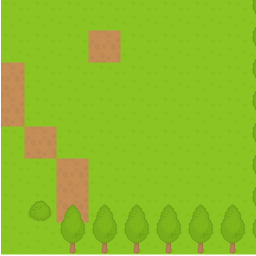

{{GamesSidebar}}

This article covers how to implement scrolling square tilemaps using the [Canvas API](/en-US/docs/Web/API/Canvas_API).

> **Note:** When writing this article, we assumed previous reader knowledge of canvas basics such as how get a 2D canvas context, load images, etc., which is all explained in the [Canvas API tutorial](/en-US/docs/Web/API/Canvas_API/Tutorial), as well as the basic information included in our [Tilemaps](/en-US/docs/Games/Techniques/Tilemaps) introduction article. This article also builds upon [implementing static square tilemaps](/en-US/docs/Games/Techniques/Tilemaps/Square_tilemaps_implementation:_Static_maps) — you should read that too if you've not done so already.

## The camera

The camera is an object that holds information about which section of the game world or level is currently being shown. Cameras can either be free-form, controlled by the player (such as in strategy games) or follow an object (such as the main character in platform games.)

Regardless of the type of camera, we would always need information regarding its current position, viewport size, etc. In the [demo provided](https://mozdevs.github.io/gamedev-js-tiles/square/scroll.html) along with this article, these are the parameters the camera has:

- `x` and `y`: The current position of the camera. In this implementation, we are assuming that `(x,y)` points to the top left corner of visible portion of the map.
- `width` and `height`: The size of the camera's viewport.
- `maxX` and `maxY`: The limit for the camera's position — The lower limit will nearly always be (0,0), and in this case the upper limit is equal to the size of the world minus the size of the camera's viewport.

## Rendering the map

There are two main differences between rendering scrolling maps vs. static maps:

- **Partial tiles might be shown**. In static maps, usually the rendering starts in the top left corner of a tile situated in the top left corner of a viewport. While rendering scrolling tilemaps, the first tile will often be clipped.

TODO: show a diagram here explaining this.

- **Only a section of the map will be rendered**. If the map is bigger than the viewport, we can obviously only display a part of it at a time, whereas non-scrolling maps are usually rendered wholly.

To handle these issues, we need to slightly modify the rendering algorithm. Let's imagine that we have the camera pointing at `(5,10)`. That means that the first tile would be `0x0`. In the demo code, the starting point is stored at `startCol` and `startRow`. It's convenient to also pre-calculate the last tile to be rendered.

```js
const startCol = Math.floor(this.camera.x / map.tsize);
const endCol = startCol + this.camera.width / map.tsize;
const startRow = Math.floor(this.camera.y / map.tsize);
const endRow = startRow + this.camera.height / map.tsize;
```

Once we have the first tile, we need to calculate how much its rendering (and therefore the rendering of the other tiles) is offset by. Since the camera is pointing at `(5, 10)`, we know that the first tile should be shifted by `(-5,-10)` pixels. In our demo the shifting amount is stored in the `offsetX` and `offsetY` variables.

```js
const offsetX = -this.camera.x + startCol * map.tsize;
const offsetY = -this.camera.y + startRow * map.tsize;
```

With these values in place, the loop that renders the map is quite similar to the one used for rendering static tilemaps. The main difference is that we are adding the `offsetX` and `offsetY` values to the target `x` and `y` coordinates, and these values are rounded, to avoid artifacts that would result from the camera pointing at positions with floating point numbers.

```js
for (let c = startCol; c <= endCol; c++) {
  for (let r = startRow; r <= endRow; r++) {
    const tile = map.getTile(c, r);
    const x = (c - startCol) * map.tsize + offsetX;
    const y = (r - startRow) * map.tsize + offsetY;
    if (tile !== 0) {
      // 0 => empty tile
      this.ctx.drawImage(
        this.tileAtlas, // image
        (tile - 1) * map.tsize, // source x
        0, // source y
        map.tsize, // source width
        map.tsize, // source height
        Math.round(x), // target x
        Math.round(y), // target y
        map.tsize, // target width
        map.tsize, // target height
      );
    }
  }
}
```

## Demo

Our scrolling tilemap implementation demo pulls the above code together to show what an implementation of this map looks like. You can take a look at a [live demo](https://mozdevs.github.io/gamedev-js-tiles/square/scroll.html), and see [its source code](https://github.com/mozdevs/gamedev-js-tiles).



There's [another demo available](https://mozdevs.github.io/gamedev-js-tiles/square/logic-grid.html), that shows how to make the camera follow a character.
