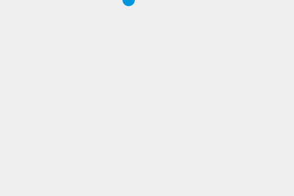

{{GamesSidebar}}

{{PreviousNext("Games/Workflows/2D_Breakout_game_pure_JavaScript/Move_the_ball", "Games/Workflows/2D_Breakout_game_pure_JavaScript/Paddle_and_keyboard_controls")}}

This is the **3rd step** out of 10 of the [Gamedev Canvas tutorial](/en-US/docs/Games/Tutorials/2D_Breakout_game_pure_JavaScript). You can find the source code as it should look after completing this lesson at [Gamedev-Canvas-workshop/lesson3.html](https://github.com/end3r/Gamedev-Canvas-workshop/blob/gh-pages/lesson03.html).

It is nice to see our ball moving, but it quickly disappears from the screen, limiting the fun we can have with it! To overcome that we will implement some collision detection (which will be explained [later](/en-US/docs/Games/Tutorials/2D_Breakout_game_pure_JavaScript/Collision_detection) in more detail) to make the ball bounce off the four edges of the Canvas.

## Simple collision detection

To detect the collision we will check whether the ball is touching (colliding with) the wall, and if so, we will change the direction of its movement accordingly.

To make the calculations easier let's define a variable called `ballRadius` that will hold the radius of the drawn circle and be used for calculations. Add this to your code, somewhere below the existing variable declarations:

```js
const ballRadius = 10;
```

Now update the line that draws the ball inside the `drawBall()` function to this:

```js
ctx.arc(x, y, ballRadius, 0, Math.PI * 2);
```

### Bouncing off the top and bottom

There are four walls to bounce the ball off — let's focus on the top one first. We need to check, on every frame, whether the ball is touching the top edge of the Canvas — if yes, we'll reverse the ball movement so it will start to move in the opposite direction and stay within the visible boundaries. Remembering that the coordinate system starts from the top left, we can come up with something like this:

```js
if (y + dy < 0) {
  dy = -dy;
}
```

If the `y` value of the ball position is lower than zero, change the direction of the movement on the `y` axis by setting it equal to itself, reversed. If the ball was moving upwards with a speed of 2 pixels per frame, now it will be moving "up" with a speed of -2 pixels, which actually equals to moving down at a speed of 2 pixels per frame.

The code above would deal with the ball bouncing off the top edge, so now let's think about the bottom edge:

```js
if (y + dy > canvas.height) {
  dy = -dy;
}
```

If the ball's `y` position is greater than the height of the Canvas (remember that we count the `y` values from the top left, so the top edge starts at 0 and the bottom edge is at 320 pixels, the Canvas' height), then bounce it off the bottom edge by reversing the `y` axis movement as before.

We could merge those two statements into one to save on code verbosity:

```js
if (y + dy > canvas.height || y + dy < 0) {
  dy = -dy;
}
```

If either of the two statements is `true`, reverse the movement of the ball.

### Bouncing off the left and right

We have the top and bottom edge covered, so let's think about the left and right ones. It is very similar actually, all you have to do is to repeat the statements for `x` instead of `y`:

```js
if (x + dx > canvas.width || x + dx < 0) {
  dx = -dx;
}

if (y + dy > canvas.height || y + dy < 0) {
  dy = -dy;
}
```

At this point you should insert the above code block into the draw() function, just before the closing curly brace.

### The ball keeps disappearing into the wall!

Test your code at this point, and you will be impressed — now we have a ball that bounced off all four edges of the canvas! We have another problem however — when the ball hits each wall it sinks into it slightly before changing direction:



This is because we're calculating the collision point of the wall and the center of the ball, while we should be doing it for its circumference. The ball should bounce right after if touches the wall, not when it's already halfway in the wall, so let's adjust our statements a bit to include that. Update the last code you added to this:

```js
if (x + dx > canvas.width - ballRadius || x + dx < ballRadius) {
  dx = -dx;
}
if (y + dy > canvas.height - ballRadius || y + dy < ballRadius) {
  dy = -dy;
}
```

When the distance between the center of the ball and the edge of the wall is exactly the same as the radius of the ball, it will change the movement direction. Subtracting the radius from one edge's width and adding it onto the other gives us the impression of the proper collision detection — the ball bounces off the walls as it should do.

## Compare your code

Let's again check the finished code for this part against what you've got, and have a play:

```html hidden
<canvas id="myCanvas" width="480" height="320"></canvas>
<button id="runButton">Start game</button>
```

```css hidden
canvas {
  background: #eee;
}
button {
  display: block;
}
```

```js
const canvas = document.getElementById("myCanvas");
const ctx = canvas.getContext("2d");
const ballRadius = 10;
let x = canvas.width / 2;
let y = canvas.height - 30;
let dx = 2;
let dy = -2;

function drawBall() {
  ctx.beginPath();
  ctx.arc(x, y, ballRadius, 0, Math.PI * 2);
  ctx.fillStyle = "#0095DD";
  ctx.fill();
  ctx.closePath();
}

function draw() {
  ctx.clearRect(0, 0, canvas.width, canvas.height);
  drawBall();

  if (x + dx > canvas.width - ballRadius || x + dx < ballRadius) {
    dx = -dx;
  }
  if (y + dy > canvas.height - ballRadius || y + dy < ballRadius) {
    dy = -dy;
  }

  x += dx;
  y += dy;
}

function startGame() {
  setInterval(draw, 10);
}

document.getElementById("runButton").addEventListener("click", function () {
  startGame();
  this.disabled = true;
});
```

{{embedlivesample("compare_your_code", 600, 360)}}

> [!NOTE]
> Try changing the color of the ball to a random color every time it hits the wall.

## Next steps

We've now got to the stage where our ball is both moving and staying on the game board. In the fourth chapter we'll look at implementing a controllable paddle — see [Paddle and keyboard controls](/en-US/docs/Games/Tutorials/2D_Breakout_game_pure_JavaScript/Paddle_and_keyboard_controls).

{{PreviousNext("Games/Workflows/2D_Breakout_game_pure_JavaScript/Move_the_ball", "Games/Workflows/2D_Breakout_game_pure_JavaScript/Paddle_and_keyboard_controls")}}
