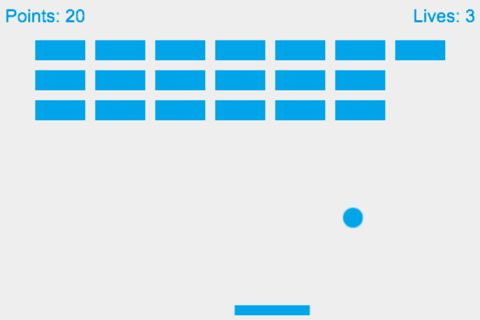

{{Next("Games/Tutorials/2D_breakout_game_pure_JavaScript/Initialize_the_canvas")}}

In this step-by-step tutorial, we create a simple mobile **MDN Breakout** game written in JavaScript, using pure JavaScript without any external libraries.

Every step has editable, live samples available to play with, so you can see what the intermediate stages should look like. You will learn the basics of implementing fundamental game mechanics like canvas manipulation, rendering and moving images, collision detection, control mechanisms, animations and tweens, and winning and losing states.

To get the most out of this series of articles, you should already have basic to intermediate [JavaScript](/en-US/docs/Learn_web_development/Getting_started/Your_first_website/Adding_interactivity) knowledge. After working through this tutorial, you should be able to build your own basic Web games.

> [!NOTE]
> This guide has a sister guide: [2D breakout game using Phaser](/en-US/docs/Games/Tutorials/2D_breakout_game_Phaser). They follow essentially the same steps and arrive at visually identical results.

## Lesson details

1. [Initialize the canvas](/en-US/docs/Games/Tutorials/2D_breakout_game_pure_JavaScript/Initialize_the_canvas)
2. [Move the ball](/en-US/docs/Games/Tutorials/2D_breakout_game_pure_JavaScript/Move_the_ball)
3. [Bounce off the walls](/en-US/docs/Games/Tutorials/2D_breakout_game_pure_JavaScript/Bounce_off_the_walls)
4. [Player paddle and controls](/en-US/docs/Games/Tutorials/2D_breakout_game_pure_JavaScript/Player_paddle_and_controls)
5. [Game over](/en-US/docs/Games/Tutorials/2D_breakout_game_pure_JavaScript/Game_over)
6. [Build the brick field](/en-US/docs/Games/Tutorials/2D_breakout_game_pure_JavaScript/Build_the_brick_field)
7. [Track the score and win](/en-US/docs/Games/Tutorials/2D_breakout_game_pure_JavaScript/Track_the_score_and_win)
8. [Extra lives](/en-US/docs/Games/Tutorials/2D_breakout_game_pure_JavaScript/Extra_lives)
9. [Animations and tweens](/en-US/docs/Games/Tutorials/2D_breakout_game_pure_JavaScript/Animations_and_tweens)
10. [Buttons](/en-US/docs/Games/Tutorials/2D_breakout_game_pure_JavaScript/Buttons)
11. [Randomizing gameplay](/en-US/docs/Games/Tutorials/2D_breakout_game_pure_JavaScript/Randomizing_gameplay)

## Next steps

Ok, let us get started! Head to the first part of the series—[Initialize the canvas](/en-US/docs/Games/Tutorials/2D_breakout_game_pure_JavaScript/Initialize_the_canvas).

{{Next("Games/Tutorials/2D_breakout_game_pure_JavaScript/Initialize_the_canvas")}}
