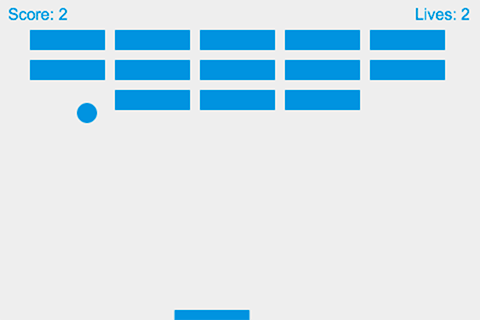

{{GamesSidebar}}

{{Next("Games/Workflows/2D_Breakout_game_pure_JavaScript/Create_the_Canvas_and_draw_on_it")}}

In this step-by-step tutorial we create a simple **MDN Breakout** game written entirely in pure JavaScript and rendered on HTML {{htmlelement("canvas")}}.

Every step has editable, live samples available to play with so you can see what the intermediate stages should look like. You will learn the basics of using the {{htmlelement("canvas")}} element to implement fundamental game mechanics like rendering and moving images, collision detection, control mechanisms, and winning and losing states.

To get the most out of this series of articles you should already have basic to intermediate [JavaScript](/en-US/docs/Learn/Getting_started_with_the_web/JavaScript_basics) knowledge. After working through this tutorial you should be able to build your own simple Web games.

## Lesson details

All the lessons — and the different versions of the [MDN Breakout game](https://breakout.enclavegames.com/lesson10.html) we are building together — are [available on GitHub](https://github.com/end3r/Gamedev-Canvas-workshop):

1. [Create the Canvas and draw on it](/en-US/docs/Games/Tutorials/2D_Breakout_game_pure_JavaScript/Create_the_Canvas_and_draw_on_it)
2. [Move the ball](/en-US/docs/Games/Tutorials/2D_Breakout_game_pure_JavaScript/Move_the_ball)
3. [Bounce off the walls](/en-US/docs/Games/Tutorials/2D_Breakout_game_pure_JavaScript/Bounce_off_the_walls)
4. [Paddle and keyboard controls](/en-US/docs/Games/Tutorials/2D_Breakout_game_pure_JavaScript/Paddle_and_keyboard_controls)
5. [Game over](/en-US/docs/Games/Tutorials/2D_Breakout_game_pure_JavaScript/Game_over)
6. [Build the brick field](/en-US/docs/Games/Tutorials/2D_Breakout_game_pure_JavaScript/Build_the_brick_field)
7. [Collision detection](/en-US/docs/Games/Tutorials/2D_Breakout_game_pure_JavaScript/Collision_detection)
8. [Track the score and win](/en-US/docs/Games/Tutorials/2D_Breakout_game_pure_JavaScript/Track_the_score_and_win)
9. [Mouse controls](/en-US/docs/Games/Tutorials/2D_Breakout_game_pure_JavaScript/Mouse_controls)
10. [Finishing up](/en-US/docs/Games/Tutorials/2D_Breakout_game_pure_JavaScript/Finishing_up)

Starting with pure JavaScript is the best way to get a solid knowledge of web game development. After that, you can pick any framework you like and use it for your projects. Frameworks are just tools built with the JavaScript language; so even if you plan on working with them, it's good to learn about the language itself first to know what exactly is going on under the hood. Frameworks speed up development time and help take care of boring parts of the game, but if something is not working as expected, you can always try to debug that or just write your own solutions in pure JavaScript.

> **Note:** If you are interested in learning about 2D web game development using a game library, consult this series' counterpart, [2D breakout game using Phaser](/en-US/docs/Games/Tutorials/2D_breakout_game_Phaser).

> **Note:** This series of articles can be used as material for hands-on game development workshops. You can also make use of the [Gamedev Canvas Content Kit](https://github.com/end3r/Gamedev-Canvas-Content-Kit) based on this tutorial if you want to give a talk about game development in general.

## Next steps

Ok, let's get started! Head to the first chapter— [Create the Canvas and draw on it](/en-US/docs/Games/Tutorials/2D_Breakout_game_pure_JavaScript/Create_the_Canvas_and_draw_on_it).

{{Next("Games/Workflows/2D_Breakout_game_pure_JavaScript/Create_the_Canvas_and_draw_on_it")}}
