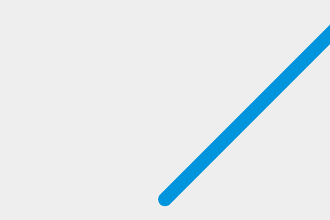

{{GamesSidebar}}

{{PreviousNext("Games/Workflows/2D_Breakout_game_pure_JavaScript/Create_the_Canvas_and_draw_on_it", "Games/Workflows/2D_Breakout_game_pure_JavaScript/Bounce_off_the_walls")}}

This is the **2nd step** out of 10 of the [Gamedev Canvas tutorial](/en-US/docs/Games/Tutorials/2D_Breakout_game_pure_JavaScript). You can find the source code as it should look after completing this lesson at [Gamedev-Canvas-workshop/lesson2.html](https://github.com/end3r/Gamedev-Canvas-workshop/blob/gh-pages/lesson02.html).

You already know how to draw a ball from working through the previous article, so now let's make it move. Technically, we will be painting the ball on the screen, clearing it and then painting it again in a slightly different position every frame to make the impression of movement — just like how movement works with the movies.

## Defining a drawing loop

To keep constantly updating the canvas drawing on each frame, we need to define a drawing function that will run over and over again, with a different set of variable values each time to change sprite positions, etc. You can run a function over and over again using a JavaScript timing function such as {{domxref("setInterval()")}} or {{domxref("window.requestAnimationFrame()", "requestAnimationFrame()")}}.

Delete all the JavaScript you currently have inside your HTML file except for the first two lines, and add the following below them. The `draw()` function will be executed within `setInterval` every 10 milliseconds:

```js
function draw() {
  // drawing code
}
setInterval(draw, 10);
```

Thanks to the infinite nature of `setInterval` the `draw()` function will be called every 10 milliseconds forever, or until we stop it. Now, let's draw the ball — add the following inside your `draw()` function:

```js
ctx.beginPath();
ctx.arc(50, 50, 10, 0, Math.PI * 2);
ctx.fillStyle = "#0095DD";
ctx.fill();
ctx.closePath();
```

Try your updated code now — the ball should be repainted on every frame.

## Making it move

You won't notice the ball being repainted constantly at the moment, as it's not moving. Let's change that. First, instead of a hardcoded position at (50,50) we will define a starting point at the bottom center part of the Canvas in variables called `x` and `y`, then use those to define the position the circle is drawn at.

First, add the following two lines above your `draw()` function, to define `x` and `y`:

```js
let x = canvas.width / 2;
let y = canvas.height - 30;
```

Next update the `draw()` function to use the x and y variables in the {{domxref("CanvasRenderingContext2D.arc()","arc()")}} method, as shown in the following highlighted line:

```js
function draw() {
  ctx.beginPath();
  ctx.arc(x, y, 10, 0, Math.PI * 2);
  ctx.fillStyle = "#0095DD";
  ctx.fill();
  ctx.closePath();
}
```

Now comes the important part: we want to add a small value to `x` and `y` after every frame has been drawn to make it appear that the ball is moving. Let's define these small values as `dx` and `dy` and set their values to 2 and -2 respectively. Add the following below your x and y variable definitions:

```js
let dx = 2;
let dy = -2;
```

The last thing to do is to update `x` and `y` with our `dx` and `dy` variable on every frame, so the ball will be painted in the new position on every update. Add the following two new lines indicated below to your `draw()` function:

```js
function draw() {
  ctx.beginPath();
  ctx.arc(x, y, 10, 0, Math.PI * 2);
  ctx.fillStyle = "#0095DD";
  ctx.fill();
  ctx.closePath();
  x += dx;
  y += dy;
}
```

Save your code again and try it in your browser. This works OK, although it appears that the ball is leaving a trail behind it:



## Clearing the canvas before each frame

The ball is leaving a trail because we're painting a new circle on every frame without removing the previous one. Don't worry, because there's a method to clear canvas content: {{domxref("CanvasRenderingContext2D.clearRect()","clearRect()")}}. This method takes four parameters: the x and y coordinates of the top left corner of a rectangle, and the x and y coordinates of the bottom right corner of a rectangle. The whole area covered by this rectangle will be cleared of any content previously painted there.

Add the following highlighted new line to the `draw()` function:

```js
function draw() {
  ctx.clearRect(0, 0, canvas.width, canvas.height);
  ctx.beginPath();
  ctx.arc(x, y, 10, 0, Math.PI * 2);
  ctx.fillStyle = "#0095DD";
  ctx.fill();
  ctx.closePath();
  x += dx;
  y += dy;
}
```

Save your code and try again, and this time you'll see the ball move without a trail. Every 10 milliseconds the canvas is cleared, the blue circle (our ball) will be drawn on a given position and the `x` and `y` values will be updated for the next frame.

## Cleaning up our code

We will be adding more and more commands to the `draw()` function in the next few articles, so it's good to keep it as simple and clean as possible. Let's start by moving the ball drawing code to a separate function.

Replace the existing draw() function with the following two functions:

```js
function drawBall() {
  ctx.beginPath();
  ctx.arc(x, y, 10, 0, Math.PI * 2);
  ctx.fillStyle = "#0095DD";
  ctx.fill();
  ctx.closePath();
}

function draw() {
  ctx.clearRect(0, 0, canvas.width, canvas.height);
  drawBall();
  x += dx;
  y += dy;
}
```

## Compare your code

You can check the finished code for this article for yourself in the live demo below, and play with it to understand better how it works:

{{JSFiddleEmbed("https://jsfiddle.net/end3r/3x5foxb1/","","395")}}

> **Note:** Try changing the speed of the moving ball, or the direction it moves in.

## Next steps

We've drawn our ball and gotten it moving, but it keeps disappearing off the edge of the canvas. In the third chapter we'll explore how to make it [bounce off the walls](/en-US/docs/Games/Tutorials/2D_Breakout_game_pure_JavaScript/Bounce_off_the_walls).

{{PreviousNext("Games/Workflows/2D_Breakout_game_pure_JavaScript/Create_the_Canvas_and_draw_on_it", "Games/Workflows/2D_Breakout_game_pure_JavaScript/Bounce_off_the_walls")}}
