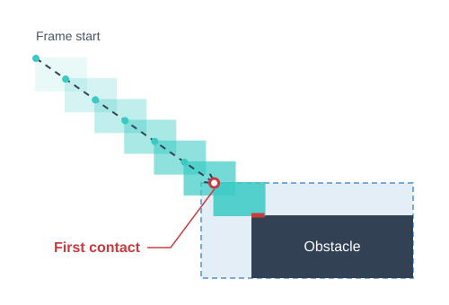

{{PreviousNext("Games/Tutorials/2D_breakout_game_pure_JavaScript/Bounce_off_the_walls", "Games/Tutorials/2D_breakout_game_pure_JavaScript/Game_over")}}

This is the **4th step** out of 12 of the [creating a Breakout game in pure JavaScript tutorial](/en-US/docs/Games/Tutorials/2D_breakout_game_pure_JavaScript). We have the ball moving and bouncing off the walls, but it quickly gets boring—there's no interactivity! We need a way to introduce gameplay, so in this article, we'll create a paddle to move around and hit the ball with.

## Rendering the paddle

The ball and paddle both need an image, a position, a size, a hitbox, and drawing logic. We can share these through a `GameObject` base class. Replace the existing `Ball` class with the following two classes:

```js
class GameObject {
  asset;
  ctx;
  size = { w: undefined, h: undefined };
  pos = { x: 0, y: 0 };
  origin = { x: 0.5, y: 0.5 };
  constructor(url, ctx) {
    this.asset = new Image();
    this.asset.src = url;
    this.ctx = ctx;
  }
  async preload() {
    await this.asset.decode();
    if (this.size.w === undefined) {
      this.size.w = this.asset.width;
      this.size.h = this.asset.height;
    }
  }
  get hitbox() {
    const left = this.pos.x - this.size.w * this.origin.x;
    const top = this.pos.y - this.size.h * this.origin.y;
    return {
      left,
      right: left + this.size.w,
      top,
      bottom: top + this.size.h,
    };
  }
  draw() {
    const { left, top } = this.hitbox;
    this.ctx.drawImage(this.asset, left, top);
  }
  onCollide() {}
}

class Ball extends GameObject {
  pos = { x: 50, y: 50 };
  vel = { x: 0.15, y: 0.15 };
  move(dt) {
    this.pos.x += this.vel.x * dt;
    this.pos.y += this.vel.y * dt;
  }
  onCollide({ x, y }) {
    if (x) {
      this.vel.x = -this.vel.x;
    }
    if (y) {
      this.vel.y = -this.vel.y;
    }
  }
}
```

The `origin` defines which point on the image is placed at `pos`, as a fraction of its width and height. The default `(0.5, 0.5)` places the center there. The base class also defines an empty `onCollide()` method to ensure that all objects have one. If an object doesn't react to collisions—like the paddle—it can inherit this default method.

`Ball` inherits the constructor, `preload()`, `hitbox`, and `draw()` from `GameObject`. It adds its initial position, velocity, `move()`, and the `onCollide()` response from the previous lesson.

Now add a `Paddle` class below `Ball`:

```js
class Paddle extends GameObject {
  origin = { x: 0.5, y: 1 };
  constructor(url, ctx) {
    super(url, ctx);
    this.pos = { x: ctx.canvas.width / 2, y: ctx.canvas.height - 5 };
  }
}
```

The `super(url, ctx)` call runs the shared constructor to set up the paddle's image and drawing context. The paddle then sets its initial position. We can use the `canvas.width` and `canvas.height` values to position the paddle exactly where we want it: `canvas.width / 2` will be right in the middle of the screen. In our case, the world is the same as the canvas, but for other types of games, like side-scrollers, the world will be bigger, and you can tinker with it to create interesting effects.

> [!NOTE]
> With `origin.y` set to `1`, we subtract `this.size.h` instead of `this.size.h / 2` when drawing the paddle and calculating its top edge. This means that `paddle.pos.y` represents the y-position of the _bottom_ edge of the paddle instead of its center. This allows us to more conveniently control the paddle's position relative to the canvas's bottom edge.

Grab the [paddle graphic](https://mdn.github.io/shared-assets/images/examples/2D_breakout_game_Phaser/paddle.png) and save it in your `/img` folder. Create the paddle right after the ball:

```js
const paddle = new Paddle("img/paddle.png", ctx);
```

Also add `paddle` to the array inside `Promise.all()`:

```js
Promise.all([ball, paddle].map((obj) => obj.preload())).then(() =>
  requestAnimationFrame(draw),
);
```

And add the following after the existing `ball.draw()` call:

```js
paddle.draw();
```

The paddle is now positioned right where we want it to be. Now, to make the ball bounce off the paddle, we have to implement collision physics between them.

## Adding physics

> [!NOTE]
> We are moving faster here than the rest of the tutorial, because this part is exactly where a framework like [Phaser](/en-US/docs/Games/Tutorials/2D_breakout_game_Phaser/Player_paddle_and_controls) does for us. Usually, you would not be implementing any of the physics and just need to register the paddle as a collider.

Unlike walls, the paddle is a finite rectangle, so it can be hit from all four edges (or even on the corner) and—in the super rare case, if the ball is fast enough—can even be passed through. Instead of checking for overlap after moving the ball, we will implement _continuous collision detection_, which calculates the first instant it comes into contact with the surface between the frames, so we never lose information about which surface is touched first.

We will put the collision calculation in a reusable function so we can use it for the paddle and, later, the bricks. It will take one `moving` hitbox and one `obstacle` hitbox and tell us if the `moving` object is expected to collide with `obstacle` within `dt`, and if so, when and where.

Instead of calculating the position of the mover's four sides one by one, like we did with `handleWallCollisions`, we can reduce the mover to a single point—its top-left corner—by extending the obstacle's region by one width and one height of the mover.



```js
function getCollision(moving, velocity, obstacle, dt) {
  const width = moving.right - moving.left;
  const height = moving.bottom - moving.top;
  const movingPos = { x: moving.left, y: moving.top };
  const left = obstacle.left - width;
  const right = obstacle.right;
  const top = obstacle.top - height;
  const bottom = obstacle.bottom;
  const hit = { time: dt, x: null, y: null };

  function checkFace(axis, direction, coordinate, min, max) {
    if (velocity[axis] * direction <= 0) {
      return;
    }
    const time = (coordinate - movingPos[axis]) / velocity[axis];
    if (time < 0 || time > hit.time) {
      return;
    }
    const otherAxis = axis === "x" ? "y" : "x";
    const otherPosition = movingPos[otherAxis] + velocity[otherAxis] * time;
    if (otherPosition < min || otherPosition > max) {
      return;
    }
    if (time < hit.time) {
      hit.x = null;
      hit.y = null;
    }
    hit.time = time;
    hit[axis] = coordinate;
  }

  checkFace("x", 1, left, top, bottom);
  checkFace("x", -1, right, top, bottom);
  checkFace("y", 1, top, left, right);
  checkFace("y", -1, bottom, left, right);

  return hit.x === null && hit.y === null ? null : hit;
}
```

The bulk of the logic is inside the nested `checkFace()` function. It takes the `axis`, `direction`, and `coordinate` parameters, which represent one of the four faces of the obstacle, as an inward normal vector. For example, `"x", 1, left` represents the left edge, because a vector in the positive-x direction will be perpendicular to the surface and pointing into the object.

For a vertical surface, the time to contact is the horizontal distance divided by the horizontal velocity. We then calculate the ball's vertical position at that time to check whether it hits the surface or passes above or below it (and therefore there's no actual collision). Horizontal surfaces work the same way, with the axes exchanged. The `checkFace()` function keeps the earliest contact within `dt`.

The result of `getCollision()` is `null` if there is no contact; otherwise, it contains the contact time and the top-left coordinate to use on each colliding axis. For example, hitting a vertical face gives an `x` coordinate, while `y` remains `null`. At an exact corner hit, both coordinates are set.

Now we just need to call `getCollision()` between the ball and everything it may collide into. We can even implement the walls as normal obstacles so we don't need a separate set of logic. The `colliders` list has a list of objects with a `hitbox` property, so that each time we call `getCollision()`, we can retrieve the latest `hitbox` value by triggering the getter on `GameObject`, instead of storing a snapshot from when it was first added to the list.

```js
const baseWallHitbox = {
  left: -Infinity,
  right: Infinity,
  top: -Infinity,
  bottom: Infinity,
};

const colliders = [
  { hitbox: { ...baseWallHitbox, right: 0 } },
  { hitbox: { ...baseWallHitbox, left: canvas.width } },
  { hitbox: { ...baseWallHitbox, bottom: 0 } },
  { hitbox: { ...baseWallHitbox, top: canvas.height } },
];
```

Immediately after creating the paddle, register the `paddle` too:

```js
colliders.push(paddle);
```

Next, replace the old `handleWallCollisions()` function with the `moveBall()` function. It coordinates collision handling, repeatedly calling `getCollision()` and advancing the ball until the specified `dt` has elapsed. Each time, it finds the next obstacle(s) that the ball will collide into (`hit.time` is the smallest), moves the ball right to the point of contact, calls the collision responses, and proceeds with the remaining time.

```js
function moveBall(dt) {
  while (dt > 0) {
    // Avoid repeatedly triggering the getter
    const ballHitbox = ball.hitbox;
    let hitTime = dt;
    let hitX = null;
    let hitY = null;
    let contacts = [];

    for (const collider of colliders) {
      const hit = getCollision(ballHitbox, ball.vel, collider.hitbox, hitTime);
      if (hit === null) {
        continue;
      }
      if (hit.time < hitTime) {
        hitX = null;
        hitY = null;
        contacts = [];
      }
      hitTime = hit.time;
      hitX = hit.x ?? hitX;
      hitY = hit.y ?? hitY;
      contacts.push({ collider, hit });
    }

    ball.move(hitTime);
    dt -= hitTime;

    if (contacts.length === 0) {
      break;
    }
    // Snap the position to the point of contact to avoid floating point errors
    if (hitX !== null) {
      ball.pos.x = hitX + ball.size.w / 2;
    }
    if (hitY !== null) {
      ball.pos.y = hitY + ball.size.h / 2;
    }

    ball.onCollide({ x: hitX !== null, y: hitY !== null });
    for (const { collider, hit } of contacts) {
      collider.onCollide?.({ x: hit.x !== null, y: hit.y !== null });
    }
  }
}
```

> [!NOTE]
> This loop could potentially process many collisions within one frame, causing a lag. People sometimes limit the number of collisions allowed within a frame, and discard the remaining `dt` once that limit is reached, allowing the game to be repainted sooner but causing the object to move more slowly.

Inside `draw()`, replace the calls to `ball.move(dt)` and `handleWallCollisions()` with a call to `moveBall()`:

```js
if (lastTimestamp !== null) {
  const dt = timestamp - lastTimestamp;
  moveBall(dt);
}
```

This calculation assumes that the ball starts inside the canvas without overlapping any collider, and that the colliders stay still during each call to `moveBall()`.

## Controlling the paddle

The next problem is that we can't move the paddle. To fix that, we can use the system's pointer input (mouse or touch, depending on the platform) and set the paddle position to where the pointer position is.

```js
canvas.addEventListener("pointermove", (event) => {
  if (paddle.size.w === undefined) {
    return;
  }
  const bounds = canvas.getBoundingClientRect();
  const x = ((event.clientX - bounds.left) * canvas.width) / bounds.width;
  paddle.pos.x = Math.max(
    paddle.size.w / 2,
    Math.min(canvas.width - paddle.size.w / 2, x),
  );
});
```

The pointer's `clientX` is measured relative to the viewport. We subtract the canvas's left edge and scale the result to the canvas's drawing coordinates, because the CSS may display the canvas at a different size. We then update `paddle.pos.x`, keeping the entire paddle inside the canvas. Until the pointer moves, the paddle stays at the center position set by its constructor. The size check ignores input before the paddle image has loaded.

To allow touch dragging without scrolling the page, add this declaration to the canvas's CSS rule:

```css
canvas {
  /* … */
  touch-action: none;
}
```

If you haven't already done so, reload your `index.html` and try it out!

## Position the ball

We have the paddle working as expected, so let's position the ball on it. After both assets have loaded, we can use their hitboxes and dimensions to place the ball's bottom edge at the paddle's top edge. Update the `Ball` class:

```js
class Ball extends GameObject {
  pos = { x: undefined, y: undefined };
  vel = { x: 0.15, y: -0.15 };
  // …
}
```

The horizontal velocity stays the same. We change the vertical velocity from `0.15` to `-0.15` so the ball starts by moving up instead of down. We can't know the position ahead of time, because we need to put it on top of the paddle, which requires loading the paddle first. Replace the existing `Promise.all()` block with the following:

```js
Promise.all([ball, paddle].map((obj) => obj.preload())).then(() => {
  ball.pos.x = paddle.pos.x;
  ball.pos.y = paddle.hitbox.top - ball.size.h / 2;
  requestAnimationFrame(draw);
});
```

Now the ball will start right from the middle of the paddle.

## Compare your code

Here's what you should have so far, running live. To view its source code, click the "Play" button.

```html hidden
<canvas id="game-canvas" width="480" height="320"></canvas>
```

```css hidden
* {
  padding: 0;
  margin: 0;
}

body {
  min-height: 100vh;
  display: grid;
  place-items: center;
}

canvas {
  display: block;
  width: min(100vw, 150vh);
  height: auto;
  touch-action: none;
}
```

```js hidden
const canvas = document.getElementById("game-canvas");
const ctx = canvas.getContext("2d");
let lastTimestamp = null;

const baseWallHitbox = {
  left: -Infinity,
  right: Infinity,
  top: -Infinity,
  bottom: Infinity,
};

const colliders = [
  { hitbox: { ...baseWallHitbox, right: 0 } },
  { hitbox: { ...baseWallHitbox, left: canvas.width } },
  { hitbox: { ...baseWallHitbox, bottom: 0 } },
  { hitbox: { ...baseWallHitbox, top: canvas.height } },
];

class GameObject {
  asset;
  ctx;
  size = { w: undefined, h: undefined };
  pos = { x: 0, y: 0 };
  origin = { x: 0.5, y: 0.5 };
  constructor(url, ctx) {
    this.asset = new Image();
    this.asset.src = url;
    this.ctx = ctx;
  }
  async preload() {
    await this.asset.decode();
    if (this.size.w === undefined) {
      this.size.w = this.asset.width;
      this.size.h = this.asset.height;
    }
  }
  get hitbox() {
    const left = this.pos.x - this.size.w * this.origin.x;
    const top = this.pos.y - this.size.h * this.origin.y;
    return {
      left,
      right: left + this.size.w,
      top,
      bottom: top + this.size.h,
    };
  }
  draw() {
    const { left, top } = this.hitbox;
    this.ctx.drawImage(this.asset, left, top);
  }
  onCollide() {}
}

class Ball extends GameObject {
  pos = { x: undefined, y: undefined };
  vel = { x: 0.15, y: -0.15 };
  move(dt) {
    this.pos.x += this.vel.x * dt;
    this.pos.y += this.vel.y * dt;
  }
  onCollide({ x, y }) {
    if (x) {
      this.vel.x = -this.vel.x;
    }
    if (y) {
      this.vel.y = -this.vel.y;
    }
  }
}

class Paddle extends GameObject {
  origin = { x: 0.5, y: 1 };
  constructor(url, ctx) {
    super(url, ctx);
    this.pos = { x: ctx.canvas.width / 2, y: ctx.canvas.height - 5 };
  }
}

const ball = new Ball(
  "https://mdn.github.io/shared-assets/images/examples/2D_breakout_game_Phaser/ball.png",
  ctx,
);
const paddle = new Paddle(
  "https://mdn.github.io/shared-assets/images/examples/2D_breakout_game_Phaser/paddle.png",
  ctx,
);
colliders.push(paddle);

canvas.addEventListener("pointermove", (event) => {
  if (paddle.size.w === undefined) {
    return;
  }
  const bounds = canvas.getBoundingClientRect();
  const x = ((event.clientX - bounds.left) * canvas.width) / bounds.width;
  paddle.pos.x = Math.max(
    paddle.size.w / 2,
    Math.min(canvas.width - paddle.size.w / 2, x),
  );
});

Promise.all([ball, paddle].map((obj) => obj.preload())).then(() => {
  ball.pos.x = paddle.pos.x;
  ball.pos.y = paddle.hitbox.top - ball.size.h / 2;
  requestAnimationFrame(draw);
});

function draw(timestamp) {
  ctx.fillStyle = "#eeeeee";
  ctx.fillRect(0, 0, canvas.width, canvas.height);
  if (lastTimestamp !== null) {
    const dt = timestamp - lastTimestamp;
    moveBall(dt);
  }
  lastTimestamp = timestamp;
  ball.draw();
  paddle.draw();

  requestAnimationFrame(draw);
}

function getCollision(moving, velocity, obstacle, dt) {
  const width = moving.right - moving.left;
  const height = moving.bottom - moving.top;
  const movingPos = { x: moving.left, y: moving.top };
  const left = obstacle.left - width;
  const right = obstacle.right;
  const top = obstacle.top - height;
  const bottom = obstacle.bottom;
  const hit = { time: dt, x: null, y: null };

  function checkFace(axis, coordinate, min, max, direction) {
    if (velocity[axis] * direction <= 0) {
      return;
    }
    const time = (coordinate - movingPos[axis]) / velocity[axis];
    if (time < 0 || time > hit.time) {
      return;
    }
    const otherAxis = axis === "x" ? "y" : "x";
    const otherPosition = movingPos[otherAxis] + velocity[otherAxis] * time;
    if (otherPosition < min || otherPosition > max) {
      return;
    }
    if (time < hit.time) {
      hit.x = null;
      hit.y = null;
    }
    hit.time = time;
    hit[axis] = coordinate;
  }

  checkFace("x", left, top, bottom, 1);
  checkFace("x", right, top, bottom, -1);
  checkFace("y", top, left, right, 1);
  checkFace("y", bottom, left, right, -1);

  return hit.x === null && hit.y === null ? null : hit;
}

function moveBall(dt) {
  while (dt > 0) {
    // Avoid repeatedly triggering the getter
    const ballHitbox = ball.hitbox;
    let hitTime = dt;
    let hitX = null;
    let hitY = null;
    let contacts = [];

    for (const collider of colliders) {
      const hit = getCollision(ballHitbox, ball.vel, collider.hitbox, hitTime);
      if (hit === null) {
        continue;
      }
      if (hit.time < hitTime) {
        hitX = null;
        hitY = null;
        contacts = [];
      }
      hitTime = hit.time;
      hitX = hit.x ?? hitX;
      hitY = hit.y ?? hitY;
      contacts.push({ collider, hit });
    }

    ball.move(hitTime);
    dt -= hitTime;

    if (contacts.length === 0) {
      break;
    }
    // Snap the position to the point of contact to avoid floating point errors
    if (hitX !== null) {
      ball.pos.x = hitX + ball.size.w / 2;
    }
    if (hitY !== null) {
      ball.pos.y = hitY + ball.size.h / 2;
    }

    ball.onCollide({ x: hitX !== null, y: hitY !== null });
    for (const { collider, hit } of contacts) {
      collider.onCollide?.({ x: hit.x !== null, y: hit.y !== null });
    }
  }
}
```

{{EmbedLiveSample("compare your code", "", 480, , , , , "allow-modals")}}

## Next steps

We can move the paddle and bounce the ball off it, but what's the point if the ball is bouncing off the bottom edge of the screen anyway? Let's introduce the possibility of losing—also known as [game over](/en-US/docs/Games/Tutorials/2D_breakout_game_pure_JavaScript/Game_over) logic.

{{PreviousNext("Games/Tutorials/2D_breakout_game_pure_JavaScript/Bounce_off_the_walls", "Games/Tutorials/2D_breakout_game_pure_JavaScript/Game_over")}}
