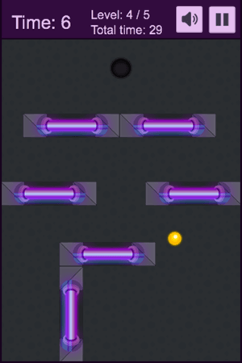
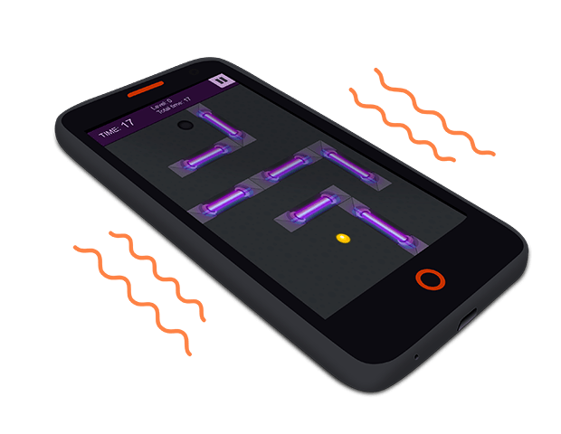

{{GamesSidebar}}

In this tutorial we'll go through the process of building an HTML mobile game that uses the [Device Orientation](/en-US/docs/Web/Apps/Fundamentals/gather_and_modify_data/responding_to_device_orientation_changes) and [Vibration](/en-US/docs/Web/API/Vibration_API) **APIs** to enhance the gameplay and is built using the [Phaser](https://phaser.io/) framework. Basic JavaScript knowledge is recommended to get the most from this tutorial.

## Example game

By the end of the tutorial you will have a fully functional demo game: [Cyber Orb](https://orb.enclavegames.com/). It will look something like this:



## Phaser framework

[Phaser](https://phaser.io/) is a framework for building desktop and mobile HTML games. It's quite new, but growing rapidly thanks to the passionate community involved in the development process. You can check it out [on GitHub](https://github.com/photonstorm/phaser) where it's open sourced, read the [online documentation](https://phaser.io/docs/) and go through the big collection of [examples](https://phaser.io/examples). The Phaser framework provides you with a set of tools that will speed up development and help handle generic tasks needed to complete the game, so you can focus on the game idea itself.

## Starting with the project

You can see [Cyber Orb source code](https://github.com/EnclaveGames/Cyber-Orb) on GitHub. The folder structure is quite straightforward: the starting point is the `index.html` file where we initialize the framework and set up an {{htmlelement("canvas")}} to render the game on.


You can open the index file in your favorite browser to launch the game and try it. There are also three folders in the directory:

- `img`: All the images that we will use in the game.
- `src`: The JavaScript files with all the source code of the game defined inside.
- `audio:` The sound files used in the game.

## Setting up the Canvas

We will be rendering our game on Canvas, but we won't do it manually — this will be taken care of by the framework. Let's set it up: our starting point is the `index.html` file with the following content. You can create this yourself if you want to follow along:

```html
<!DOCTYPE html>
<html lang="en-GB">
  <head>
    <meta charset="utf-8" />
    <title>Cyber Orb demo</title>
    <style>
      body {
        margin: 0;
        background: #333;
      }
    </style>
    <script src="src/phaser-arcade-physics.2.2.2.min.js"></script>
    <script src="src/Boot.js"></script>
    <script src="src/Preloader.js"></script>
    <script src="src/MainMenu.js"></script>
    <script src="src/Howto.js"></script>
    <script src="src/Game.js"></script>
  </head>
  <body>
    <script>
      (() => {
        const game = new Phaser.Game(320, 480, Phaser.CANVAS, "game");
        game.state.add("Boot", Ball.Boot);
        game.state.add("Preloader", Ball.Preloader);
        game.state.add("MainMenu", Ball.MainMenu);
        game.state.add("Howto", Ball.Howto);
        game.state.add("Game", Ball.Game);
        game.state.start("Boot");
      })();
    </script>
  </body>
</html>
```

So far we have a simple HTML website with some basic content in the `<head>` section: charset, title, CSS styling and the inclusion of the JavaScript files. The `<body>` contains initialization of the Phaser framework and the definitions of the game states.

```js
const game = new Phaser.Game(320, 480, Phaser.CANVAS, "game");
```

The line above will initialize the Phaser instance — the arguments are the width of the Canvas, height of the Canvas, rendering method (we're using `CANVAS`, but there are also `WEBGL` and `AUTO` options available) and the optional ID of the DOM container we want to put the Canvas in. If there's nothing specified in that last argument or the element is not found, the Canvas will be added to the \<body> tag. Without the framework, to add the Canvas element to the page, you would have to write something like this inside the \<body> tag:

```html
<canvas id="game" width="320" height="480"></canvas>
```

The important thing to remember is that the framework is setting up helpful methods to speed up a lot of things like image manipulation or assets management, which would be a lot harder to do manually.

> **Note:** You can read the [Building Monster Wants Candy](https://gamedevelopment.tutsplus.com/tutorials/getting-started-with-phaser-building-monster-wants-candy--cms-21723) article for the in-depth introduction to the basic Phaser-specific functions and methods.

Back to game states: the line below is adding a new state called `Boot` to the game:

```js
game.state.add("Boot", Ball.Boot);
```

The first value is the name of the state and the second one is the object we want to assign to it. The `start` method is starting the given state and making it active. Let's see what the states are actually.

## Managing game states

The states in Phaser are separate parts of the game logic; in our case we're loading them from independent JavaScript files for better maintainability. The basic states used in this game are: `Boot`, `Preloader`, `MainMenu`, `Howto` and `Game`. `Boot` will take care of initializing a few settings, `Preloader` will load all of the assets like graphics and audio, `MainMenu` is the menu with the start button, `Howto` shows the "how to play" instructions and the `Game` state lets you actually play the game. Let's quickly go through the content of those states.

### Boot.js

The `Boot` state is the first one in the game.

```js
const Ball = {
  _WIDTH: 320,
  _HEIGHT: 480,
};

Ball.Boot = function (game) {};
Ball.Boot.prototype = {
  preload() {
    this.load.image("preloaderBg", "img/loading-bg.png");
    this.load.image("preloaderBar", "img/loading-bar.png");
  },
  create() {
    this.game.scale.scaleMode = Phaser.ScaleManager.SHOW_ALL;
    this.game.scale.pageAlignHorizontally = true;
    this.game.scale.pageAlignVertically = true;
    this.game.state.start("Preloader");
  },
};
```

The main `Ball` object is defined and we're adding two variables called `_WIDTH` and `_HEIGHT` that are the width and the height of the game Canvas — they will help us position the elements on the screen. We're loading two images first that will be used later in the `Preload` state to show the progress of loading all the other assets. The `create` function holds some basic configuration: we're setting up the scaling and alignment of the Canvas, and moving on to the `Preload` state when everything's ready.

### Preloader.js

The `Preloader` state takes care of loading all the assets:

```js
Ball.Preloader = function (game) {};
Ball.Preloader.prototype = {
  preload() {
    this.preloadBg = this.add.sprite(
      (Ball._WIDTH - 297) * 0.5,
      (Ball._HEIGHT - 145) * 0.5,
      "preloaderBg"
    );
    this.preloadBar = this.add.sprite(
      (Ball._WIDTH - 158) * 0.5,
      (Ball._HEIGHT - 50) * 0.5,
      "preloaderBar"
    );
    this.load.setPreloadSprite(this.preloadBar);

    this.load.image("ball", "img/ball.png");
    // …
    this.load.spritesheet("button-start", "img/button-start.png", 146, 51);
    // …
    this.load.audio("audio-bounce", [
      "audio/bounce.ogg",
      "audio/bounce.mp3",
      "audio/bounce.m4a",
    ]);
  },
  create() {
    this.game.state.start("MainMenu");
  },
};
```

There are single images, spritesheets and audio files loaded by the framework. In this state the `preloadBar` is showing the progress on the screen. That progress of the loaded assets is visualized by the framework with the use of one image. With every asset loaded you can see more of the `preloadBar` image: from 0% to 100%, updated on every frame. After all the assets are loaded, the `MainMenu` state is launched.

### MainMenu.js

The `MainMenu` state shows the main menu of the game, where you can start playing by clicking the button.

```js
Ball.MainMenu = function (game) {};
Ball.MainMenu.prototype = {
  create() {
    this.add.sprite(0, 0, "screen-mainmenu");
    this.gameTitle = this.add.sprite(Ball._WIDTH * 0.5, 40, "title");
    this.gameTitle.anchor.set(0.5, 0);
    this.startButton = this.add.button(
      Ball._WIDTH * 0.5,
      200,
      "button-start",
      this.startGame,
      this,
      2,
      0,
      1
    );
    this.startButton.anchor.set(0.5, 0);
    this.startButton.input.useHandCursor = true;
  },
  startGame() {
    this.game.state.start("Howto");
  },
};
```

To create a new button there's `add.button` method with the following list of optional arguments:

- Top absolute position on Canvas in pixels.
- Left absolute position on Canvas in pixels.
- Name of the image asset the button is using.
- Function that will be executed when someone clicks the button.
- The execution context.
- Frame from the image asset used as the button's "hover" state.
- Frame from the image asset used as the button's "normal" or "out" state.
- Frame from the image asset used as the button's "click" or "down" state.

The `anchor.set` is setting up the anchor point on the button for which all the calculations of the position are applied. In our case it's anchored half the way from the left edge and at the start of the top edge, so it can be easily horizontally centered on the screen without the need to know its width.

When the start button is pressed, instead of jumping directly into the action the game will show the screen with the information on how to play the game.

### Howto.js

```js
Ball.Howto = function (game) {};
Ball.Howto.prototype = {
  create() {
    this.buttonContinue = this.add.button(
      0,
      0,
      "screen-howtoplay",
      this.startGame,
      this
    );
  },
  startGame() {
    this.game.state.start("Game");
  },
};
```

The `Howto` state shows the gameplay instructions on the screen before starting the game. After clicking the screen the actual game is launched.

### Game.js

The `Game` state from the `Game.js` file is where all the magic happens. All the initialization is in the `create()` function (launched once at the beginning of the game). After that some functionality will require further code to control — we will write our own functions to handle more complicated tasks. In particular, take note of the `update()` function (executed at every frame), which updates things such as the ball position.

```js
Ball.Game = function (game) {};
Ball.Game.prototype = {
  create() {},
  initLevels() {},
  showLevel(level) {},
  updateCounter() {},
  managePause() {},
  manageAudio() {},
  update() {},
  wallCollision() {},
  handleOrientation(e) {},
  finishLevel() {},
};
```

The `create` and `update` functions are framework-specific, while others will be our own creations:

- `initLevels` initializes the level data.
- `showLevel` prints the level data on the screen.
- `updateCounter` updates the time spent playing each level and records the total time spent playing the game.
- `managePause` pauses and resumes the game.
- `manageAudio` turns the audio on and off.
- `wallCollision` is executed when the ball hits the walls or other objects.
- `handleOrientation` is the function bound to the event responsible for the Device Orientation API, providing the motion controls when the game is running on a mobile device with appropriate hardware.
- `finishLevel` loads a new level when the current level is completed, or finished the game if the final level is completed.

#### Adding the ball and its motion mechanics

First, let's go to the `create()` function, initialize the ball object itself and assign a few properties to it:

```js
this.ball = this.add.sprite(this.ballStartPos.x, this.ballStartPos.y, "ball");
this.ball.anchor.set(0.5);
this.physics.enable(this.ball, Phaser.Physics.ARCADE);
this.ball.body.setSize(18, 18);
this.ball.body.bounce.set(0.3, 0.3);
```

Here we're adding a sprite at the given place on the screen and using the `'ball'` image from the loaded graphic assets. We're also setting the anchor for any physics calculations to the middle of the ball, enabling the Arcade physics engine (which handles all the physics for the ball movement), and setting the size of the body for the collision detection. The `bounce` property is used to set the bounciness of the ball when it hits the obstacles.

#### Controlling the ball

It's cool to have the ball ready to be thrown around in the play area, but it's also important to be able to actually move it! Now we will add the ability to control the ball with the keyboard on the desktop devices, and then we will move to the implementation of the Device Orientation API. Let's focus on the keyboard first by adding the following to the `create()` function :

```js
this.keys = this.game.input.keyboard.createCursorKeys();
```

As you can see there's a special Phaser function called `createCursorKeys()`, which will give us an object with event handlers for the four arrow keys to play with: up, down, left and right.

Next we will add the following code to the `update()` function, so it will be fired on every frame. The `this.keys` object will be checked against player input, so the ball can react accordingly with the predefined force:

```js
if (this.keys.left.isDown) {
  this.ball.body.velocity.x -= this.movementForce;
} else if (this.keys.right.isDown) {
  this.ball.body.velocity.x += this.movementForce;
}
if (this.keys.up.isDown) {
  this.ball.body.velocity.y -= this.movementForce;
} else if (this.keys.down.isDown) {
  this.ball.body.velocity.y += this.movementForce;
}
```

That way we can check which key is pressed at the given frame and apply the defined force to the ball, thus increase the velocity in the proper direction.

#### Implementing the Device Orientation API

Probably the most interesting part of the game is its usage of the **Device Orientation API** for control on mobile devices. Thanks to this you can play the game by tilting the device in the direction you want the ball to roll. Here's the code from the `create()` function responsible for this:

```js
window.addEventListener("deviceorientation", this.handleOrientation, true);
```

We're adding an event listener to the `"deviceorientation"` event and binding the `handleOrientation` function which looks like this:

```js
handleOrientation(e) {
  const x = e.gamma;
  const y = e.beta;
  Ball._player.body.velocity.x += x;
  Ball._player.body.velocity.y += y;
},
```

The more you tilt the device, the more force is applied to the ball, therefore the faster it moves (the velocity is higher).


> **Note:** To find more out about implementing device orientation and what raw code would look like, read [Keep it level: responding to device orientation changes](/en-US/docs/Web/Apps/Fundamentals/gather_and_modify_data/responding_to_device_orientation_changes).

#### Adding the hole

The main objective in the game is to move the ball from the starting position to the ending position: a hole in the ground. Implementation looks very similar to the part where we created the ball, and it's also added in the `create()` function of our `Game` state:

```js
this.hole = this.add.sprite(Ball._WIDTH * 0.5, 90, "hole");
this.physics.enable(this.hole, Phaser.Physics.ARCADE);
this.hole.anchor.set(0.5);
this.hole.body.setSize(2, 2);
```

The difference is that our hole's body will not move when we hit it with the ball and will have the collision detection calculated (which will be discussed later on in this article).

#### Building the block labyrinth

To make the game harder and more interesting we will add some obstacles between the ball and the exit. We could use a level editor, but for the sake of this tutorial let's create something on our own.

To hold the block information we'll use a level data array: for each block we'll store the top and left absolute positions in pixels (`x` and `y`) and the type of the block — horizontal or vertical (`t` with the `'w'` value meaning width and `'h'` meaning height). Then, to load the level we'll parse the data and show the blocks specific for that level. In the `initLevels` function we have:

```js
this.levelData = [
  [{ x: 96, y: 224, t: "w" }],
  [
    { x: 72, y: 320, t: "w" },
    { x: 200, y: 320, t: "h" },
    { x: 72, y: 150, t: "w" },
  ],
  // …
];
```

Every array element holds a collection of blocks with an `x` and `y` position and `t` value for each. After `levelData`, but still in the `initLevels` function, we're adding the blocks into an array in the `for` loop using some of the framework-specific methods:

```js
for (let i = 0; i < this.maxLevels; i++) {
  const newLevel = this.add.group();
  newLevel.enableBody = true;
  newLevel.physicsBodyType = Phaser.Physics.ARCADE;
  for (let e = 0; e < this.levelData[i].length; e++) {
    const item = this.levelData[i][e];
    newLevel.create(item.x, item.y, `element-${item.t}`);
  }
  newLevel.setAll("body.immovable", true);
  newLevel.visible = false;
  this.levels.push(newLevel);
}
```

First, `add.group()` is used to create a new group of items. Then the `ARCADE` body type is set for that group to enable physics calculations. The `newLevel.create` method creates new items in the group with starting left and top positions, and its own image. If you don't want to loop through the list of items again to add a property to every single one explicitly, you can use `setAll` on a group to apply it to all the items in that group.

The objects are stored in the `this.levels` array, which is by default invisible. To load specific levels, we make sure the previous levels are hidden, and show the current one:

```js
showLevel(level) {
  const lvl = level | this.level;
  if (this.levels[lvl - 2]) {
    this.levels[lvl - 2].visible = false;
  }
  this.levels[lvl - 1].visible = true;
}
```

Thanks to that the game gives the player a challenge - now they have to roll the ball across the play area and guide it through the labyrinth built from the blocks. It's just an example of loading the levels, and there are only 5 of them just to showcase the idea, but you can work on expanding that on your own.

#### Collision detection

At this point we've got the ball that is controlled by the player, the hole to reach and the obstacles blocking the way. There's a problem though — our game doesn't have any collision detection yet, so nothing happens when the ball hits the blocks — it just goes through. Let's fix it! The good news is that the framework will take care of calculating the collision detection, we only have to specify the colliding objects in the `update()` function:

```js
this.physics.arcade.collide(
  this.ball,
  this.borderGroup,
  this.wallCollision,
  null,
  this
);
this.physics.arcade.collide(
  this.ball,
  this.levels[this.level - 1],
  this.wallCollision,
  null,
  this
);
```

This will tell the framework to execute the `wallCollision` function when the ball hits any of the walls. We can use the `wallCollision` function to add any functionality we want like playing the bounce sound and implementing the **Vibration API**.

#### Adding the sound

Among the preloaded assets there was an audio track (in various formats for browser compatibility), which we can use now. It has to be defined in the `create()` function first:

```js
this.bounceSound = this.game.add.audio("audio-bounce");
```

If the status of the audio is `true` (so the sounds in the game are enabled), we can play it in the `wallCollision` function:

```js
if (this.audioStatus) {
  this.bounceSound.play();
}
```

That's all — loading and playing the sounds is easy with Phaser.

#### Implementing the Vibration API

When collision detection works as expected let's add some special effects with the help from the Vibration API.



The best way to use it in our case is to vibrate the phone every time the ball hits the walls — inside the `wallCollision` function:

```js
if ("vibrate" in window.navigator) {
  window.navigator.vibrate(100);
}
```

If the `vibrate` method is supported by the browser and available in the `window.navigator` object, vibrate the phone for 100 milliseconds. That's it!

#### Adding the elapsed time

To improve replayability and give players the option to compete with each other we will store the elapsed time — players can then try to improve on their best game completion time. To implement this we have to create a variable for storing the actual number of seconds elapsed from the start of the game, and to show it for the player in the game. Let's define the variables in the `create` function first:

```js
this.timer = 0; // time elapsed in the current level
this.totalTimer = 0; // time elapsed in the whole game
```

Then, right after that, we can initialize the necessary text objects to display this information to the user:

```js
this.timerText = this.game.add.text(
  15,
  15,
  `Time: ${this.timer}`,
  this.fontBig
);
this.totalTimeText = this.game.add.text(
  120,
  30,
  `Total time: ${this.totalTimer}`,
  this.fontSmall
);
```

We're defining the top and left positions of the text, the content that will be shown and the styling applied to the text. We have this printed out on the screen, but it would be good to update the values every second:

```js
this.time.events.loop(Phaser.Timer.SECOND, this.updateCounter, this);
```

This loop, also in the `create` function, will execute the `updateCounter` function every single second from the beginning of the game, so we can apply the changes accordingly. This is how the complete `updateCounter` function looks:

```js
updateCounter() {
  this.timer++;
  this.timerText.setText(`Time: ${this.timer}`);
  this.totalTimeText.setText(`Total time: ${this.totalTimer+this.timer}`);
},
```

As you can see we're incrementing the `this.timer` variable and updating the content of the text objects with the current values on each iteration, so the player sees the elapsed time.

#### Finishing the level and the game

The ball is rolling on the screen, the timer is working and we have the hole created that we have to reach. Now let's set up the possibility to actually finish the level! The following line in the `update()` function adds a listener that fires when the ball gets to the hole.

```js
this.physics.arcade.overlap(this.ball, this.hole, this.finishLevel, null, this);
```

This works similarly to the `collide` method explained earlier. When the ball overlaps with the hole (instead of colliding), the `finishLevel` function is executed:

```js
finishLevel() {
  if (this.level >= this.maxLevels) {
    this.totalTimer += this.timer;
    alert(`Congratulations, game completed!\nTotal time of play: ${this.totalTimer} seconds!`);
    this.game.state.start('MainMenu');
  } else {
    alert(`Congratulations, level ${this.level} completed!`);
    this.totalTimer += this.timer;
    this.timer = 0;
    this.level++;
    this.timerText.setText(`Time: ${this.timer}`);
    this.totalTimeText.setText(`Total time: ${this.totalTimer}`);
    this.levelText.setText(`Level: ${this.level} / ${this.maxLevels}`);
    this.ball.body.x = this.ballStartPos.x;
    this.ball.body.y = this.ballStartPos.y;
    this.ball.body.velocity.x = 0;
    this.ball.body.velocity.y = 0;
    this.showLevel();
  }
},
```

If the current level is equal to the maximum number of levels (in this case 5), then the game is finished — you'll get a congratulations message along with the number of seconds elapsed through the whole game, and a button to press that takes you to the main menu.

If the current level is lower than 5, all the necessary variables are reset and the next level is loaded.

## Ideas for new features

This is merely a working demo of a game that could have lots of additional features. We can for example add power-ups to collect along the way that will make our ball roll faster, stop the timer for a few seconds or give the ball special powers to go through obstacles. There's also room for the traps which will slow the ball down or make it more difficult to reach the hole. You can create more levels of increasing difficulty. You can even implement achievements, leaderboards and medals for different actions in the game. There are endless possibilities — they only depend on your imagination.

## Summary

I hope this tutorial will help you dive into 2D game development and inspire you to create awesome games on your own. You can play the demo game [Cyber Orb](https://orb.enclavegames.com/) and check out its [source code on GitHub](https://github.com/EnclaveGames/Cyber-Orb).

HTML gives us raw tools, the frameworks built on top of it are getting faster and better, so now is a great time get into web game development. In this tutorial we used Phaser, but there are a number of [other frameworks](https://html5devstarter.enclavegames.com/#frameworks) worth considering too like [ImpactJS](https://impactjs.com/), [Construct 3](https://www.construct.net/en/make-games/games-editor) or [PlayCanvas](https://playcanvas.com/) — it depends on your preferences, coding skills (or lack thereof), project scale, requirements and other aspects. You should check them all out and decide which one suits your needs best.
