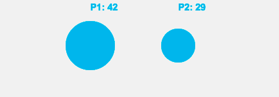

{{GamesSidebar}}

This article is for Touch Event Horizon and A Game Related To It

## Touch Gestures and Events

[Link](/en-US/docs/Web/Apps/Fundamentals/User_input_methods/Touch_Gestures_and_Events)

## The example game

[GitHub repository](https://github.com/EnclaveGames/Touch-Event-Horizon)

[Live demo](https://touch.enclavegames.com/)

### Setting up the canvas

### Counting the taps

touchstart, touchend

### Collecting the bonus

touchmove

## Future developments

## Summary

This tutorial shows how to use Touch Events to create a game on a \<canvas>. This is a multiplayer game relying on the Tap and Drag gestures.
