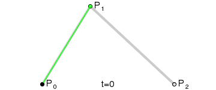

{{GlossarySidebar}}

A **Bézier curve** (pronounced \[bezje]) is a mathematically described curve used in computer graphics and animation. In vector images, they are used to model smooth curves that can be scaled indefinitely.

The curve is defined by a set of control points with a minimum of two. Web related graphics and animations often use cubic Béziers, which are curves with four control points P0, P1, P2, and P3.

To draw a quadratic Bézier curve, two imaginary lines are drawn, one from P0 to P1 and the other from P1 to P2. A third imaginary line is drawn with its starting point moving steadily on the first helper line and the end point on the second helper line. On this imaginary line a point is drawn from its starting point moving steadily to its end point. The curve this point describes is the Bézier curve. Here's an animated illustration demonstrating the creation of the curve:

## See also

- [Bézier curve](https://en.wikipedia.org/wiki/B%C3%A9zier_curve) on Wikipedia
- [Cubic Bézier easing functions in CSS](/en-US/docs/Web/CSS/easing-function/cubic-bezier)
- {{SVGAttr("keySplines")}} SVG attribute
