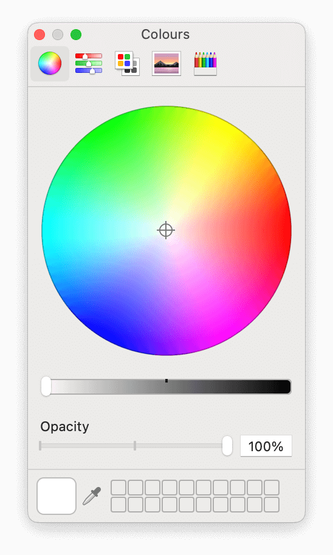

{{GlossarySidebar}}

A **color wheel**, or a _color circle_, represents a palette of colors in chart form, arranged in a circle. A color wheel can display colors identified by two polar coordinates, the _angle_ and the _distance_ from the origin, the circle's center.

Color wheels are convenient for comparing colors expressed in polar or cylindrical coordinates, like [`hsl()`](/en-US/docs/Web/CSS/color_value/hsl), [`hwb()`](/en-US/docs/Web/CSS/color_value/hwb), or [`lch()`](/en-US/docs/Web/CSS/color_value/lch).

In such cases, _complementary colors_ are often found opposite on the same diameter. Similarly, _monochromatic colors_ – colors of the same _tone_ but of different _shades_ – are located on the same radius, and _triadic colors_ – three colors evenly spaced around the color wheel that lead to colors that work well together – are also easy to find.

Color wheels are used in real life when we want to choose between different hues. For example, when selecting wall paint or the color for a piece of furniture.

In the digital world, color wheels are used in _color pickers_, like the default one on macOS:

## See also

- Related glossary terms:
  - {{glossary("Color space")}}
- [`<color>`](/en-US/docs/Web/CSS/color_value) the CSS data type
- [Color theory and the color wheel](https://www.canva.com/colors/color-wheel/)
- [How to Use the Color Wheel to Pick Your Perfect Color Palette](https://www.bhg.com/decorating/color/basics/color-wheel-color-chart/) on Better Homes & Gardens
- [Color wheel](https://en.wikipedia.org/wiki/Color_wheel) on Wikipedia
