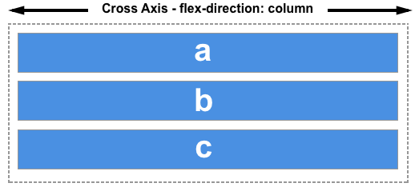

{{GlossarySidebar}}

The cross axis in {{glossary("flexbox")}} runs perpendicular to the {{glossary("main axis")}}, therefore if your {{cssxref("flex-direction")}} is either `row` or `row-reverse` then the cross axis runs down the columns.

If your main axis is `column` or `column-reverse` then the cross axis runs along the rows.

Alignment of items on the cross axis is achieved with the `align-items` property on the flex container or `align-self` property on individual items. In the case of a multi-line flex container, with additional space on the cross axis, you can use `align-content` to control the spacing of the rows.

## See also

### Property reference

- {{cssxref("align-content")}}
- {{cssxref("align-items")}}
- {{cssxref("align-self")}}
- {{cssxref("flex-wrap")}}
- {{cssxref("flex-direction")}}
- {{cssxref("flex")}}
- {{cssxref("flex-basis")}}
- {{cssxref("flex-flow")}}
- {{cssxref("flex-grow")}}
- {{cssxref("flex-shrink")}}
- {{cssxref("justify-content")}}
- {{cssxref("order")}}

### Further reading

- CSS Flexbox Guide: _[Basic Concepts of Flexbox](/en-US/docs/Web/CSS/CSS_Flexible_Box_Layout/Basic_Concepts_of_Flexbox)_
- CSS Flexbox Guide: _[Aligning items in a flex container](/en-US/docs/Web/CSS/CSS_Flexible_Box_Layout/Aligning_Items_in_a_Flex_Container)_
- CSS Flexbox Guide: _[Mastering wrapping of flex items](/en-US/docs/Web/CSS/CSS_Flexible_Box_Layout/Mastering_Wrapping_of_Flex_Items)_
- [Glossary](/en-US/docs/Glossary)

  - {{Glossary("Flex")}}
  - {{Glossary("Flex Container")}}
  - {{Glossary("Flex Item")}}
  - {{Glossary("Grid")}}
