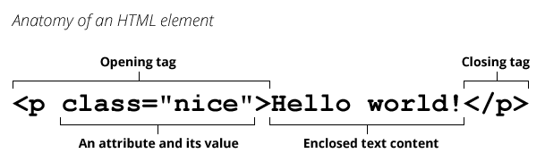

An **element** is a part of a webpage. In {{glossary("XML")}} and {{glossary("HTML")}}, an element may contain a data item or a chunk of text or an image, or perhaps nothing. A typical element includes an opening tag with some {{glossary("attribute", "attributes")}}, enclosed text content, and a closing tag.

Elements and {{glossary("tag", "tags")}} are _not_ the same things. Tags begin or end an element in source code, whereas elements are part of the {{Glossary("DOM")}}, the document model for displaying the page in the {{glossary("browser")}}.

## See also

- [Getting started with HTML](/en-US/docs/Learn/HTML/Introduction_to_HTML/Getting_started)
- [Defining custom elements](/en-US/docs/Web/Web_Components/Using_custom_elements)
- The {{domxref("Element")}} interface, representing an element in the DOM.
