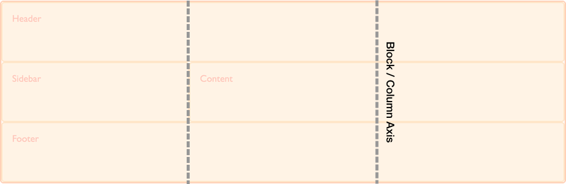
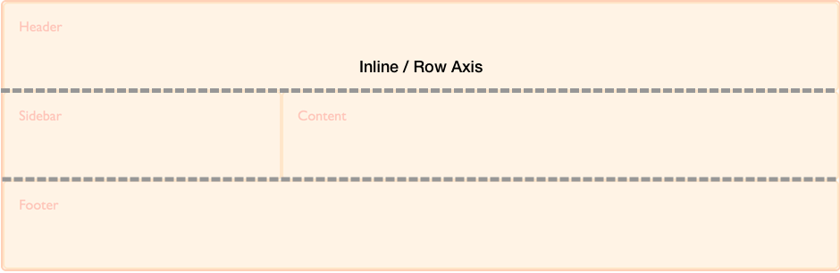

{{GlossarySidebar}}

CSS grid layout is a two-dimensional layout method enabling the laying out of content in _rows_ and _columns_. Therefore in any grid we have two axes. The _block or column axis_, and the _inline or row axis_.

It is along these axes that items can be aligned and justified using the properties defined in the [Box Alignment specification](/en-US/docs/Web/CSS/CSS_grid_layout/Box_alignment_in_grid_layout).

In CSS the _block or column axis_ is the axis used when laying out blocks of text. If you have two paragraphs and are working in a right to left, top to bottom language they lay out one below the other, on the block axis.

The _inline or row axis_ runs across the Block Axis and is the direction along which regular text flows. These are our rows in CSS grid layout.

The physical direction of these axes can change according to the [writing mode](/en-US/docs/Web/CSS/CSS_grid_layout/Grids_logical_values_and_writing_modes) of the document.

## See also

- [Basic concepts of grid layout](/en-US/docs/Web/CSS/CSS_grid_layout/Basic_concepts_of_grid_layout)
- [Box alignment in grid layout](/en-US/docs/Web/CSS/CSS_grid_layout/Box_alignment_in_grid_layout)
- [Grids, logical values and writing modes](/en-US/docs/Web/CSS/CSS_grid_layout/Grids_logical_values_and_writing_modes)
