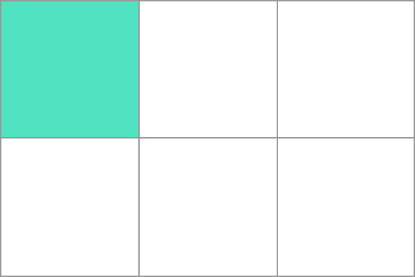

{{GlossarySidebar}}

In a [CSS Grid Layout](/en-US/docs/Web/CSS/CSS_Grid_Layout), a **grid cell** is the smallest unit you can have on your CSS grid. It is the space between four intersecting {{glossary("grid lines")}} and conceptually much like a table cell.



If you do not place items using one of the grid placement methods, direct children of the grid container will be placed one into each individual grid cell by the auto-placement algorithm. Additional row or column {{glossary("grid tracks", "tracks")}} will be created to create enough cells to hold all items.

## Example

In the example we have created a three column track grid. The five items are placed into grid cells working along an initial row of three grid cells, then creating a new row for the remaining two.

```css hidden
* {
  box-sizing: border-box;
}

.wrapper {
  border: 2px solid #f76707;
  border-radius: 5px;
  background-color: #fff4e6;
}

.wrapper > div {
  border: 2px solid #ffa94d;
  border-radius: 5px;
  background-color: #ffd8a8;
  padding: 1em;
  color: #d9480f;
}
```

```css
.wrapper {
  display: grid;
  grid-template-columns: repeat(3, 1fr);
  grid-auto-rows: 100px;
}
```

```html
<div class="wrapper">
  <div>One</div>
  <div>Two</div>
  <div>Three</div>
  <div>Four</div>
  <div>Five</div>
</div>
```

{{ EmbedLiveSample('Example', '300', '280') }}

## See also

### Property reference

- {{cssxref("grid-template-columns")}}
- {{cssxref("grid-template-rows")}}
- {{cssxref("grid-auto-rows")}}
- {{cssxref("grid-auto-columns")}}

### Further reading

- CSS Grid Layout Guide: _[Basic concepts of grid layout](/en-US/docs/Web/CSS/CSS_Grid_Layout/Basic_Concepts_of_Grid_Layout)_
- [Definition of Grid Cells in the CSS Grid Layout specification](https://drafts.csswg.org/css-grid/#grid-track-concept)
