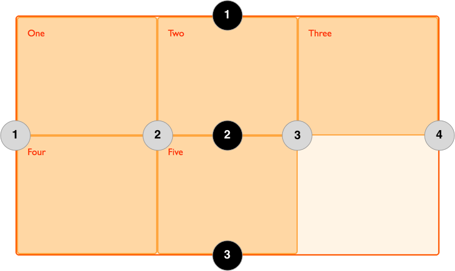

{{GlossarySidebar}}

**Grid lines** are created anytime you use a [CSS grid layout](/en-US/docs/Web/CSS/CSS_grid_layout).

## Example

In the following example there is a grid with three column tracks and two row tracks. This gives us 4 column lines and 3 row lines.

```css hidden
* {
  box-sizing: border-box;
}

.wrapper {
  border: 2px solid #f76707;
  border-radius: 5px;
  background-color: #fff4e6;
  display: grid;
  grid-template-columns: repeat(3, 1fr);
  grid-template-rows: repeat(3, 100px);
}

.wrapper > div {
  border: 2px solid #ffa94d;
  border-radius: 5px;
  background-color: #ffd8a8;
  padding: 1em;
  color: #d9480f;
}
```

```html
<div class="wrapper">
  <div>One</div>
  <div>Two</div>
  <div>Three</div>
  <div>Four</div>
  <div>Five</div>
</div>
```

```css
.wrapper {
  display: grid;
  grid-template-columns: repeat(3, 1fr);
  grid-template-rows: 100px 100px;
}
```

{{ EmbedLiveSample('Example', '500', '250') }}

Lines can be addressed using their line number. In a left-to-right language such as English, column line 1 will be on the left of the grid, row line 1 on the top. Lines numbers respect the [writing mode](/en-US/docs/Web/CSS/CSS_writing_modes) of the document and so in a right-to-left language for example, column line 1 will be on the right of the grid. The image below shows the line numbers of the grid, assuming the language is left-to-right.



Lines are also created in the _implicit grid_ when implicit tracks are created to hold content positioned outside of the _explicit grid_, however these lines cannot be addressed by a number.

## Placing items onto the grid by line number

Having created a grid, you can place items onto the grid by line number. In the following example the item is positioned from column line 1 to column line 3, and from row line 1 to row line 3.

```css hidden
* {
  box-sizing: border-box;
}

.wrapper {
  border: 2px solid #f76707;
  border-radius: 5px;
  background-color: #fff4e6;
  display: grid;
  grid-template-columns: repeat(3, 1fr);
  grid-template-rows: repeat(3, 100px);
}

.wrapper > div {
  border: 2px solid #ffa94d;
  border-radius: 5px;
  background-color: #ffd8a8;
  padding: 1em;
  color: #d9480f;
}
```

```html
<div class="wrapper">
  <div class="item">Item</div>
</div>
```

```css
.wrapper {
  display: grid;
  grid-template-columns: repeat(3, 1fr);
  grid-template-rows: 100px 100px;
}
.item {
  grid-column-start: 1;
  grid-column-end: 3;
  grid-row-start: 1;
  grid-row-end: 3;
}
```

{{ EmbedLiveSample('Placing_items_onto_the_grid_by_line_number', '500', '250') }}

## Naming lines

The lines created in the _explicit grid_ can be named, by adding the name in square brackets before or after the track sizing information. When placing an item, you can then use these names instead of the line number, as demonstrated below.

```css hidden
* {
  box-sizing: border-box;
}

.wrapper {
  border: 2px solid #f76707;
  border-radius: 5px;
  background-color: #fff4e6;
  display: grid;
  grid-template-columns: repeat(3, 1fr);
  grid-template-rows: repeat(3, 100px);
}

.wrapper > div {
  border: 2px solid #ffa94d;
  border-radius: 5px;
  background-color: #ffd8a8;
  padding: 1em;
  color: #d9480f;
}
```

```html
<div class="wrapper">
  <div class="item">Item</div>
</div>
```

```css
.wrapper {
  display: grid;
  grid-template-columns: [col1-start] 1fr [col2-start] 1fr [col3-start] 1fr [cols-end];
  grid-template-rows: [row1-start] 100px [row2-start] 100px [rows-end];
}
.item {
  grid-column-start: col1-start;
  grid-column-end: col3-start;
  grid-row-start: row1-start;
  grid-row-end: rows-end;
}
```

{{ EmbedLiveSample('Naming_lines', '500', '250') }}

## See also

### Property reference

- {{cssxref("grid-template-columns")}}
- {{cssxref("grid-template-rows")}}
- {{cssxref("grid-column-start")}}
- {{cssxref("grid-column-end")}}
- {{cssxref("grid-column")}}
- {{cssxref("grid-row-start")}}
- {{cssxref("grid-row-end")}}
- {{cssxref("grid-row")}}

### Further reading

- CSS grid layout guides:
  - [Basic concepts of grid layout](/en-US/docs/Web/CSS/CSS_grid_layout/Basic_concepts_of_grid_layout)
  - [Line-based placement with CSS grid](/en-US/docs/Web/CSS/CSS_grid_layout/Grid_layout_using_line-based_placement)
  - [Layout using named grid lines](/en-US/docs/Web/CSS/CSS_grid_layout/Grid_layout_using_named_grid_lines)
  - [CSS grids, logical values and writing modes](/en-US/docs/Web/CSS/CSS_grid_layout/Grids_logical_values_and_writing_modes)
- [Definition of grid lines in the CSS grid layout specification](https://drafts.csswg.org/css-grid/#grid-line-concept)
