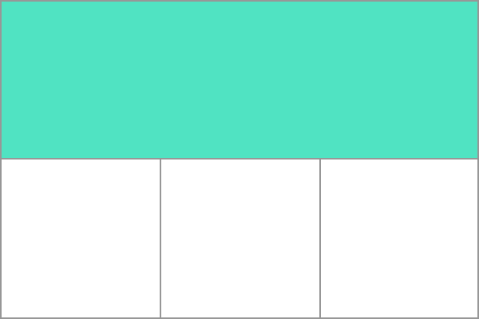

{{GlossarySidebar}}

A **grid track** is the space between two adjacent {{glossary("grid lines")}}. They are defined in the _explicit grid_ by using the {{cssxref("grid-template-columns")}} and {{cssxref("grid-template-rows")}} properties or the shorthand {{cssxref("grid")}} or {{cssxref("grid-template")}} properties. Tracks are also created in the _implicit grid_ by positioning a grid item outside of the tracks created in the explicit grid.

The image below shows the first row track on a grid.



## Track sizing in the explicit grid

When defining grid tracks using {{cssxref("grid-template-columns")}} and {{cssxref("grid-template-rows")}} you may use any length unit, and also the flex unit, `fr` which indicates a portion of the available space in the grid container.

## Example

The example below demonstrates a grid with three column tracks, one of 200 pixels, the second of 1fr, the third of 3fr. Once the 200 pixels has been subtracted from the space available in the grid container, the remaining space is divided by 4. One part is given to column 2, 3 parts to column 3.

```css hidden
* {
  box-sizing: border-box;
}

.wrapper {
  border: 2px solid #f76707;
  border-radius: 5px;
  background-color: #fff4e6;
}

.wrapper > div {
  border: 2px solid #ffa94d;
  border-radius: 5px;
  background-color: #ffd8a8;
  padding: 1em;
  color: #d9480f;
}
```

```css
.wrapper {
  display: grid;
  grid-template-columns: 200px 1fr 3fr;
}
```

```html
<div class="wrapper">
  <div>One</div>
  <div>Two</div>
  <div>Three</div>
  <div>Four</div>
  <div>Five</div>
</div>
```

{{ EmbedLiveSample('Example', '500', '230') }}

## Track sizing in the implicit grid

Tracks created in the implicit grid are auto-sized by default, however you can define a size for these tracks using the {{cssxref("grid-auto-rows")}} and {{cssxref("grid-auto-columns")}} properties.

## See also

- [Basic concepts of grid layout](/en-US/docs/Web/CSS/CSS_Grid_Layout/Basic_Concepts_of_Grid_Layout)
- [Definition of Grid Tracks in the CSS Grid Layout specification](https://drafts.csswg.org/css-grid/#grid-track-concept)
- Property reference

  - {{cssxref("grid-template-columns")}}
  - {{cssxref("grid-template-rows")}}
  - {{cssxref("grid")}}
  - {{cssxref("grid-template")}}
