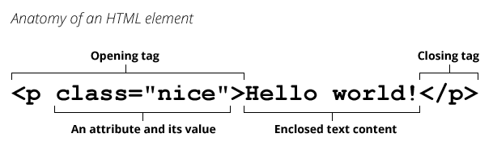

**HTML** (HyperText Markup Language) is a descriptive language that specifies webpage structure.

## Brief history

In 1990, as part of his vision of the {{Glossary("World Wide Web","Web")}}, Tim Berners-Lee defined the concept of {{Glossary("hypertext")}}, which Berners-Lee formalized the following year through a markup mainly based on {{Glossary("SGML")}}. The {{Glossary("IETF")}} began formally specifying HTML in 1993, and after several drafts released version 2.0 in 1995. In 1994 Berners-Lee founded the {{Glossary("W3C")}} to develop the Web. In 1996, the W3C took over the HTML work and published the HTML 3.2 recommendation a year later. HTML 4.0 was released in 1999 and became an {{Glossary("ISO")}} standard in 2000.

At that time, the W3C nearly abandoned HTML in favor of {{Glossary("XHTML")}}, prompting the founding of an independent group called {{Glossary("WHATWG")}} in 2004. Thanks to WHATWG, work on HTML continued: the two organizations released the first draft of {{Glossary("HTML5")}} in 2008 and an official standard in 2014. The term "HTML5" is just a buzzword referring to modern web technologies which are part of the [HTML Living Standard](https://html.spec.whatwg.org).

## Concept and syntax

An HTML document is a plaintext document structured with {{Glossary("element","elements")}}. Elements are surrounded by matching opening and closing {{Glossary("tag","tags")}}. Each tag begins and ends with angle brackets (`<>`). There are a few empty or _void_ tags that cannot enclose any text, for instance {{htmlelement("img")}}.

You can extend HTML tags with {{Glossary("attribute","attributes")}}, which provide additional information affecting how the browser interprets the element:

An HTML file is normally saved with an `.htm` or `.html` extension, served by a {{Glossary("Server","web server")}}, and can be rendered by any {{Glossary("Browser","Web browser")}}.

## See also

- [HTML](https://en.wikipedia.org/wiki/HTML) on Wikipedia
- [Our HTML tutorial](/en-US/docs/Learn/HTML)
- [The web course on codecademy.com](https://www.codecademy.com/learn/learn-html)
- [The HTML documentation on MDN](/en-US/docs/Web/HTML)
- [The HTML specification](https://html.spec.whatwg.org/multipage/)
