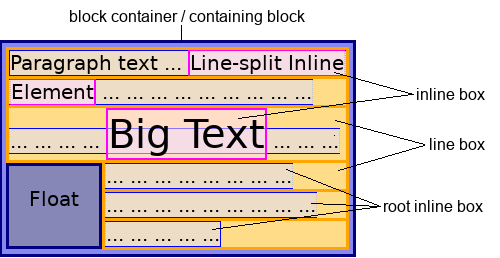

In CSS, content that participates in inline layout is called inline-level content. Mostly text sequences and inline boxes are inline-level.

In inline layout, a mixed stream of text and inline boxes are laid out by fragmenting them into a stack of line boxes. Within each line box, inline-level boxes are aligned to each other vertically/horizontally based on writing mode. Typically, they are allinged by the baselines of their text.



> **Note:** HTML (**HyperText Markup Language**) elements historically were categorized as either "block-level" elements or "inline-level" elements. Since this is a presentational characteristic it is nowadays specified by CSS.

## Examples

```html
<div>
  The following span is an <span class="highlight">inline element</span>; its
  background has been colored to display both the beginning and end of the
  inline element's influence.
</div>
```

In this example, the {{HTMLElement("div")}} element contains some text. Within that text is a {{HTMLElement("span")}} element, which is an inline element. Because the `<span>` element is inline, the paragraph correctly renders as a single, unbroken text flow, like this:

```css hidden
body {
  margin: 0;
  padding: 4px;
  border: 1px solid #333;
}

.highlight {
  background-color: #ee3;
}
```

{{EmbedLiveSample("Examples")}}

## See also

- [block-level](/en-US/docs/Glossary/block-level)
- [Inline formatting context](/en-US/docs/Web/CSS/Inline_formatting_context)
- {{cssxref("display")}}
