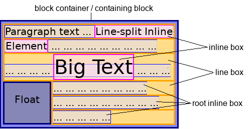

{{GlossarySidebar}}

In CSS, content that participates in inline layout is called **inline-level content**. Most text sequences, replaced elements, and generated content are inline-level by default.

In inline layout, a mixed stream of text, [replaced elements](/en-US/docs/Web/CSS/Replaced_element), and other inline boxes are laid out by fragmenting them into a stack of line boxes. Within each line box, inline-level boxes are aligned to each other vertically or horizontally, depending on the writing mode. Typically, they are aligned by the baselines of their text. This can be changed with CSS.



> [!NOTE]
> HTML (_HyperText Markup Language_) elements historically were categorized as either "block-level" elements or "inline" elements. As a presentational characteristic, this is now specified by CSS.

## Examples

```html
<p>
  This span is an <span class="highlight">inline-level element</span>; its
  background has been colored to display both the beginning and end of the
  element's influence. Input elements, like <input type="radio" /> and
  <input type="checkbox" />, are also inline-level content.
</p>
```

In this example, the {{HTMLElement("p")}} element contains some text. Within that text is a {{HTMLElement("span")}} element and two {{HTMLElement("input")}} elements, which are inline-level elements. If the `<span>` is spread across two lines, two line boxes are generated. Because these elements are inline, the paragraph correctly renders as a single paragraph of unbroken text flow:

```css hidden
body {
  margin: 0;
  padding: 4px;
  border: 1px solid #333;
}

.highlight {
  background-color: #ee3;
}
```

{{EmbedLiveSample("Examples")}}

## See also

- Related glossary terms:
  - {{Glossary("Block-level content")}}
- [Inline formatting context](/en-US/docs/Web/CSS/Inline_formatting_context)
- {{cssxref("display")}}
