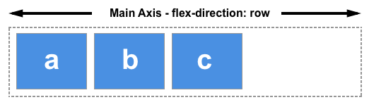

{{GlossarySidebar}}

The main axis in {{glossary("flexbox")}} is defined by the direction set by the {{cssxref("flex-direction")}} property. There are four possible values for `flex-direction`. These are:

- `row`
- `row-reverse`
- `column`
- `column-reverse`

Should you choose `row` or `row-reverse` then your main axis will run along the row in the inline direction.

Choose `column` or `column-reverse` and your main axis will run top to bottom of the page in the block direction.

On the main axis you can control the sizing of flex items by adding any available space to the items themselves, by way of `flex` properties on the items. Or, you can control the space between and around items by using the `justify-content` property.

## See also

### Property reference

- {{cssxref("flex-basis")}}
- {{cssxref("flex-direction")}}
- {{cssxref("flex-grow")}}
- {{cssxref("flex-shrink")}}
- {{cssxref("justify-content")}}
- {{cssxref("flex")}}

### Further reading

- CSS flexbox guides:
  - [Basic concepts of flexbox](/en-US/docs/Web/CSS/CSS_flexible_box_layout/Basic_concepts_of_flexbox)
  - [Aligning items in a flex container](/en-US/docs/Web/CSS/CSS_flexible_box_layout/Aligning_items_in_a_flex_container)
  - [Controlling Ratios of flex items along the main axis](/en-US/docs/Web/CSS/CSS_flexible_box_layout/Controlling_ratios_of_flex_items_along_the_main_axis)
