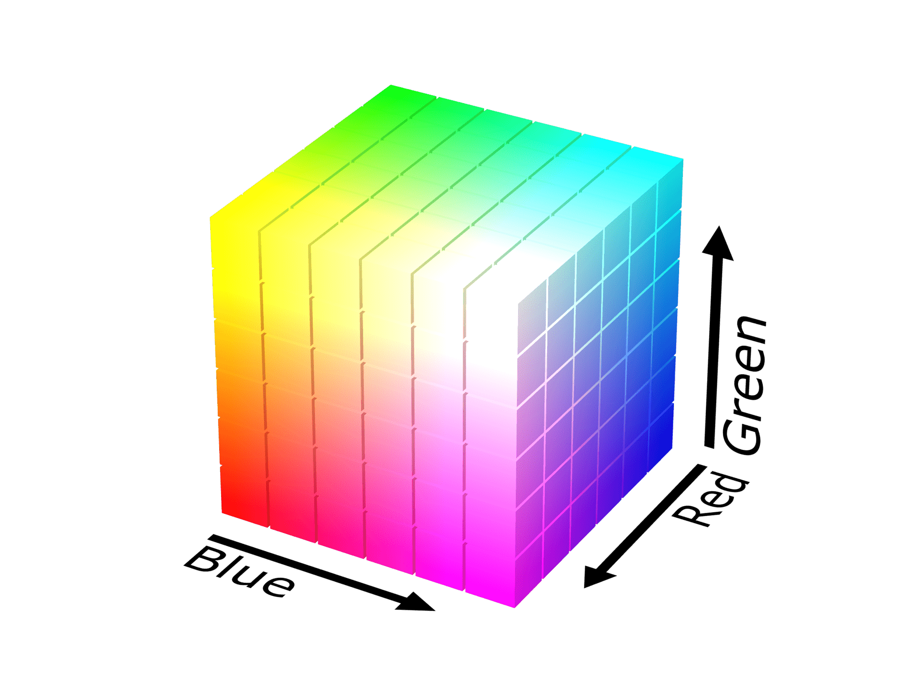

{{GlossarySidebar}}

_Red-Green-Blue_ (**RGB**) is a color model that represents colors as mixtures of three underlying components (or channels), namely: _red_, _green_, and _blue_. This model describes a color with a sequence of three numbers (typically between 0.0 and 1.0, or between 0 and 255). Each number represents the primary colors' different intensities (or contributions) in determining the final color.

An RGB value by itself has no meaning. It's the color model that defines how the three components interact within a {{glossary("color space")}} to define a color. Graphically, a point in a three-dimensional grid or cube represents a color. Each dimension (or axis) corresponds to a different channel. The RGB color model is then a _cubic_, or _Cartesian_, coordinate system of the underlying color space.

For the web, the underlying color space for an RGB value is _sRGB_ (Standard RGB), and each RGB component is a number between 0 and 1.

Note that `sRGB` is one of [several RGB color spaces](/en-US/docs/Glossary/Color_space#rgb_color_spaces). Other RGB color spaces, like the _Adobe RGB_ color space, can represent a wider {{glossary("gamut")}} of color than the _sRGB_ color space. The coordinates in _sRGB_ and _Adobe RGB_ are different.

There are many ways to describe the RGB components of a color. In {{Glossary("CSS")}}, they can be represented in various ways: in [hexadecimal](/en-US/docs/Web/CSS/hex-color) notation as a single 24-bit integer (for example, `#add8e6` is light blue) or in functional notation by using [`rgb()`](/en-US/docs/Web/CSS/color_value/rgb) with three percent values or numbers ranging from `0` to `255` (for example, `rgb(46 139 87)` is green). CSS also supports the `srgb`, `srgb-linear`, `a98-rgb`, and `prophoto-rgb` color spaces for the [`color()`](/en-US/docs/Web/CSS/color_value/color) function.

RGB is not the only color model that can represent the `sRGB` {{glossary("color space")}}. Cylindrical coordinate systems like the [`HSL`](/en-US/docs/Web/CSS/color_value/hsl) (_hue-saturation-lightness_) or [`HWB`](/en-US/docs/Web/CSS/color_value/hwb) (_hue-whiteness-blackness_) color models are also used to represent an `sRGB` color on the web.

## See also

- [CSS data type: `<color>`](/en-US/docs/Web/CSS/color_value)
- [ColorAide: sRGB color space](https://facelessuser.github.io/coloraide/colors/srgb/)
- [RGB color model](https://en.wikipedia.org/wiki/RGB_color_model) on Wikipedia
- [sRGB color space](https://en.wikipedia.org/wiki/SRGB) on Wikipedia
- [Adobe RGB color space](https://en.wikipedia.org/wiki/Adobe_RGB_color_space) on Wikipedia
