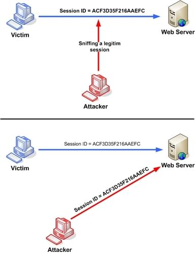

**Session hijacking** occurs when an attacker takes over a valid session between two computers. The attacker steals a valid session ID in order to break into the system and snoop data.

Most authentication occurs only at the start of a {{glossary("TCP")}} session. In TCP session hijacking, an attacker gains access by taking over a TCP session between two machines in mid session.

### Session hijacking occurs because

- no account lockout for invalid session IDs
- weak session-ID generation algorithm
- insecure handling
- indefinite session expiration time
- short session IDs
- transmission in plain text

### Session hijacking process

1. **Sniff**, that is perform a man-in-the-middle (MITM) attack, place yourself between victim and server.
2. **Monitor** packets flowing between server and user.
3. **Break** the victim machine's connection.
4. **Take control** of the session.
5. **Inject** new packets to the server using the Victim's Session ID.

### Protection against session hijacking

- create a secure communication channel with SSH (secure shell)
- pass authentication cookies over HTTPS connection
- implement logout functionality so the user can end the session
- generate the session ID after successful login
- pass encrypted data between the users and the web server
- use a string or long random number as a session key

## See also

- [Session hijacking](https://en.wikipedia.org/wiki/Session_hijacking) on Wikipedia
