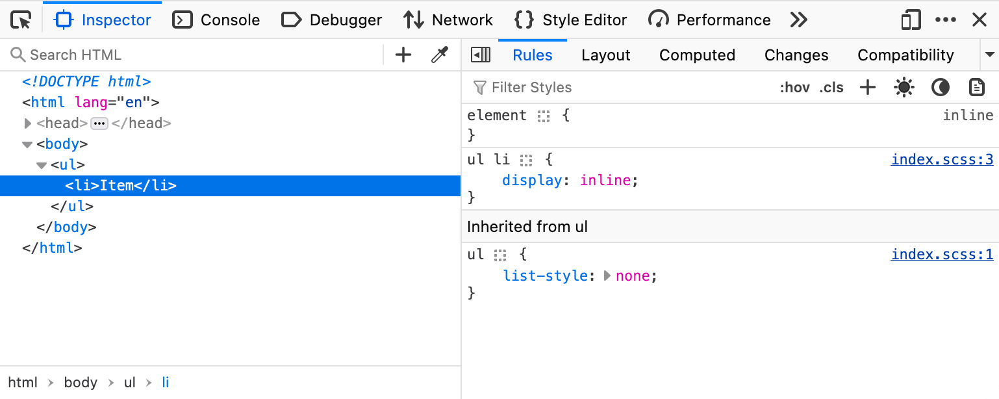
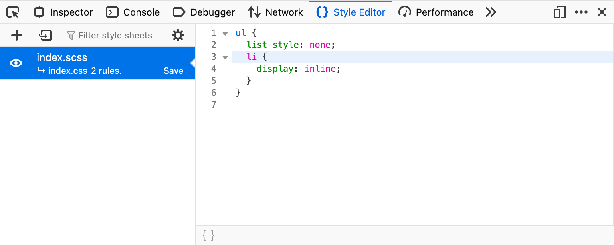

{{GlossarySidebar}}

A **source map** is a {{Glossary("JSON")}} file format that maps between minified or transformed code received by the browser and its original unmodified form, allowing the original code to be reconstructed and used when debugging.

Code executed by the browser is often transformed in some way from the original source created by a developer. There are several reasons for this:

- To make delivering code from the server more efficient by combining and minifying source files.
- To support older browsers by transforming modern features into older equivalents.
- To use languages that browsers don't support, like {{Glossary("TypeScript")}} or [Sass](https://sass-lang.com/).

In these situations, debugging the original source is much easier than the source in the transformed state that the browser has downloaded.
Browsers detect a source map via the {{HTTPHeader("SourceMap")}} HTTP header for a resource, or a `sourceMappingURL` annotation in the generated code.

## Example

For example, consider this SCSS syntax of Sass:

```scss
ul {
  list-style: none;
  li {
    display: inline;
  }
}
```

During the build process, the SCSS is transformed into CSS.
A source map file `index.css.map` is generated and linked to from the CSS in a comment at the end:

```css
ul {
  list-style: none;
}
ul li {
  display: inline;
}

/*# sourceMappingURL=index.css.map */
```

This map file contains not only mappings between the original SCSS and the generated CSS but also the original SCSS source code in encoded form. It's ignored by the browser's CSS parser but used by browser's DevTools:

```json
{
  "version": 3,
  "sourceRoot": "",
  "sources": ["index.scss"],
  "names": [],
  "mappings": "AAAA;EACC;;AACA;EACC",
  "file": "index.css"
}
```

The source map allows the browser's DevTools to link to specific lines in the original SCSS file and display the source code:





## See also

- [Source map format specification](https://tc39.es/ecma426/2024/)
- HTTP {{HTTPHeader("SourceMap")}} response header
- [Firefox Developer Tools: using a source map](https://firefox-source-docs.mozilla.org/devtools-user/debugger/how_to/use_a_source_map/index.html)
