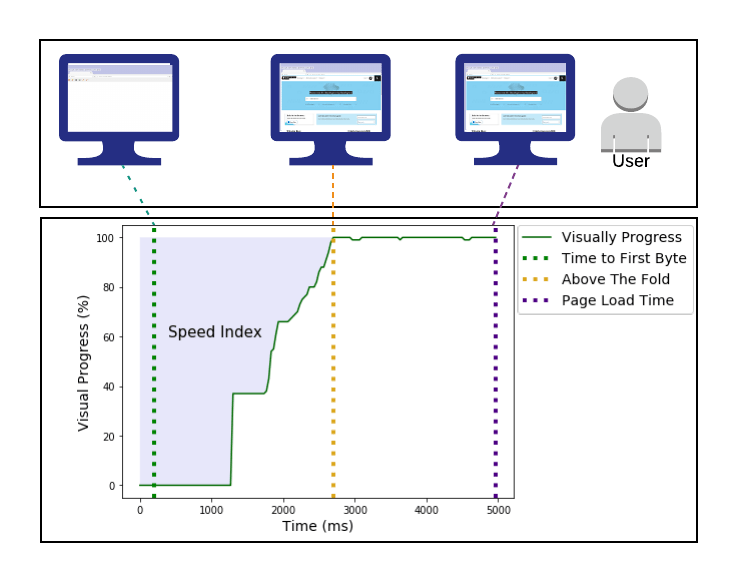

{{GlossarySidebar}}

**Speed Index** (SI) is a page load performance metric measuring how quickly the contents of a page are visibly populated. Speed Index is dependent on size of the viewport and expressed in milliseconds: the lower amount of time the better the score.

Speed Index was introduced to address issues with other milestones and metrics and provide a gauge of real user experience. Speed Index has been implemented in several common audits including [WebPageTest](https://github.com/WPO-Foundation/webpagetest-docs/blob/main/src/metrics/SpeedIndex.md) and [Lighthouse](https://github.com/paulirish/speedline).

Speed Index is calculated by what percent of the page is visually complete at every 100ms interval until the page is visually complete. The overall score is a sum of the individual 10 times per second intervals of the percent of the screen that is not visually complete.

_Diagram showing how above the fold content can load before the page load event and is measured by Speed Index_:

## See also

- [Learn web performance](/en-US/docs/Learn/Performance)
