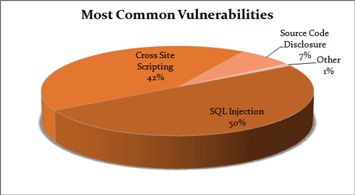
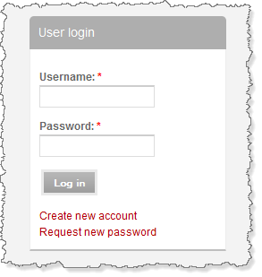

{{GlossarySidebar}}

SQL injection takes advantage of Web apps that fail to validate user input. Hackers can maliciously pass SQL commands through the Web app for execution by a backend database.

SQL injection can gain unauthorized access to a database or to retrieve information directly from the database. Many data breaches are due to SQL injection.



[Original source](https://cdn.acunetix.com/wp_content/uploads/2010/09/sql_inj_xss.gif)

## How It Works



After entering username and password, behind the GUI the SQL queries work as follows:

```sql
"SELECT Count(*) FROM Users WHERE Username=' " + txt.User.Text+" ' AND Password=' "+ txt.Password.Text+" ' ";
```

Now suppose User enters the Username: admin and Password: passwd123, so after clicking on the Log in button, SQL query will run as follows:

```sql
"SELECT Count(*) FROM Users WHERE Username=' admin ' AND Password=' passwd123 ' ";
```

If the credentials are correct, then the user is allowed to log in, so it's a very simple (and therefore insecure) mechanism. Hackers use this insecurity to gain unauthorized access.

Hackers use a simple string called a Magical String, for example:

**Username: _admin_**

**Password: _anything 'or'1'='1_**

After clicking on the login button, the SQL query will work as follows:

```sql
"SELECT Count(*) FROM Users WHERE Username=' admin ' AND Password=' anything 'or'1'='1 ' ";
```

Just take a closer look at the above query's password section.

```plain
Password=' anything 'or'1'='1 '
```

The password is not 'anything', hence password=anything results in FALSE, but '1'='1' is a TRUE statement and hence returns a TRUE value. Finally, due to the OR operator, the value (FALSE OR TRUE) is TRUE, so authentication bypasses successfully. Just due to a simple string (Magical String) the entire database is compromised.

## How To Prevent

Before executing the queries for the user credentials, make some changes like the following:

```php
$id = $_GET["id"]

(1) $id = stripslashes($id)

(2) $id = mysql_real_escape_String($id)
```

So due to (1) each single quote (') in the input string is replaced with double quotes ("), and due to (2) before every (') it adds (/). The revised magical string fails to bypass the authentication, and your database stays secure.

## See also

- [SQL injection](https://en.wikipedia.org/wiki/SQL_injection) on Wikipedia
- [Explanation of SQL injection](https://owasp.org/www-community/attacks/SQL_Injection) on OWASP (Open Web Application Security Project)
