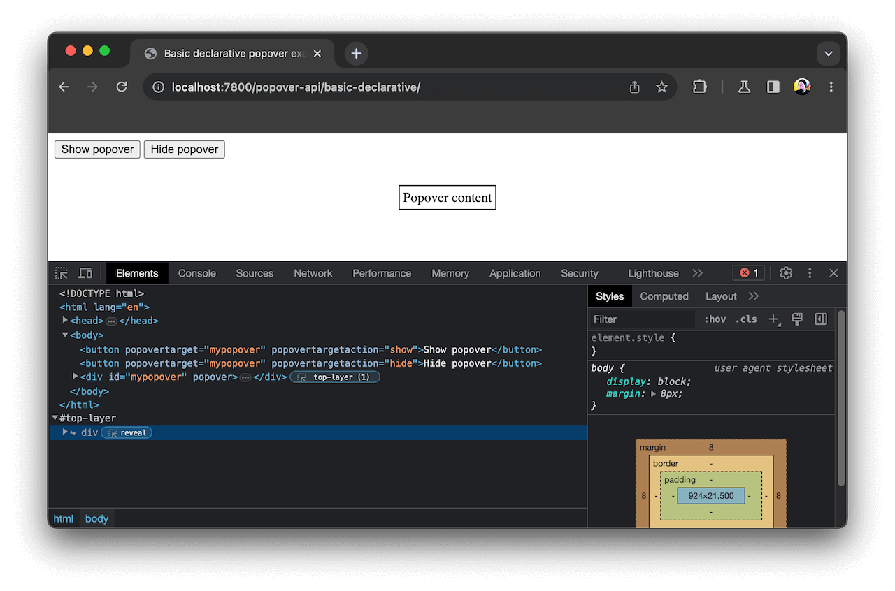

{{GlossarySidebar}}

The **top layer** is a specific layer that spans the entire width and height of the viewport and sits on top of all other layers displayed in a web document. It is created by the browser to contain elements that should appear on top of all other content on the page.

Elements placed in the top layer generate a new [stacking context](/en-US/docs/Web/CSS/CSS_positioned_layout/Understanding_z-index/Stacking_context), as do their corresponding {{cssxref("::backdrop")}} pseudo-elements.

Elements that will appear in the top layer include:

- Fullscreen elements, i.e. elements that have been caused to display in fullscreen mode by a successful {{domxref("Element.requestFullscreen()")}} call.
- {{htmlelement("dialog")}} elements displayed as a modal via a successful {{domxref("HTMLDialogElement.showModal()")}} call.
- Popover elements shown via a successful {{domxref("HTMLElement.showPopover()")}} call.

Some browsers, such as Chrome, show elements placed in the top layer inside a special DOM tree entry. For example:

Note that the top layer is an internal browser concept and cannot be directly manipulated from code. You can target elements placed in the top layer using CSS and JavaScript, but you cannot target the top layer itself.

## See also

- [The stacking context](/en-US/docs/Web/CSS/CSS_positioned_layout/Understanding_z-index/Stacking_context)
- [Fullscreen API](/en-US/docs/Web/API/Fullscreen_API)
- {{htmlelement("dialog")}} element, {{domxref("HTMLDialogElement")}} interface
- [Popover API](/en-US/docs/Web/API/Popover_API)
- {{CSSXref(":fullscreen")}} pseudo-class
