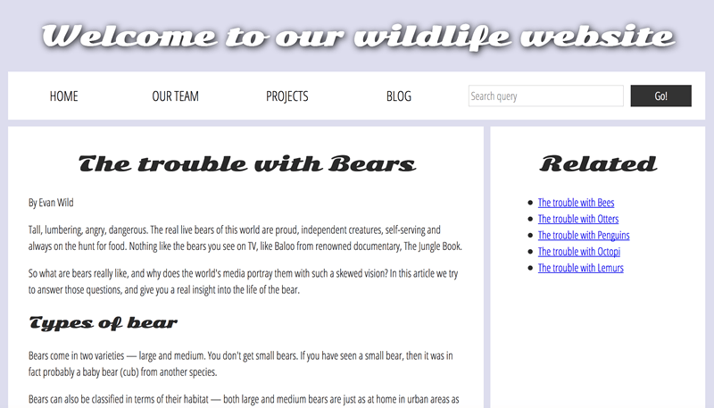

{{LearnSidebar}}{{PreviousMenu("Learn/Accessibility/Mobile", "Learn/Accessibility")}}

In the assessment for this module, we present to you a simple site with a number of accessibility issues that you need to diagnose and fix.

<table>
  <tbody>
    <tr>
      <th scope="row">Prerequisites:</th>
      <td>
        Basic computer literacy, a basic understanding of HTML, CSS, and
        JavaScript, an understanding of the
        <a href="/en-US/docs/Learn/Accessibility"
          >previous articles in the course</a
        >.
      </td>
    </tr>
    <tr>
      <th scope="row">Objective:</th>
      <td>To test basic knowledge of accessibility fundamentals.</td>
    </tr>
  </tbody>
</table>

## Starting point

To get this assessment started, you should go and grab the [ZIP containing the files that comprise the example](https://raw.githubusercontent.com/mdn/learning-area/main/accessibility/assessment-start/assessment-files.zip). Decompress the contents into a new directory somewhere on your local computer.

Alternatively, you could use a site like [JSBin](https://jsbin.com/) or [Glitch](https://glitch.com/) to do your assessment. You could paste the HTML, CSS, and JavaScript into one of these online editors. If the online editor you are using doesn't have a separate CSS/JS panel, feel free to put them in appropriate `<style>` / `<script>` elements.

The finished assessment site should look like so:

You will see some differences/issues with the display of the starting state of the assessment — this is mainly due to the differences in the markup, which in turn cause some styling issues as the CSS is not applied properly. Don't worry — you'll be fixing these problems in the upcoming sections!

> **Note:** If you get stuck, then ask us for help — see the [Assessment or further help](#assessment_or_further_help) section at the bottom of this page.

## Project brief

For this project, you are presented with a fictional nature site displaying a "factual" article about bears. As it stands, it has a number of accessibility issues — your task is to explore the existing site and fix them to the best of your abilities, answering the questions given below.

### Color

The text is difficult to read because of the current color scheme. Can you do a test of the current color contrast (text/background), report the results of the test, and then fix it by changing the assigned colors?

### Semantic HTML

1. The content is still not very accessible — report on what happens when you try to navigate it using a screen reader.
2. Can you update the article text to make it easier for screen reader users to navigate?
3. The navigation menu part of the site (wrapped in `

`) could be made more accessible by putting it in a proper HTML semantic element. Which one should it be updated to? Make the update.

> **Note:** You'll need to update the CSS rule selectors that style the tags to their proper equivalents for the semantic headings. Once you add paragraph elements, you'll notice the styling looking better.

### The images

The images are currently inaccessible to screen reader users. Can you fix this?

### The audio player

1. The `<audio>` player isn't accessible to hearing impaired (deaf) people — can you add some kind of accessible alternative for these users?
2. The `<audio>` player isn't accessible to those using older browsers that don't support HTML audio. How can you allow them to still access the audio?

### The forms

1. The `<input>` element in the search form at the top could do with a label, but we don't want to add a visible text label that would potentially spoil the design and isn't really needed by sighted users. How can you add a label that is only accessible to screen readers?
2. The two `<input>` elements in the comment form have visible text labels, but they are not unambiguously associated with their labels — how do you achieve this? Note that you'll need to update some of the CSS rule as well.

### The show/hide comment control

The show/hide comment control button is not current keyboard-accessible. Can you make it keyboard accessible, both in terms of focusing it using the tab key, and activating it using the return key?

### The table

The data table is not currently very accessible — it is hard for screen reader users to associate data rows and columns together, and the table also has no kind of summary to make it clear what it shows. Can you add some features to your HTML to fix this problem?

### Other considerations?

Can you list two more ideas for improvements that would make the website more accessible?

## Assessment or further help

If you would like your work assessed, or are stuck and want to ask for help:

1. Put your work into an online shareable editor such as [CodePen](https://codepen.io/), [jsFiddle](https://jsfiddle.net/), or [Glitch](https://glitch.com/).
2. Write a post asking for assessment and/or help at the [MDN Discourse forum Learning category](https://discourse.mozilla.org/c/mdn/learn/250). Your post should include:

    - A descriptive title such as "Assessment wanted for Accessibility troubleshooting".
    - Details of what you have already tried, and what you would like us to do, e.g. if you are stuck and need help, or want an assessment.
    - A link to the example you want assessed or need help with, in an online shareable editor (as mentioned in step 1 above). This is a good practice to get into — it's very hard to help someone with a coding problem if you can't see their code.
    - A link to the actual task or assessment page, so we can find the question you want help with.

{{PreviousMenu("Learn/Accessibility/Mobile", "Learn/Accessibility")}}

## In this module

- [What is accessibility?](/en-US/docs/Learn/Accessibility/What_is_accessibility)
- [HTML: A good basis for accessibility](/en-US/docs/Learn/Accessibility/HTML)
- [CSS and JavaScript accessibility best practices](/en-US/docs/Learn/Accessibility/CSS_and_JavaScript)
- [WAI-ARIA basics](/en-US/docs/Learn/Accessibility/WAI-ARIA_basics)
- [Accessible multimedia](/en-US/docs/Learn/Accessibility/Multimedia)
- [Mobile accessibility](/en-US/docs/Learn/Accessibility/Mobile)
- [Accessibility troubleshooting](/en-US/docs/Learn/Accessibility/Accessibility_troubleshooting)
