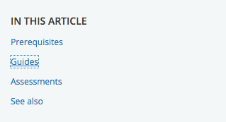
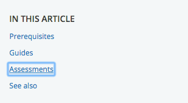
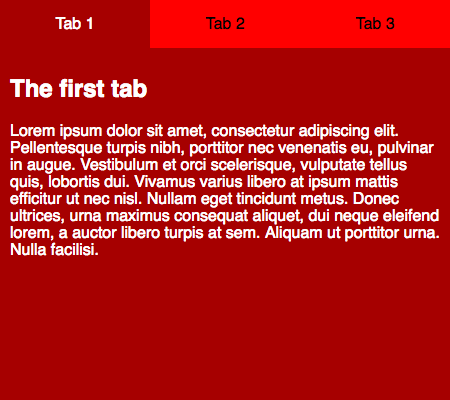

{{LearnSidebar}}{{PreviousMenuNext("Learn/Accessibility/HTML","Learn/Accessibility/WAI-ARIA_basics", "Learn/Accessibility")}}

CSS and JavaScript, when used properly, also have the potential to allow for accessible web experiences, or they can significantly harm accessibility if misused. This article outlines some CSS and JavaScript best practices that should be considered to ensure even complex content is as accessible as possible.

<table>
  <tbody>
    <tr>
      <th scope="row">Prerequisites:</th>
      <td>
        A basic understanding of HTML, CSS, and
        JavaScript, and understanding of
        <a href="/en-US/docs/Learn/Accessibility/What_is_accessibility"
          >what accessibility is</a
        >.
      </td>
    </tr>
    <tr>
      <th scope="row">Objective:</th>
      <td>
        To gain familiarity with using CSS and JavaScript appropriately in your
        web documents to maximize accessibility and not detract from it.
      </td>
    </tr>
  </tbody>
</table>

## CSS and JavaScript are accessible?

CSS and JavaScript don't have the same immediate importance for accessibility as HTML, but they are still able to help or damage accessibility, depending on how they are used. To put it another way, it is important that you consider some best practice advice to make sure that your use of CSS and JavaScript doesn't ruin the accessibility of your documents.

## CSS

Let's start off by looking at CSS.

### Correct semantics and user expectation

It is possible to use CSS to make any HTML element look like _anything_, but this doesn't mean that you should. As we frequently mentioned in our [HTML: A good basis for accessibility](/en-US/docs/Learn/Accessibility/HTML) article, you should use the appropriate semantic element for the job, whenever possible. If you don't, it can cause confusion and usability issues for everyone, but particularly users with disabilities. Using correct semantics has a lot to do with user expectations — elements look and behave in certain ways, according to their functionality, and these common conventions are expected by users.

As an example, a screen reader user can't navigate a page via heading elements if the developer hasn't appropriately used heading elements to markup the content. By the same token, a heading loses its visual purpose if you style it so it doesn't look like a heading.

Bottom line, you can update the styling of a page feature to fit in your design, but don't change it so much that it no longer looks or behaves as expected. The following sections summarize the main HTML features to consider.

#### "Standard" text content structure

Headings, paragraphs, lists — the core text content of your page:

```html
<h1>Heading</h1>

<p>Paragraph</p>

<ul>
  <li>My list</li>
  <li>has two items.</li>
</ul>
```

Some typical CSS might look like this:

```css
h1 {
  font-size: 5rem;
}

p,
li {
  line-height: 1.5;
  font-size: 1.6rem;
}
```

You should:

- Select sensible font sizes, line heights, letter spacing, etc. to make your text logical, legible, and comfortable to read.
- Make sure your headings stand out from your body text, typically big and bold like the default styling. Your lists should look like lists.
- Your text color should contrast well with your background color.

See [HTML text fundamentals](/en-US/docs/Learn/HTML/Introduction_to_HTML/HTML_text_fundamentals) and [Styling text](/en-US/docs/Learn/CSS/Styling_text) for more information.

#### Emphasized text

Inline markup that confers specific emphasis to the text that it wraps:

```html
<p>The water is <em>very hot</em>.</p>

<p>
  Water droplets collecting on surfaces is called <strong>condensation</strong>.
</p>
```

You might want to add some simple coloring to your emphasized text:

```css
strong,
em {
  color: #a60000;
}
```

You will however rarely need to style emphasis elements in any significant way. The standard conventions of bold and italic text are very recognizable, and changing the style can cause confusion. For more on emphasis, see [Emphasis and importance](/en-US/docs/Learn/HTML/Introduction_to_HTML/HTML_text_fundamentals#emphasis_and_importance).

#### Abbreviations

An element that allows an abbreviation, acronym, or initialization to be associated with its expansion:

```html
<p>
  Web content is marked up using Hypertext Markup Language, or
  <abbr>HTML</abbr>.
</p>
```

Again, you might want to style it in some simple way:

```css
abbr {
  color: #a60000;
}
```

The recognized styling convention for abbreviations is a dotted underline, and it is unwise to significantly deviate from this. For more on abbreviations, see [Abbreviations](/en-US/docs/Learn/HTML/Introduction_to_HTML/Advanced_text_formatting#abbreviations).

#### Links

Hyperlinks — the way you get to new places on the web:

```html
<p>Visit the <a href="https://www.mozilla.org">Mozilla homepage</a>.</p>
```

Some very simple link styling is shown below:

```css
a {
  color: #ff0000;
}

a:hover,
a:visited,
a:focus {
  color: #a60000;
  text-decoration: none;
}

a:active {
  color: #000000;
  background-color: #a60000;
}
```

The standard link conventions are underlined and a different color (default: blue) in their standard state, another color variation when the link has previously been visited (default: purple), and yet another color when the link is activated (default: red). In addition, the mouse pointer changes to a pointer icon when links are moused over, and the link receives a highlight when focused (e.g. via tabbing) or activated. The following image shows the highlight in both Firefox (a dotted outline) and Chrome (a blue outline):





You can be creative with link styles, as long as you keep giving users feedback when they interact with the links. Something should definitely happen when states change, and you shouldn't get rid of the pointer cursor or the outline — both are very important accessibility aids for those using keyboard controls.

#### Form elements

Elements to allow users to input data into websites:

```html
<div>
  <label for="name">Enter your name</label>
  <input type="text" id="name" name="name" />
</div>
```

You can see some good example CSS in our [form-css.html](https://github.com/mdn/learning-area/blob/main/accessibility/css/form-css.html) example ([see it live](https://mdn.github.io/learning-area/accessibility/css/form-css.html) also).

Most of the CSS you'll write for forms will be for sizing the elements, lining up labels and inputs, and getting them looking neat and tidy.

You shouldn't however deviate too much from the expected visual feedback form elements receive when they are focused, which is basically the same as links (see above). You could style form focus/hover states to make this behavior more consistent across browsers or fit in better with your page design, but don't get rid of it altogether — again, people rely on these clues to help them know what is going on.

#### Tables

Tables for presenting tabular data.

You can see a good, simple example of table HTML and CSS in our [table-css.html](https://github.com/mdn/learning-area/blob/main/accessibility/css/table-css.html) example ([see it live also](https://mdn.github.io/learning-area/accessibility/css/table-css.html)).

Table CSS generally serves to make the table fit better into your design and look less ugly. It is a good idea to make sure the table headers stand out (normally using bold), and use zebra striping to make different rows easier to parse.

### Color and color contrast

When choosing a color scheme for your website, make sure that the text (foreground) color contrasts well with the background color. Your design might look cool, but it is no good if people with visual impairments like color blindness can't read your content.

There is an easy way to check whether your contrast is large enough to not cause problems. There are a number of contrast checking tools online that you can enter your foreground and background colors into, to check them. For example WebAIM's [Color Contrast Checker](https://webaim.org/resources/contrastchecker/) is simple to use, and provides an explanation of what you need to conform to the WCAG criteria around color contrast.

> **Note:** A high contrast ratio will also allow anyone using a smartphone or tablet with a glossy screen to better read pages when in a bright environment, such as sunlight.

Another tip is to not rely on color alone for signposts/information, as this will be no good for those who can't see the color. Instead of marking required form fields in red, for example, mark them with an asterisk and in red.

### Hiding things

There are many instances where a visual design will require that not all content is shown at once. For example, in our [Tabbed info box example](https://mdn.github.io/learning-area/css/css-layout/practical-positioning-examples/info-box.html) (see [source code](https://github.com/mdn/learning-area/blob/main/css/css-layout/practical-positioning-examples/info-box.html)) we have three panels of information, but we are [positioning](/en-US/docs/Learn/CSS/CSS_layout/Positioning) them on top of one another and providing tabs that can be clicked to show each one (it is also keyboard accessible — you can alternatively use Tab and Enter/Return to select them).



Screen reader users don't care about any of this — they are happy with the content as long as the source order makes sense, and they can get to it all. Absolute positioning (as used in this example) is generally seen as one of the best mechanisms of hiding content for visual effect because it doesn't stop screen readers from getting to it.

On the other hand, you shouldn't use {{cssxref("visibility")}}`:hidden` or {{cssxref("display")}}`:none`, because they do hide content from screen readers. Unless of course, there is a good reason why you want this content to be hidden from screen readers.

> **Note:** [Invisible Content Just for Screen Reader Users](https://webaim.org/techniques/css/invisiblecontent/) has a lot more useful detail surrounding this topic.

### Accept that users can override styles

It is possible for users to override your styles with their own custom styles, for example:

- See Sarah Maddox's [How to use a custom style sheet (CSS) with Firefox](https://www.itsupportguides.com/knowledge-base/computer-accessibility/how-to-use-a-custom-style-sheet-css-with-firefox/) for a useful guide covering how to do this manually in Firefox.
- It is probably easier to do it using an extension. For example, the Stylus extension is available for [Firefox](https://addons.mozilla.org/en-US/firefox/addon/styl-us/), with Stylish being a [Chrome](https://chrome.google.com/webstore/detail/stylish-custom-themes-for/fjnbnpbmkenffdnngjfgmeleoegfcffe) equivalent.

Users might do this for a variety of reasons. A visually impaired user might want to make the text bigger on all websites they visit, or a user with severe color deficiency might want to put all websites in high contrast colors that are easy for them to see. Whatever the need, you should be comfortable with this, and make your designs flexible enough so that such changes will work in your design. As an example, you might want to make sure your main content area can handle bigger text (maybe it will start to scroll to allow it all to be seen), and won't just hide it, or break completely.

## JavaScript

JavaScript can also break accessibility, depending on how it is used.

Modern JavaScript is a powerful language, and we can do so much with it these days, from simple content and UI updates to fully-fledged 2D and 3D games. There is no rule that says all content has to be 100% accessible to all people — you just need to do what you can, and make your apps as accessible as possible.

Simple content and functionality is arguably easy to make accessible — for example text, images, tables, forms and push button that activate functions. As we looked at in our [HTML: A good basis for accessibility](/en-US/docs/Learn/Accessibility/HTML) article, the key considerations are:

- Good semantics: Using the right element for the right job. For example, making sure you use headings and paragraphs, and {{htmlelement("button")}} and {{htmlelement("a")}} elements
- Making sure content is available as text, either directly as text content, good text labels for form elements, or [text alternatives](/en-US/docs/Learn/Accessibility/HTML#text_alternatives), e.g. alt text for images.

We also looked at an example of how to use JavaScript to build in functionality where it is missing — see [Building keyboard accessibility back in](/en-US/docs/Learn/Accessibility/HTML#building_keyboard_accessibility_back_in). This is not ideal — really you should just use the right element for the right job — but it shows that it is possible in situations where for some reason you can't control the markup that is used. Another way to improve accessibility for non-semantic JavaScript-powered widgets is to use WAI-ARIA to provide extra semantics for screen reader users. The next article will also cover this in detail.

Complex functionality like 3D games are not so easy to make accessible — a complex 3D game created using [WebGL](/en-US/docs/Web/API/WebGL_API) will be rendered on a {{htmlelement("canvas")}} element, which has no facility at this time to provide text alternatives or other information for severely visually impaired users to make use of. It is arguable that such a game doesn't really have this group of people as a part of its main target audience, and it would be unreasonable to expect you to make it 100% accessible to blind people. However, you could implement [keyboard controls](/en-US/docs/Games/Techniques/Control_mechanisms/Desktop_with_mouse_and_keyboard) so it is usable by non-mouse users, and make the color scheme contrasting enough to be usable by those with color deficiencies.

### The problem with too much JavaScript

The problem often comes when people rely on JavaScript too much. Sometimes you'll see a website where everything has been done with JavaScript — the HTML has been generated by JavaScript, the CSS has been generated by JavaScript, etc. This has all kinds of accessibility and other issues associated with it, so it is not advised.

As well as using the right element for the right job, you should also make sure you are using the right technology for the right job! Think carefully about whether you need that shiny JavaScript-powered 3D information box, or whether plain old text would do. Think carefully about whether you need a complex non-standard form widget, or whether a text input would do. And don't generate all your HTML content using JavaScript if at all possible.

### Keeping it unobtrusive

You should keep **unobtrusive JavaScript** in mind when creating your content. The idea of unobtrusive JavaScript is that it should be used wherever possible to enhance functionality, not build it in entirely — basic functions should ideally work without JavaScript, although it is appreciated that this is not always an option. But again, a large part of it is using built-in browser functionality where possible.

Good example uses of unobtrusive JavaScript include:

- Providing client-side form validation, which alerts users to problems with their form entries quickly, without having to wait for the server to check the data. If it isn't available, the form will still work, but validation might be slower.
- Providing custom controls for HTML `<video>`s that are accessible to keyboard-only users, along with a direct link to the video that can be used to access it if JavaScript is not available (the default `<video>` browser controls aren't keyboard accessible in most browsers).

As an example, we've written a quick and dirty client-side form validation example — see [form-validation.html](https://github.com/mdn/learning-area/blob/main/accessibility/css/form-validation.html) (also [see the demo live](https://mdn.github.io/learning-area/accessibility/css/form-validation.html)). Here you'll see a simple form; when you try to submit the form with one or both fields left empty, the submit fails, and an error message box appears to tell you what is wrong.

This kind of form validation is unobtrusive — you can still use the form absolutely fine without the JavaScript being available, and any sensible form implementation will have server-side validation active as well, because it is too easy for malicious users to bypass client-side validation (for example, by turning JavaScript off in the browser). The client-side validation is still really useful for reporting errors — users can know about mistakes they make instantly, rather than having to wait for a round trip to the server and a page reload. This is a definite usability advantage.

> **Note:** Server-side validation has not been implemented in this simple demo.

We've made this form validation pretty accessible too. We've used {{htmlelement("label")}} elements to make sure the form labels are unambiguously linked to their inputs, so screen readers can read them out alongside:

```html
<label for="name">Enter your name:</label>
<input type="text" name="name" id="name" />
```

We only do the validation when the form is submitted — this is so that we don't update the UI too often and potentially confuse screen reader (and possibly other) users:

```js
form.onsubmit = validate;

function validate(e) {
  errorList.textContent = "";
  for (let i = 0; i < formItems.length; i++) {
    const testItem = formItems[i];
    if (testItem.input.value === "") {
      errorField.style.left = "360px";
      createLink(testItem);
    }
  }

  if (errorList.hasChildNodes()) {
    e.preventDefault();
  }
}
```

> **Note:** In this example, we are hiding and showing the error message box using absolute positioning rather than another method such as visibility or display, because it doesn't interfere with the screen reader being able to read content from it.

Real form validation would be much more complex than this — you'd want to check that the entered name actually looks like a name, the entered age is actually a number and is realistic (e.g. nonnegative and less than 4 digits). Here we've just implemented a simple check that a value has been filled in to each input field (`if (testItem.input.value === '')`).

When the validation has been performed, if the tests pass then the form is submitted. If there are errors (`if (errorList.hasChildNodes())`) then we stop the form submitting (using [`preventDefault()`](/en-US/docs/Web/API/Event/preventDefault)), and display any error messages that have been created (see below). This mechanism means that the errors will only be shown if there are errors, which is better for usability.

For each input that doesn't have a value filled in when the form is submitted, we create a list item with a link and insert it in the `errorList`.

```js
function createLink(testItem) {
  const listItem = document.createElement("li");
  const anchor = document.createElement("a");

  const name = testItem.input.name;
  anchor.textContent = `${name} field is empty: fill in your ${name}.`;
  anchor.href = `#${name}`;
  listItem.appendChild(anchor);
  errorList.appendChild(listItem);
}
```

Each link serves a dual purpose — it tells you what the error is, plus you can click on it/activate it to jump straight to the input element in question and correct your entry.

In addition, the `errorField` is placed at the top of the source order (although it is positioned differently in the UI using CSS), meaning that users can find out exactly what's wrong with their form submissions and get to the input elements in question by going back up to the start of the page.

As a final note, we have used some WAI-ARIA attributes in our demo to help solve accessibility problems caused by areas of content constantly updating without a page reload (screen readers won't pick this up or alert users to it by default):

```html
<div class="errors" role="alert" aria-relevant="all">
  <ul></ul>
</div>
```

We will explain these attributes in our next article, which covers [WAI-ARIA](/en-US/docs/Learn/Accessibility/WAI-ARIA_basics) in much more detail.

> **Note:** Some of you will probably be thinking about the fact that HTML forms have built-in validation mechanisms like the `required`, `min`/`minlength`, and `max`/`maxlength` attributes (see the {{htmlelement("input")}} element reference for more information). We didn't end up using these in the demo because cross-browser support for them is patchy (for example IE10 and above only).

> **Note:** WebAIM's [Usable and Accessible Form Validation and Error Recovery](https://webaim.org/techniques/formvalidation/) provides some further useful information about accessible form validation.

### Other JavaScript accessibility concerns

There are other things to be aware of when implementing JavaScript and thinking about accessibility. We will add more as we find them.

#### mouse-specific events

As you will be aware, most user interactions are implemented in client-side JavaScript using event handlers, which allow us to run functions in response to certain events happening. Some events can have accessibility issues. The main example you'll come across is mouse-specific events like [mouseover](/en-US/docs/Web/API/Element/mouseover_event), [mouseout](/en-US/docs/Web/API/Element/mouseout_event), [dblclick](/en-US/docs/Web/API/Element/dblclick_event), etc. Functionality that runs in response to these events will not be accessible using other mechanisms, like keyboard controls.

To mitigate such problems, you should double up these events with similar events that can be activated by other means (so-called device-independent event handlers) — [focus](/en-US/docs/Web/API/Element/focus_event) and [blur](/en-US/docs/Web/API/Element/blur_event) would provide accessibility for keyboard users.

Let's look at an example that highlights when this could be useful. Maybe we want to provide a thumbnail image that shows a larger version of the image when it is moused over or focused (like you'd see on an e-commerce product catalog.)

We've made a very simple example, which you can find at [mouse-and-keyboard-events.html](https://mdn.github.io/learning-area/accessibility/css/mouse-and-keyboard-events.html) (see also the [source code](https://github.com/mdn/learning-area/blob/main/accessibility/css/mouse-and-keyboard-events.html)). The code features two functions that show and hide the zoomed-in image; these are run by the following lines that set them as event handlers:

```js
imgThumb.onmouseover = showImg;
imgThumb.onmouseout = hideImg;

imgThumb.onfocus = showImg;
imgThumb.onblur = hideImg;
```

The first two lines run the functions when the mouse pointer hovers over and stops hovering over the thumbnail, respectively. This won't allow us to access the zoomed view by keyboard though — to allow that, we've included the last two lines, which run the functions when the image is focused and blurred (when focus stops). This can be done by tabbing over the image, because we've included `tabindex="0"` on it.

The [click](/en-US/docs/Web/API/Element/click_event) event is interesting — it sounds mouse-dependent, but most browsers will activate [onclick](/en-US/docs/Web/API/Element/click_event) event handlers after Enter/Return is pressed on a link or form element that has focus, or when such an element is tapped on a touchscreen device. This doesn't work by default however when you allow a non-default-focusable event to have focus using tabindex — in such cases you need to detect specifically when that exact key is pressed (see [Building keyboard accessibility back in](/en-US/docs/Learn/Accessibility/HTML#building_keyboard_accessibility_back_in)).

## Test your skills!

You've reached the end of this article, but can you remember the most important information? You can find some further tests to verify that you've retained this information before you move on — see [Test your skills: CSS and JavaScript accessibility](/en-US/docs/Learn/Accessibility/CSS_and_JavaScript/Test_your_skills:_CSS_and_JavaScript_accessibility).

## Summary

We hope this article has given you a good amount of detail and understanding about the accessibility issues surrounding CSS and JavaScript use on web pages.

Next up, WAI-ARIA!

{{PreviousMenuNext("Learn/Accessibility/HTML","Learn/Accessibility/WAI-ARIA_basics", "Learn/Accessibility")}}
