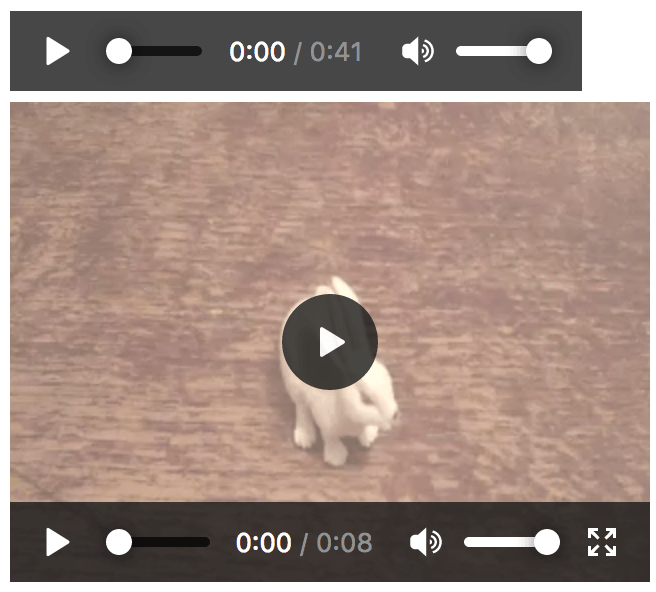
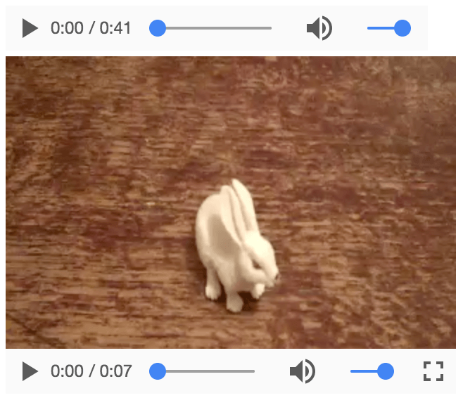
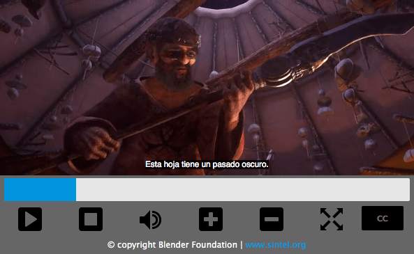

{{LearnSidebar}}{{PreviousMenuNext("Learn/Accessibility/WAI-ARIA_basics","Learn/Accessibility/Mobile", "Learn/Accessibility")}}

Another category of content that can create accessibility problems is multimedia. Video, audio, and image content need to be given proper textual alternatives so that they can be understood by assistive technologies and their users. This article shows how.

<table>
  <tbody>
    <tr>
      <th scope="row">Prerequisites:</th>
      <td>
        Basic computer literacy, a basic understanding of HTML, CSS, and
        JavaScript, and an understanding of
        <a href="/en-US/docs/Learn/Accessibility/What_is_accessibility"
          >what accessibility is</a
        >.
      </td>
    </tr>
    <tr>
      <th scope="row">Objective:</th>
      <td>
        To understand the accessibility issues behind multimedia, and how to
        overcome them.
      </td>
    </tr>
  </tbody>
</table>

## Multimedia and accessibility

So far in this module, we have looked at a variety of content and what needs to be done to ensure its accessibility, ranging from simple text content to data tables, images, native controls such as form elements and buttons, and even more complex markup structures (with [WAI-ARIA](/en-US/docs/Learn/Accessibility/WAI-ARIA_basics) attributes).

This article on the other hand looks at another general class of content that arguably isn't as easy to ensure accessibility for — multimedia. Images, audio tracks, videos, {{htmlelement("canvas")}} elements, etc., aren't as easily understood by screen readers or navigated by the keyboard, and we need to give them a helping hand.

But don't despair — here we will help you navigate through the techniques available for making multimedia more accessible.

## Simple images

We already covered simple text alternatives for HTML images in our [HTML: A good basis for accessibility](/en-US/docs/Learn/Accessibility/HTML) article — you can refer back to there for the full details. In short, you should ensure that where possible visual content has an alternative text available for screen readers to pick up and read to their users.

For example:

```html

```

## Accessible audio and video controls

Implementing controls for web-based audio/video shouldn't be a problem, right? Let's investigate.

### The problem with native HTML controls

HTML video and audio instances even come with a set of inbuilt controls that allow you to control the media straight out of the box. For example (see `native-controls.html` [source code](https://github.com/mdn/learning-area/blob/main/accessibility/multimedia/native-controls.html) and [live](https://mdn.github.io/learning-area/accessibility/multimedia/native-controls.html)):

```html
<audio controls>
  <source src="viper.mp3" type="audio/mp3" />
  <source src="viper.ogg" type="audio/ogg" />
  <p>
    Your browser doesn't support HTML audio. Here is a
    <a href="viper.mp3">link to the audio</a> instead.
  </p>
</audio>

<br />

<video controls>
  <source src="rabbit320.mp4" type="video/mp4" />
  <source src="rabbit320.webm" type="video/webm" />
  <p>
    Your browser doesn't support HTML video. Here is a
    <a href="rabbit320.mp4">link to the video</a> instead.
  </p>
</video>
```

The controls attribute provides play/pause buttons, seek bar, etc. — the basic controls you'd expect from a media player. It looks like so in Firefox and Chrome:





However, there are problems with these controls:

- They are not keyboard-accessible in most browsers, i.e. you can't tab between the controls inside the native player. Opera and Chrome provide this to some degree, but it still isn't ideal.
- Different browsers give the native controls differing styling and functionality, and they aren't stylable, meaning that they can't be easily made to follow a site style guide.

To remedy this, we can create our own custom controls. Let's look at how.

### Creating custom audio and video controls

HTML video and audio share an API — HTML Media Element — which allows you to map custom functionality to buttons and other controls — both of which you define yourself.

Let's take the video example from above and add custom controls to them.

#### Basic setup

First, grab a copy of our [custom-controls-start.html](https://github.com/mdn/learning-area/blob/main/accessibility/multimedia/custom-controls-start.html), [custom-controls.css](https://github.com/mdn/learning-area/blob/main/accessibility/multimedia/custom-controls.css), [rabbit320.mp4](https://raw.githubusercontent.com/mdn/learning-area/master/accessibility/multimedia/rabbit320.mp4), and [rabbit320.webm](https://raw.githubusercontent.com/mdn/learning-area/master/accessibility/multimedia/rabbit320.webm) files and save them in a new directory on your hard drive.

Create a new file called main.js and save it in the same directory.

First of all, let's look at the HTML for the video player, in the HTML:

```html
<section class="player">
  <video controls>
    <source src="rabbit320.mp4" type="video/mp4" />
    <source src="rabbit320.webm" type="video/webm" />
    <p>
      Your browser doesn't support HTML video. Here is a
      <a href="rabbit320.mp4">link to the video</a> instead.
    </p>
  </video>

  <div class="controls">
    <button class="playpause">Play</button>
    <button class="stop">Stop</button>
    <button class="rwd">Rwd</button>
    <button class="fwd">Fwd</button>
    <div class="time">00:00</div>
  </div>
</section>
```

#### JavaScript basic setup

We've inserted some simple control buttons below our video. These controls of course won't do anything by default; to add functionality, we will use JavaScript.

We will first need to store references to each of the controls — add the following to the top of your JavaScript file:

```js
const playPauseBtn = document.querySelector(".playpause");
const stopBtn = document.querySelector(".stop");
const rwdBtn = document.querySelector(".rwd");
const fwdBtn = document.querySelector(".fwd");
const timeLabel = document.querySelector(".time");
```

Next, we need to grab a reference to the video/audio player itself — add this line below the previous lines:

```js
const player = document.querySelector("video");
```

This holds a reference to a {{domxref("HTMLMediaElement")}} object, which has several useful properties and methods available on it that can be used to wire up functionality to our buttons.

Before moving on to creating our button functionality, let's remove the native controls so they don't get in the way of our custom controls. Add the following, again at the bottom of your JavaScript:

```js
player.removeAttribute("controls");
```

Doing it this way round rather than just not including the controls attribute in the first place has the advantage that if our JavaScript fails for any reason, the user still has some controls available.

#### Wiring up our buttons

First, let's set up the play/pause button. We can get this to toggle between play and pause with a simple conditional function, like the following. Add it to your code, at the bottom:

```js
playPauseBtn.onclick = () => {
  if (player.paused) {
    player.play();
    playPauseBtn.textContent = "Pause";
  } else {
    player.pause();
    playPauseBtn.textContent = "Play";
  }
};
```

Next, add this code to the bottom, which controls the stop button:

```js
stopBtn.onclick = () => {
  player.pause();
  player.currentTime = 0;
  playPauseBtn.textContent = "Play";
};
```

There is no `stop()` function available on {{domxref("HTMLMediaElement")}}s, so instead we `pause()` it, and at the same time set the `currentTime` to 0.

Next, our rewind and fast-forward buttons — add the following blocks to the bottom of your code:

```js
rwdBtn.onclick = () => {
  player.currentTime -= 3;
};

fwdBtn.onclick = () => {
  player.currentTime += 3;
  if (player.currentTime >= player.duration || player.paused) {
    player.pause();
    player.currentTime = 0;
    playPauseBtn.textContent = "Play";
  }
};
```

These are very simple, just adding or subtracting 3 seconds to the `currentTime` each time they are clicked. In a real video player, you'd probably want a more elaborate seeking bar, or similar.

Note that we also check to see if the `currentTime` is more than the total media `duration` or if the media is not playing when the `fwdBtn` is pressed. If either condition is true, we stop the video to avoid the user interface going wrong if they attempt to fast forward when the video is not playing or fast forward past the end of the video.

Last of all, add the following to the end of the code, to control the time elapsed display:

```js
player.ontimeupdate = () => {
  const minutes = Math.floor(player.currentTime / 60);
  const seconds = Math.floor(player.currentTime - minutes * 60);
  const minuteValue = minutes < 10 ? `0${minutes}` : minutes;
  const secondValue = seconds < 10 ? `0${seconds}` : seconds;

  const mediaTime = `${minuteValue}:${secondValue}`;
  timeLabel.textContent = mediaTime;
};
```

Each time the time updates (once per second), we fire this function. It works out the number of minutes and seconds from the given currentTime value (which is in seconds), adds a leading 0 if either the minute or second value is less than 10, and then creates the display readout and adds it to the time label.

#### Further reading

This gives you a basic idea of how to add custom player functionality to video/audio player instances. For more information on how to add more complex features to video/audio players, see:

- [Audio and video delivery](/en-US/docs/Web/Guide/Audio_and_video_delivery)
- [Video player styling basics](/en-US/docs/Web/Guide/Audio_and_video_delivery/Video_player_styling_basics)
- [Creating a cross-browser video player](/en-US/docs/Web/Guide/Audio_and_video_delivery/cross_browser_video_player)

We've also created an advanced example to show how you could create an object-oriented system that finds every video and audio player on the page (no matter how many there are) and adds our custom controls to it. See [custom-controls-oojs](https://mdn.github.io/learning-area/accessibility/multimedia/custom-controls-OOJS/) (also [see the source code](https://github.com/mdn/learning-area/tree/main/accessibility/multimedia/custom-controls-OOJS)).

## Audio transcripts

To provide deaf people with access to audio content, you need to create text transcripts. These can either be included on the same page as the audio in some way or included on a separate page and linked to.

In terms of actually creating the transcript, your options are:

- Commercial services — You could pay a professional to do the transcription, see for example companies like [Scribie](https://scribie.com/), [Casting Words](https://castingwords.com/), or [Rev](https://www.rev.com/). Look around and ask for advice to make sure you find a reputable company that you'll be able to work with effectively.
- Community/grassroots/self transcription — If you are part of an active community or team in your workplace, then you could ask them for help with doing the translations. You could even have a go at doing them yourself.
- Automated services — There are AI services available, like [Trint](https://trint.com) or [Transcribear](https://transcribear.com/index.html). Upload a video/audio file to the site, and it automatically transcribes it for you. On YouTube, you can choose to generate automated captions/transcripts. Depending on how clear the spoken audio is, the resulting transcript quality will vary greatly.

As with most things in life, you tend to get what you pay for; different services will vary in accuracy and time taken to produce the transcript. If you pay a reputable company or AI service to do the transcription, you will probably get it done rapidly and to a high quality. If you don't want to pay for it, you are likely to get it done at a lower quality, and/or slowly.

It is not OK to publish an audio resource but promise to publish the transcript later on — such promises often aren't kept, which will erode trust between you and your users. If the audio you are presenting is something like a face to face meeting or live spoken performance, it would be acceptable to take notes during the performance, publish them in full along with the audio, then seek help in cleaning up the notes afterward.

### Transcript examples

If you use an automated service, then you'll probably have to use the user interface that the tool provides. For example, take a look at our [Wait, ARIA Roles Have Categories?](https://www.youtube.com/watch?v=mwF-PpJOjMs) video and choose the three-dot menu (. . .) _> Show Transcript_. You'll see the transcript come up in a separate panel.

If you are creating your own user interface to present your audio and associated transcript, you can do it however you like, but it might make sense to include it in a showable/hideable panel; see our [audio-transcript-ui](https://mdn.github.io/learning-area/accessibility/multimedia/audio-transcript-ui/) example (also see the [source code](https://github.com/mdn/learning-area/tree/main/accessibility/multimedia/audio-transcript-ui)).

### Audio descriptions

On occasions where visuals are accompanying your audio, you'll need to provide audio descriptions of some kind to describe that extra content.

In many cases, this will take the form of video, in which case you can implement captions using the techniques described in the next section of the article.

However, there are some edge cases. You might for example have an audio recording of a meeting that refers to an accompanying resource such as a spreadsheet or chart. In such cases, you should make sure that the resources are provided along with the audio + transcript, and specifically link to them in the places where they are referred to in the transcript. This of course will help all users, not just people who are deaf.

> **Note:** An audio transcript will in general help multiple user groups. As well as giving deaf users access to the information contained in the audio, think about a user with a low bandwidth connection, who would find downloading the audio inconvenient. Think also about a user in a noisy environment like a pub or bar, who is trying to access the information but can't hear it over the noise.

## Video text tracks

To make video accessible for the deaf, visually impaired, or other groups of users (such as those on low bandwidth, or who don't understand the language the video is recorded in), you need to include text tracks along with your video content.

> **Note:** Text tracks are also useful for potentially any user, not just those with disabilities. For example, some users may not be able to hear the audio because they are in noisy environments (like a crowded bar when a sports game is being shown) or might not want to disturb others if they are in a quiet place (like a library).

This is not a new concept — television services have had closed captioning available for quite a long time:


Many countries offer English films with subtitles written in their own native languages, and different language subtitles are often available on DVDs, as shown below:


There are different types of text tracks for different purposes. The main ones you'll come across are:

- Captions — There for the benefit of deaf users who can't hear the audio track, including the words being spoken, and contextual information such as who spoke the words, if the people were angry or sad, and what mood the music is currently creating.
- Subtitles — Include translations of the audio dialog, for users that don't understand the language being spoken.
- Descriptions — These include descriptions for visually impaired people who can't see the video, for example, what the scene looks like.
- Chapter titles — Chapter markers intended to help the user navigate the media resource

### Implementing HTML video text tracks

Text tracks for displaying with HTML video need to be written in WebVTT, a text format containing multiple strings of text along with metadata such as what time in the video you want each text string to be displayed, and even limited styling/positioning information. These text strings are called cues.

A typical WebVTT file will look something like this:

```plain
WEBVTT

1
00:00:22.230 --> 00:00:24.606
This is the first subtitle.

2
00:00:30.739 --> 00:00:34.074
This is the second.

…
```

To get this displayed along with the HTML media playback, you need to:

- Save it as a .vtt file in a sensible place.
- Link to the .vtt file with the {{htmlelement("track")}} element. `<track>` should be placed within `<audio>` or `<video>`, but after all `<source>` elements. Use the [`kind`](/en-US/docs/Web/HTML/Element/track#kind) attribute to specify whether the cues are subtitles, captions, or descriptions. Furthermore, use [`srclang`](/en-US/docs/Web/HTML/Element/track#srclang) to tell the browser what language you have written the subtitles in.

Here's an example:

```html
<video controls>
  <source src="example.mp4" type="video/mp4" />
  <source src="example.webm" type="video/webm" />
  <track kind="subtitles" src="subtitles_en.vtt" srclang="en" />
</video>
```

This will result in a video that has subtitles displayed, kind of like this:



For more details, see [Adding captions and subtitles to HTML video](/en-US/docs/Web/Guide/Audio_and_video_delivery/Adding_captions_and_subtitles_to_HTML5_video). You can find [the example](https://iandevlin.github.io/mdn/video-player-with-captions/) that goes along with this article on GitHub, written by Ian Devlin (see the [source code](https://github.com/iandevlin/iandevlin.github.io/tree/master/mdn/video-player-with-captions) too.) This example uses JavaScript to allow users to choose between different subtitles. Note that to turn the subtitles on, you need to press the "CC" button and select an option — English, Deutsch, or Español.

> **Note:** Text tracks and transcriptions also help you with {{glossary("SEO")}}, since search engines especially thrive on text. Text tracks even allow search engines to link directly to a spot partway through the video.

## Test your skills!

You've reached the end of this article, but can you remember the most important information?

We've not written a new set of assessments for this article, because there are already assessments available in our [HTML Multimedia and embedding](/en-US/docs/Learn/HTML/Multimedia_and_embedding) module that test your knowledge of the information presented here. If you haven't already, go and try out the assessments at [Test your skills: HTML images](/en-US/docs/Learn/HTML/Multimedia_and_embedding/Images_in_HTML/Test_your_skills:_HTML_images) and [Test your skills: Multimedia and embedding](/en-US/docs/Learn/HTML/Multimedia_and_embedding/Video_and_audio_content/Test_your_skills:_Multimedia_and_embedding).

## Summary

This chapter has provided a summary of accessibility concerns for multimedia content, along with some practical solutions.

It is not always easy to make multimedia accessible. If for example, you are dealing with an immersive 3D game or virtual reality app, it is quite difficult to provide text alternatives for such an experience, and you might argue that visually impaired users are not really in the target audience bracket for such apps.

You can however make sure that such an app has good enough color contrast and clear presentation so it is perceivable to those with low vision/color blindness, and also make it keyboard accessible. Remember that accessibility is about doing as much as you can, rather than striving for 100% accessibility all the time, which is often impossible.

{{PreviousMenuNext("Learn/Accessibility/WAI-ARIA_basics","Learn/Accessibility/Mobile", "Learn/Accessibility")}}
