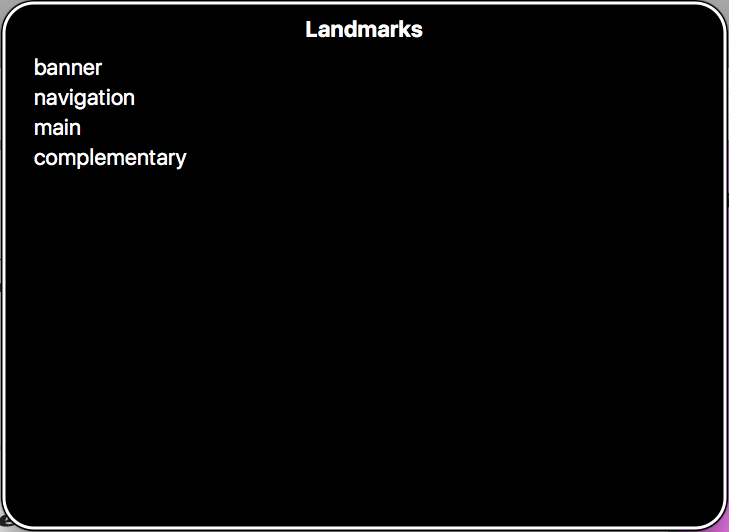

{{LearnSidebar}}{{PreviousMenuNext("Learn/Accessibility/CSS_and_JavaScript","Learn/Accessibility/Multimedia", "Learn/Accessibility")}}

Following on from the previous article, sometimes making complex UI controls that involve non-standard HTML and content dynamicaly updated with JavaScript can be difficult. WAI-ARIA is a technology that can help with such problems by adding in further semantics that browsers can expose and assistive technologies can interpret to inform users about custom features and dynamically updated content. Here we'll show how to use WAI-ARIA at a basic level to improve accessibility.

<table>
  <tbody>
    <tr>
      <th scope="row">Prerequisites:</th>
      <td>
        Basic computer literacy, a basic understanding of HTML, CSS, and
        JavaScript, an understanding of the
        <a href="/en-US/docs/Learn/Accessibility"
          >previous articles in the course</a
        >.
      </td>
    </tr>
    <tr>
      <th scope="row">Objective:</th>
      <td>
        To gain familiarity with WAI-ARIA, and how it can be used to provide
        useful additional semantics to enhance accessibility where required.
      </td>
    </tr>
  </tbody>
</table>

## What is WAI-ARIA?

Let's start by looking at what WAI-ARIA is, and what it can do for us.

### A whole new set of problems

As web apps started to get more complex and dynamic, a new set of accessibility features and problems started to appear.

For example, HTML introduced a number of semantic elements to define common page features ({{htmlelement("nav")}}, {{htmlelement("footer")}}, etc.). Before these were available, developers would use {{htmlelement("div")}}s with IDs or classes, e.g., `<div class="nav">`. However, these were problematic becuase classes and IDs are not exposed to users or assistive technologies. So while these attributes could be used to style elements to look like common UI areas or controls, they are not helpful in allowing users to find a specific page feature such as the main navigation programmatically.

The initial solution was to add one or more hidden links at the top of the page to link to the navigation (or whatever else), for example:

```html
<a href="#hidden" class="hidden">Skip to navigation</a>
```

But this is still not very precise, and can only be used when the screen reader is reading from the top of the page.

As another example, apps started to feature complex controls like date pickers for choosing dates, sliders for choosing values, etc. HTML provides special input types to render such controls:

```html
<input type="date">
<input type="range">
```

These were originally not well-supported and it was, and still is to a lesser extent, difficult to style them, leading designers and developer to opt for custom solutions. Instead of using these native features, some developers rely on JavaScript libraries that generate such controls as a series of nested {{htmlelement("div")}}s which are then styled using CSS and controlled using JavaScript.

The problem here is that visually they work, but they expose no useful information to assistive technologies.

### Enter WAI-ARIA

[WAI-ARIA](https://www.w3.org/TR/wai-aria-1.1/) (Web Accessibility Initiative - Accessible Rich Internet Applications) is a specification written by the W3C, defining a set of attributes that can be applied to HTML elements to provide additional semantics or improve accessibility wherever it is lacking. There are three main features defined in the spec:

- **[Roles](/en-US/docs/Web/Accessibility/ARIA/Roles)** — These define what an element is or does. Many of these are so-called landmark roles, which largely duplicate the semantic value of structural elements, such as `role="navigation"` ({{htmlelement("nav")}}) or `role="complementary"` ({{htmlelement("aside")}}). Some other roles describe different pages structures, such as `role="banner"`, `role="search"`, `role="tablist"`, and `role="tab"`, which are commonly found in UIs.
- **Properties** — These define properties of elements, which can be used to give them extra meaning or semantics. As an example, `aria-required="true"` specifies that a form input needs to be filled in order to be valid, whereas `aria-labelledby="label-id"` allows you to put an ID on an element, then reference it as being the label for anything else on the page, including multiple elements, which is not possible using `<label for="input-id">`. As an example, you could use `aria-labelledby` to specify that a table's accessible name, i.e., "caption", contained in a {{htmlelement("div")}} preceding the table. Or you could use it as a way to associate a text alternative with an image — using existing information on the page, rather than repeating it as the value of the `alt` attribute. You can see an example of this at [Text alternatives](/en-US/docs/Learn/Accessibility/HTML#text_alternatives).
- **States** — Special properties that define the current conditions of elements, such as `aria-disabled="true"`, which specifies to a screen reader that a form input is currently disabled. States differ from properties in that properties don't change throughout the lifecycle of an app, whereas states can change, generally programmatically via JavaScript.

An important point about WAI-ARIA attributes is that they don't affect anything about the web page, except for the information exposed by the browser's accessibility APIs (where assistive technologies, such as screen readers, get their information from). WAI-ARIA doesn't affect web page structure, or change default functionality or styling of an element, although the attributes can be useful for selecting elements by CSS.

> **Note:** You can find a useful list of all the ARIA roles and their uses, with links to further information, in the WAI-ARIA spec — see [Definition of Roles](https://www.w3.org/TR/wai-aria-1.1/#role_definitions) — on this site — see [ARIA roles](/en-US/docs/Web/Accessibility/ARIA/Roles).
>
> The spec also contains a list of all the properties and states, with links to further information — see [Definitions of States and Properties (all aria-\* attributes)](https://www.w3.org/TR/wai-aria-1.1/#state_prop_def).

### Where is WAI-ARIA supported?

This is not an easy question to answer. It is difficult to find a conclusive resource that states what features of WAI-ARIA are supported, and where, because:

1. There are a lot of features in the WAI-ARIA spec.
2. There are many combinations of operating system, browser, and screen reader to consider.

This last point is key — To use a screen reader in the first place, your operating system needs to run browsers that have the necessary accessibility APIs in place to expose the information screen readers need to do their job. Most popular OSes have one or two browsers in place that screen readers can work with. The Paciello Group has a fairly up-to-date post that provides data for this — see [Rough Guide: browsers, operating systems and screen reader support updated](https://www.tpgi.com/rough-guide-browsers-operating-systems-and-screen-reader-support-updated/).

Next, you need to worry about whether the browsers in question support ARIA features and expose them via their APIs, but also whether screen readers recognize that information and present it to their users in a useful way.

1. Browser support is generally quite good — at the time of writing, [caniuse.com](https://caniuse.com/#feat=wai-aria) stated that global browser support for WAI-ARIA was around 88%.
2. Depending on the specific ARIA feature, assistive technology support may be variable. You can get an idea of support levels by looking at Powermapper's [WAI-ARIA Screen reader compatibility](https://www.powermapper.com/tests/screen-readers/aria/) article, or check out [a11ysuport.io](https://a11ysupport.io/).

In this article, we won't attempt to cover every WAI-ARIA feature, and its exact support details. Instead, we will cover the most critical WAI-ARIA features for you to know about; if we don't mention any support details, you can assume that the feature is well-supported. We will clearly mention any exceptions to this.

> **Note:** Some JavaScript libraries support WAI-ARIA, meaning that when they generate UI features like complex form controls, they add ARIA attributes to improve the accessibility of those features. If you are looking for a 3rd party JavaScript solution for rapid UI development, you should definitely consider the accessibility of its UI widgets as an important factor when making your choice. Good examples are jQuery UI (see [About jQuery UI: Deep accessibility support](https://jqueryui.com/about/#deep-accessibility-support)), [ExtJS](https://www.sencha.com/products/extjs/), and [Dojo/Dijit](https://dojotoolkit.org/reference-guide/1.10/dijit/a11y/statement.html).

### When should you use WAI-ARIA?

We talked about some of the problems that prompted WAI-ARIA to be created earlier on, but essentially, there are three main areas that WAI-ARIA is useful in:

1. **Signposts/Landmarks**: ARIA's [`role`](/en-US/docs/Web/Accessibility/ARIA/Roles) attribute values can act as landmarks that either replicate the semantics of HTML elements (e.g., {{htmlelement("nav")}}), or go beyond HTML semantics to provide signposts to different functional areas, for example, `search`, `tablist`, `tab`, `listbox`, etc.
2. **Dynamic content updates**: screen readers tend to have difficulty with reporting constantly changing content; with ARIA we can use `aria-live` to inform screen reader users when an area of content is updated, for example, via [XMLHttpRequest](/en-US/docs/Web/API/XMLHttpRequest), or [DOM APIs](/en-US/docs/Web/API/Document_Object_Model).
3. **Accessibility of non-semantic controls**: When a series of nested `<div>`s along with CSS/JavaScript is used to create a complex UI-feature, or a native control is greatly enhanced/changed via JavaScript, accessibility can suffer — screen reader users will find it difficult to work out what the feature does if there are no semantics or other clues. In these situations, ARIA can help to provide what's missing with a combination of roles like `button`, `listbox`, or `tablist`, and properties like `aria-required` or `aria-posinset` to provide further clues as to functionality.

One thing to remember though — **you should only use WAI-ARIA when you need to!** Ideally, you should _always_ use [native HTML features](/en-US/docs/Learn/Accessibility/HTML) to provide the semantics required by screen readers to tell their users what is going on. Sometimes this isn't possible, either because you have limited control over the code, or because you are creating something complex that doesn't have an easy HTML element to implement it. In such cases, WAI-ARIA can be a valuable accessibility enhancing tool.

But again, only use it when necessary!

> **Note:** Also, try to make sure you test your site with a variety of users — people with and without disabilities, people using screen readers, people using keyboard navigation, people using voice control, etc. They will have better insights than you about how well it works.

## Practical WAI-ARIA implementations

In the next section, we'll look at the three areas in more detail, along with practical examples. Before you continue, you should get a screen reader testing setup put in place, so you can test some of the examples as you go through.

See our section on [testing screen readers](/en-US/docs/Learn/Tools_and_testing/Cross_browser_testing/Accessibility#screen_readers) for more information.

### Signposts/Landmarks

WAI-ARIA adds the [`role` attribute](https://www.w3.org/TR/wai-aria-1.1/#role_definitions), which allows you to add or overwrite the implicit ARIA role of an HTML element. The first major area in which this is useful is providing information for screen readers so that their users can find common page elements. Let's look at an example — our [website-no-roles](https://github.com/mdn/learning-area/tree/main/accessibility/aria/website-no-roles) example ([see it live](https://mdn.github.io/learning-area/accessibility/aria/website-no-roles/)) has the following structure:

```html
<header>
  <h1>…</h1>
  <nav>
    <ul>…</ul>
    <form>
      <!-- search form  -->
    </form>
  </nav>
</header>

<main>
  <article>…</article>
  <aside>…</aside>
</main>

<footer>…</footer>
```

If you try testing the example with a screen reader in a modern browser, you'll already get some useful information. For example, VoiceOver gives you the following:

- On the `<header>` element — "banner, 2 items" (it contains a heading and the `<nav>`).
- On the `<nav>` element — "navigation 2 items" (it contains a list and a form).
- On the `<main>` element — "main 2 items" (it contains an article and an aside).
- On the `<aside>` element — "complementary 2 items" (it contains a heading and a list).
- On the search form input — "Search query, insertion at beginning of text".
- On the `<footer>` element — "footer 1 item".

If you go to VoiceOver's landmarks menu (accessed using VoiceOver key + U and then using the cursor keys to cycle through the menu choices), you'll see that most of the elements are nicely listed so they can be accessed quickly.



However, we could do better here. The search form is a really important landmark that people will want to find, but it is not listed in the landmarks menu or exposed in any notable way beyond the actual input being called out as a search input (`<input type="search">`).

Let's improve it by adding a specific [`role`](/en-US/docs/Web/Accessibility/ARIA/Roles) to the `<form>` element. You can try taking a copy of our original files (see [index.html](https://github.com/mdn/learning-area/blob/main/accessibility/aria/website-no-roles/index.html) and [style.css](https://github.com/mdn/learning-area/blob/main/accessibility/aria/website-no-roles/style.css)), or navigating to our [website-aria-roles](https://github.com/mdn/learning-area/tree/main/accessibility/aria/website-aria-roles) example ([see it live](https://mdn.github.io/learning-area/accessibility/aria/website-aria-roles/)), which has a structure like this:

```html
<header>
  <h1>…</h1>
  <nav>
    <ul>…</ul>
    <form role="search">
      <!-- search form  -->
    </form>
  </nav>
</header>

<main>
  <article>…</article>
  <aside>…</aside>
</main>

<footer>…</footer>
```

We've also given you a bonus feature in this example — the {{htmlelement("input")}} element has been given the attribute [`aria-label`](https://www.w3.org/TR/wai-aria-1.1/#aria-label), which gives it a descriptive label to be read out by a screen reader, even though we haven't included a {{htmlelement("label")}} element. In cases like these, this is very useful — a search form like this one is a very common, easily recognized feature, and adding a visual label would spoil the page design.

```html
<input type="search" name="q" placeholder="Search query" aria-label="Search through site content">
```

Now if we use VoiceOver to look at this example, we get some improvements:

- The search form is called out as a separate item, both when browsing through the page, and in the Landmarks menu.
- The label text contained in the `aria-label` attribute is read out when the form input is highlighted.

The improved semantics of the search form have shown what is made possible when ARIA goes beyond the semantics available in HTML. You'll see a lot more about these semantics and the power of ARIA properties/attributes below, especially in the [Accessibility of non-semantic controls](#accessibility_of_non-semantic_controls) section. For now though, let's look at how ARIA can help with dynamic content updates.

### Dynamic content updates

Content loaded into the DOM can be easily accessed using a screen reader, from textual content to alternative text attached to images. Traditional static websites with largely text content are therefore easy to make accessible for people with visual impairments.

The problem is that modern web apps are often not just static text — they tend to have a lot of dynamically updating content, i.e. content that updates without the entire page reloading via a mechanism like [XMLHttpRequest](/en-US/docs/Web/API/XMLHttpRequest), [Fetch](/en-US/docs/Web/API/Fetch_API), or [DOM APIs](/en-US/docs/Web/API/Document_Object_Model). These are sometimes referred to as **live regions**.

Let's look at a quick example — see [aria-no-live.html](https://github.com/mdn/learning-area/blob/main/accessibility/aria/aria-no-live.html) (also [see it running live](https://mdn.github.io/learning-area/accessibility/aria/aria-no-live.html)). In this example, we have a simple random quote box:

```html
<section>
  <h1>Random quote</h1>
  <blockquote>
    <p></p>
  </blockquote>
</section>
```

Our JavaScript loads a JSON file via [`XMLHttpRequest`](/en-US/docs/Web/API/XMLHttpRequest) containing a series of random quotes and their authors. Once that is done, we start up a [`setInterval()`](/en-US/docs/Web/API/setInterval) loop that loads a new random quote into the quote box every 10 seconds:

```js
const intervalID = setInterval(showQuote, 10000);
```

This works OK, but it is not good for accessibility — the content update is not detected by screen readers, so their users would not know what is going on. This is a fairly trivial example, but just imagine if you were creating a complex UI with lots of constantly updating content, like a chat room, or a strategy game UI, or a live updating shopping cart display — it would be impossible to use the app in any effective way without some kind of way of alerting the user to the updates.

WAI-ARIA fortunately provides a useful mechanism to provide these alerts — the [`aria-live`](https://www.w3.org/TR/wai-aria-1.1/#aria-live) property. Applying this to an element causes screen readers to read out the content that is updated. How urgently the content is read out depends on the attribute value:

- `off:` The default. Updates should not be announced.
- `polite`: Updates should be announced only if the user is idle.
- `assertive`: Updates should be announced to the user as soon as possible.

We'd like you to take a copy of [aria-no-live.html](https://github.com/mdn/learning-area/blob/main/accessibility/aria/aria-no-live.html) and [quotes.json](https://github.com/mdn/learning-area/blob/main/accessibility/aria/quotes.json), and update your `<section>` tag as follows:

```html
<section aria-live="assertive">
```

This will cause a screen reader to read out the content of the `<section>` as it is updated.

> **Note:** Most browsers will throw a security exception if you try to do an `XMLHttpRequest` call from a `file://` URL, e.g., if you just load the file by loading it directly into the browser (via double clicking, etc.). To get it to run, you will need to upload it to a web server, for example [using GitHub](/en-US/docs/Learn/Common_questions/Using_Github_pages), or a local web server like [Python's SimpleHTTPServer](https://www.pythonforbeginners.com/modules-in-python/how-to-use-simplehttpserver/).

There is an additional consideration here — only the bit of text that updates is read out. It might be nice if we always read out the heading too, so the user can remember the context for what is being announced. To do this, we can add the [`aria-atomic`](https://www.w3.org/TR/wai-aria-1.1/#aria-atomic) property to the section. Update your `<section>` tag again, like so:

```html
<section aria-live="assertive" aria-atomic="true">
```

The `aria-atomic="true"` attribute tells screen readers to read out the entire element contents as one atomic unit, not just the bits that were updated.

> **Note:** You can see the finished example at [aria-live.html](https://github.com/mdn/learning-area/blob/main/accessibility/aria/aria-live.html) ([see it running live](https://mdn.github.io/learning-area/accessibility/aria/aria-live.html)).

> **Note:** The [`aria-relevant`](https://www.w3.org/TR/wai-aria-1.1/#aria-relevant) property is also quite useful for controlling what gets read out when a live region is updated. You can for example only get content additions or removals read out.

### Accessibility of non-semantic controls

This follows on from the previous section — when a series of nested `<div>`s along with CSS/JavaScript is used to create a complex UI-feature, or a native control is greatly enhanced/changed via JavaScript, not only can keyboard accessibility suffer, but screen reader users will find it difficult to work out what the feature does if there are no semantics or other clues. In such situations, ARIA can help to provide those missing semantics.

#### Form validation and error alerts

First of all, let's revisit the form example we first looked at in our CSS and JavaScript accessibility article (read [Keeping it unobtrusive](/en-US/docs/Learn/Accessibility/CSS_and_JavaScript#keeping_it_unobtrusive) for a full recap). At the end of this section we showed that we have included some ARIA attributes on the error message box that displays any validation errors when you try to submit the form:

```html
<div class="errors" role="alert" aria-relevant="all">
  <ul>
  </ul>
</div>
```

- [`role="alert"`](/en-US/docs/Web/Accessibility/ARIA/Roles/alert_role) automatically turns the element it is applied to into a live region, so changes to it are read out; it also semantically identifies it as an alert message (important time/context-sensitive information), and represents a better, more accessible way of delivering an alert to a user (modal dialogs like [`alert()`](/en-US/docs/Web/API/Window/alert) calls have a number of accessibility problems; see [Popup Windows](https://webaim.org/techniques/javascript/other#popups) by WebAIM).
- An [`aria-relevant`](/en-US/docs/Web/Accessibility/ARIA/Attributes/aria-relevant) value of `all` instructs the screen reader to read out the contents of the error list when any changes are made to it — i.e., when errors are added or removed. This is useful because the user will want to know what errors are left, not just what has been added or removed from the list.

We could go further with our ARIA usage, and provide some more validation help. How about indicating whether fields are required in the first place, and what range the age should be?

1. At this point, take a copy of our [form-validation.html](https://github.com/mdn/learning-area/blob/main/accessibility/css/form-validation.html) and [validation.js](https://github.com/mdn/learning-area/blob/main/accessibility/css/validation.js) files, and save them in a local directory.
2. Open them both in a text editor and have a look at how the code works.
3. First of all, add a paragraph just above the opening `<form>` tag, like the one below, and mark both the form `<label>`s with an asterisk. This is normally how we mark required fields for sighted users.

    ```html
    <p>Fields marked with an asterisk (*) are required.</p>
    ```

4. This makes visual sense, but it isn't as easy to understand for screen reader users. Fortunately, WAI-ARIA provides the [`aria-required`](/en-US/docs/Web/Accessibility/ARIA/Attributes/aria-required) attribute to give screen readers hints that they should tell users that form inputs need to be filled in. Update the `<input>` elements like so:

    ```html
    <input type="text" name="name" id="name" aria-required="true">

    <input type="number" name="age" id="age" aria-required="true">
    ```

5. If you save the example now and test it with a screen reader, you should hear something like "Enter your name star, required, edit text".
6. It might also be useful if we give screen reader users and sighted users an idea of what the age value should be. This is often presented as a tooltip or placeholder inside the form field. WAI-ARIA does include [`aria-valuemin`](/en-US/docs/Web/Accessibility/ARIA/Attributes/aria-valuemin) and [`aria-valuemax`](/en-US/docs/Web/Accessibility/ARIA/Attributes/aria-valuemax) properties to specify min and max values, and screen readers support the native `min` and `max` attributes. Another well-supported feature is the HTML `placeholder` attribute, which can contain a message that is shown in the input when no value is entered and is read out by a few screen readers. Update your number input like this:

    ```html
    <label for="age">Your age:</label>
    <input type="number" name="age" id="age" placeholder="Enter 1 to 150" required aria-required="true">
    ```

Always include a {{HTMLelement('label')}} for every input. While some screen readers announce the placeholder text, most do not. Acceptable substitutions for providing form controls with an accessible name include [`aria-label`](/en-US/docs/Web/Accessibility/ARIA/Attributes/aria-label) and [`aria-labelledby`](/en-US/docs/Web/Accessibility/ARIA/Attributes/aria-labelledby). But the `<label>` element with a `for` attribute is the preferred method as it provides usability for all users, including mouse users.

> **Note:** You can see the finished example live at [form-validation-updated.html](https://mdn.github.io/learning-area/accessibility/aria/form-validation-updated.html).

WAI-ARIA also enables some advanced form labelling techniques, beyond the classic {{htmlelement("label")}} element. We already talked about using the [`aria-label`](/en-US/docs/Web/Accessibility/ARIA/Attributes/aria-label) property to provide a label where we don't want the label to be visible to sighted users (see the [Signposts/Landmarks](#signpostslandmarks) section, above). Some other labeling techniques use other properties such as [`aria-labelledby`](/en-US/docs/Web/Accessibility/ARIA/Attributes/aria-labelledby) if you want to designate a non-`<label>` element as a label or label multiple form inputs with the same label, and [`aria-describedby`](/en-US/docs/Web/Accessibility/ARIA/Attributes/aria-describedby), if you want to associate other information with a form input and have it read out as well. See [WebAIM's Advanced Form Labeling article](https://webaim.org/techniques/forms/advanced) for more details.

There are many other useful properties and states too, for indicating the status of form elements. For example, `aria-disabled="true"` can be used to indicate that a form field is disabled. Many browsers will just skip past disabled form fields, and they won't even be read out by screen readers, but in some cases they will be perceived, so it is a good idea to include this attribute to let the screen reader know that a disabled input is in fact disabled.

If the disabled state of an input is likely to change, then it is also a good idea to indicate when it happens, and what the result is. For example, in our [form-validation-checkbox-disabled.html](https://mdn.github.io/learning-area/accessibility/aria/form-validation-checkbox-disabled.html) demo there is a checkbox that when checked, enables another form input to allow further information to be entered. We've set up a hidden live region:

```html
<p class="hidden-alert" aria-live="assertive"></p>
```

which is hidden from view using absolute positioning. When this is checked/unchecked, we update the text inside the hidden live region to tell screen reader users what the result of checking this checkbox is, as well as updating the `aria-disabled` state, and some visual indicators too:

```js
function toggleMusician(bool) {
  const instruItem = formItems[formItems.length-1];
  if (bool) {
    instruItem.input.disabled = false;
    instruItem.label.style.color = '#000';
    instruItem.input.setAttribute('aria-disabled', 'false');
    hiddenAlert.textContent = 'Instruments played field now enabled; use it to tell us what you play.';
  } else {
    instruItem.input.disabled = true;
    instruItem.label.style.color = '#999';
    instruItem.input.setAttribute('aria-disabled', 'true');
    instruItem.input.removeAttribute('aria-label');
    hiddenAlert.textContent = 'Instruments played field now disabled.';
  }
}
```

#### Describing non-semantic buttons as buttons

A few times in this course already, we've mentioned the native accessibility of (and the accessibility issues behind using other elements to fake) buttons, links, or form elements (see [UI controls](/en-US/docs/Learn/Accessibility/HTML#ui_controls) in the HTML accessibility article, and [Enhancing keyboard accessibility](#enhancing_keyboard_accessibility), above). Basically, you can add keyboard accessibility back in without too much trouble in many cases, using `tabindex` and a bit of JavaScript.

But what about screen readers? They still won't see the elements as buttons. If we test our [fake-div-buttons.html](https://mdn.github.io/learning-area/tools-testing/cross-browser-testing/accessibility/fake-div-buttons.html) example in a screen reader, our fake buttons will be reported using phrases like "Click me!, group", which is obviously confusing.

We can fix this using a WAI-ARIA role. Make a local copy of [fake-div-buttons.html](https://github.com/mdn/learning-area/blob/main/tools-testing/cross-browser-testing/accessibility/fake-div-buttons.html), and add [`role="button"`](/en-US/docs/Web/Accessibility/ARIA/Roles/button_role) to each button `<div>`, for example:

```html
<div data-message="This is from the first button" tabindex="0" role="button">Click me!</div>
```

Now when you try this using a screen reader, you'll have buttons be reported using phrases like "Click me!, button". While this is much better, you still have to add in all the native button features users expect, like handling <kbd>enter</kbd> and click events, as explained in the [`button` role documentation](/en-US/docs/Web/Accessibility/ARIA/Roles/button).

> **Note:** Don't forget however that using the correct semantic element where possible is always better. If you want to create a button, and can use a {{htmlelement("button")}} element, you should use a {{htmlelement("button")}} element!

#### Guiding users through complex widgets

There are a whole host of other [roles](/en-US/docs/Web/Accessibility/ARIA/Roles) that can identify non-semantic element structures as common UI features that go beyond what's available in standard HTML, for example [`combobox`](/en-US/docs/Web/Accessibility/ARIA/Roles/combobox_role), [`slider`](/en-US/docs/Web/Accessibility/ARIA/Roles/slider_role), [`tabpanel`](/en-US/docs/Web/Accessibility/ARIA/Roles/tabpanel_role), [`tree`](/en-US/docs/Web/Accessibility/ARIA/Roles/tree_role). You can see several useful examples in the [Deque university code library](https://dequeuniversity.com/library/) to give you an idea of how such controls can be made accessible.

Let's go through an example of our own. We'll return to our simple absolutely-positioned tabbed interface (see [Hiding things](/en-US/docs/Learn/Accessibility/CSS_and_JavaScript#hiding_things) in our CSS and JavaScript accessibility article), which you can find at [Tabbed info box example](https://mdn.github.io/learning-area/css/css-layout/practical-positioning-examples/info-box.html) (see [source code](https://github.com/mdn/learning-area/blob/main/css/css-layout/practical-positioning-examples/info-box.html)).

This example as-is works fine in terms of keyboard accessibility — you can happily tab between the different tabs and select them to show the tab contents. It is also fairly accessible too — you can scroll through the content and use the headings to navigate, even if you can't see what is happening on screen. It is however not that obvious what the content is — a screen reader currently reports the content as a list of links, and some content with three headings. It doesn't give you any idea of what the relationship is between the content. Giving the user more clues as to the structure of the content is always good.

To improve things, we've created a new version of the example called [aria-tabbed-info-box.html](https://github.com/mdn/learning-area/blob/main/accessibility/aria/aria-tabbed-info-box.html) ([see it running live](https://mdn.github.io/learning-area/accessibility/aria/aria-tabbed-info-box.html)). We've updated the structure of the tabbed interface like so:

```html
<ul role="tablist">
  <li class="active" role="tab" aria-selected="true" aria-setsize="3" aria-posinset="1" tabindex="0">Tab 1</li>
  <li role="tab" aria-selected="false" aria-setsize="3" aria-posinset="2" tabindex="0">Tab 2</li>
  <li role="tab" aria-selected="false" aria-setsize="3" aria-posinset="3" tabindex="0">Tab 3</li>
</ul>
<div class="panels">
  <article class="active-panel" role="tabpanel" aria-hidden="false">
    …
  </article>
  <article role="tabpanel" aria-hidden="true">
    …
  </article>
  <article role="tabpanel" aria-hidden="true">
    …
  </article>
</div>
```

> **Note:** The most striking change here is that we've removed the links that were originally present in the example, and just used the list items as the tabs — this was done because it makes things less confusing for screen reader users (the links don't really take you anywhere; they just change the view), and it allows the setsize/position in set features to work better — when these were put on the links, the browser kept reporting "1 of 1" all the time, not "1 of 3", "2 of 3", etc.

ARIA features used include follows:

- New roles — [`tablist`](/en-US/docs/Web/Accessibility/ARIA/Roles/tablist_role), [`tab`](/en-US/docs/Web/Accessibility/ARIA/Roles/tab_role), [`tabpanel`](/en-US/docs/Web/Accessibility/ARIA/Roles/tabpanel_role) — these identify the important areas of the tabbed interface — the container for the tabs, the tabs themselves, and the corresponding tabpanels.
- [`aria-selected`](/en-US/docs/Web/Accessibility/ARIA/Attributes/aria-selected) — Defines which tab is currently selected. As different tabs are selected by the user, the value of this attribute on the different tabs is updated via JavaScript.
- [`aria-hidden`](/en-US/docs/Web/Accessibility/ARIA/Attributes/aria-hidden) — Hides an element from being read out by a screen reader. As different tabs are selected by the user, the value of this attribute on the different tabs is updated via JavaScript.
- `tabindex="0"` — As we've removed the links, we need to give the list items this attribute to provide it with keyboard focus.
- [`aria-setsize`](/en-US/docs/Web/Accessibility/ARIA/Attributes/aria-setsize) — This property allows you to specify to screen readers that an element is part of a series, and how many items the series has.
- [`aria-posinset`](/en-US/docs/Web/Accessibility/ARIA/Attributes/aria-posinset) — This property allows you to specify what position in a series an element is in. Along with `aria-setsize`, it provides a screen reader with enough information to tell you that you are currently on item "1 of 3", etc. In many cases, browsers should be able to infer this information from the element hierarchy, but it certainly helps to provide more clues.

In our tests, this new structure did serve to improve things overall. The tabs are now recognized as tabs (e.g. "tab" is spoken by the screen reader), the selected tab is indicated by "selected" being read out with the tab name, and the screen reader also tells you which tab number you are currently on. In addition, because of the `aria-hidden` settings (only the non-hidden tab ever has `aria-hidden="false"` set), the non-hidden content is the only one you can navigate down to, meaning the selected content is easier to find.

> **Note:** If there is anything you explicitly don't want screen readers to read out, you can give them the `aria-hidden="true"` attribute.

## Test your skills!

You've reached the end of this article, but can you remember the most important information? You can find some further tests to verify that you've retained this information before you move on — see [Test your skills: WAI-ARIA](/en-US/docs/Learn/Accessibility/WAI-ARIA_basics/Test_your_skills:_WAI-ARIA).

## Summary

This article has by no means covered all that's available in WAI-ARIA, but it should have given you enough information to understand how to use it, and know some of the most common patterns you will encounter that require it.

## See also

- [Definition of Roles](/en-US/docs/Web/Accessibility/ARIA/Roles/) — ARIA roles reference.
- [Definitions of States and Properties (all aria-\* attributes)](/en-US/docs/Web/Accessibility/ARIA/Attributes/) — properties and states reference.
- [Deque university code library](https://dequeuniversity.com/library/) — a library of really useful practical examples showing complex UI controls made accessible using WAI-ARIA features.
- [WAI-ARIA Authoring Practices](https://w3c.github.io/aria-practices/) — very detailed design patterns from the W3C, explaining how to implement different types of complex UI control whilst making them accessible using WAI-ARIA features.
- [ARIA in HTML](https://www.w3.org/TR/html-aria/) — A W3C spec that defines, for each HTML feature, what accessibility (ARIA) semantics that feature implicitly has set on it by the browser, and what WAI-ARIA features you may set on it if extra semantics are required.

{{PreviousMenuNext("Learn/Accessibility/CSS_and_JavaScript","Learn/Accessibility/Multimedia", "Learn/Accessibility")}}

## In this module

- [What is accessibility?](/en-US/docs/Learn/Accessibility/What_is_accessibility)
- [HTML: A good basis for accessibility](/en-US/docs/Learn/Accessibility/HTML)
- [CSS and JavaScript accessibility best practices](/en-US/docs/Learn/Accessibility/CSS_and_JavaScript)
- [WAI-ARIA basics](/en-US/docs/Learn/Accessibility/WAI-ARIA_basics)
- [Accessible multimedia](/en-US/docs/Learn/Accessibility/Multimedia)
- [Mobile accessibility](/en-US/docs/Learn/Accessibility/Mobile)
- [Accessibility troubleshooting](/en-US/docs/Learn/Accessibility/Accessibility_troubleshooting)
