When designing pages for your website, it's good to have an idea of the most common layouts.

<table class="standard-table">
  <tbody>
    <tr>
      <th scope="row">Prerequisites:</th>
      <td>
        Make sure you've already thought about
        <a href="/en-US/docs/Learn/Common_questions/Thinking_before_coding"
          >what you want to accomplish</a
        >
        with your web project.
      </td>
    </tr>
    <tr>
      <th scope="row">Objective:</th>
      <td>
        Learn where to put things on your webpages, and how to put them there.
      </td>
    </tr>
  </tbody>
</table>

## Summary

There's a reason we talk about web design. You start out with a blank page, and you can take it so many directions. And if you don't have much experience, starting out with a blank page might be a bit scary. We have over 25 years' experience and we'll give you some common rules of thumb to help you design your site.

Even now with the new focus on mobile Web, almost all mainstream webpages are built from these parts:

- Header
  - : Visible at the top of every page on the site. Contains information relevant to all pages (like site name or logo) and an easy-to-use navigation system.
- Main content
  - : The biggest region, containing content unique to the current page.
- Stuff on the side
  - : 1) Information complementing the main content; 2) information shared among a subset of pages; 3) alternative navigation system. In fact, everything not absolutely required by the page's main content.
- Footer
  - : Visible at the bottom of every page on the site. Like the header, contains less prominent global information like legal notices or contact info.

These elements are quite common in all form factors, but they can be laid out different ways. Here are some examples (**1** represents header, **2** footer; **A** main content; **B1, B2** things on the side):

**1-column layout**. Especially important for mobile browsers so you don't clutter the small screen up.

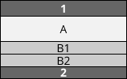

**2-column layout**. Often used to target tablets, since they have medium-size screens.

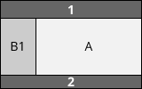 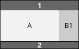

**3-column layouts**. Only suitable for desktops with big screens. (Even many desktop-users prefer viewing things in small windows rather than fullscreen.)

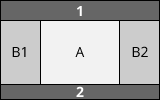 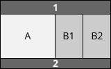 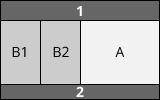

The real fun begins when you start mixing them all together:

 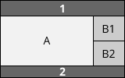 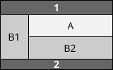 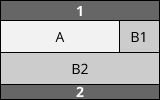…

These are just examples and you're quite free to lay things out as you want. You may notice that, while the content can move around on the screen, we always keep the header (1) on top and the footer (2) at the bottom. Also, the main content (A) matters most, so give it most of the space.

These are rules of thumb you can draw on. There are complex designs and exceptions, of course. In other articles we'll discuss how to design responsive sites (sites that change depending on the screen size) and sites whose layouts vary between pages. For now, it's best to keep your layout consistent throughout your site.

## Active learning

_There is no active learning available yet. [Please, consider contributing](/en-US/docs/MDN/Community/Contributing/Getting_started)._

## Deeper dive

Let's study some more concrete examples taken from well-known websites.

### One-column layout

**[Invision application](https://www.invisionapp.com/)**. A typical one-column layout providing all the information linearly on one page.

        

Quite straightforward. Just remember, many people will still browse your site from desktops, so make your content usable/readable there as well.

### Two-column layout

**[Abduzeedo](https://abduzeedo.com/typography-mania-261)**, a simple blog layout. Blogs usually have two columns, a fat one for the main content and a thin one for stuff on the side (like widgets, secondary navigation levels, and ads).

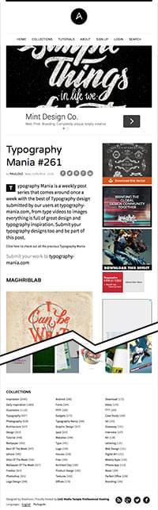        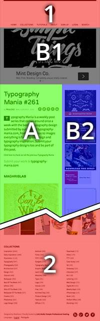

In this example, look at the image (B1) right underneath the header. It's related to the main content, but the main content makes sense without it, so you could think of the image either as main content or as side content. It doesn't really matter. What does matter is, if you put something right under the header, it should either be main content or _directly related_ to the main content.

### It's a trap

**[MICA](https://www.mica.edu/about-mica/)**. This is a bit trickier. It looks like a three-column layout:

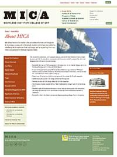        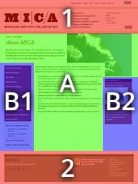

But it's not! B1 and B2 float around the main content. Remember that word "float"--it will ring a bell when you start learning about {{Glossary("CSS")}}.

Why would you think it's a three-column layout? Because the image on the top-right is L-shaped, because B1 looks like a column supporting the shifted main content, and because the "M" and "I" of the MICA logo create a vertical line of force.

This is a good example of a classic layout supporting some design creativity. Simple layouts are easier to implement, but allow yourself room to express your creativity in this area.

### A much trickier layout

**The Opera de Paris**.

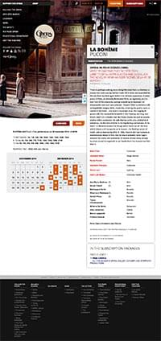        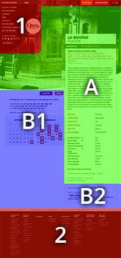

Basically a two-column layout, but you'll notice many tweaks here and there that visually break up the layout. Especially, the header overlaps the image of the main content. The way the curve of the header's menu ties in with the curve at the bottom of the image, the header and main content look like one thing even though they're technically completely different. The Opera example looks more complex than the MICA example, but it's actually easier to implement (all right, "easy" _is_ a relative concept).

As you see, you can craft stunning websites even with just basic layouts. Have a look at your own favorite websites and ask yourself, where's the header, the footer, the main content, and the side content? That will inspire you for your own design and give you good hints for which designs work and which ones don't.
