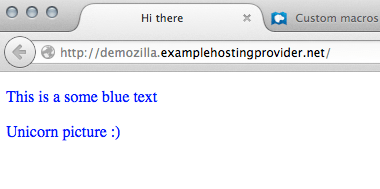
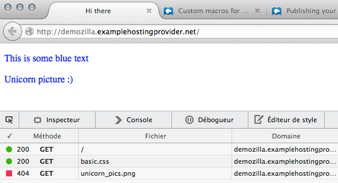
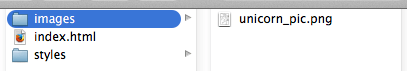
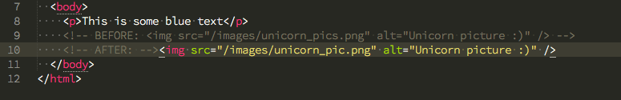
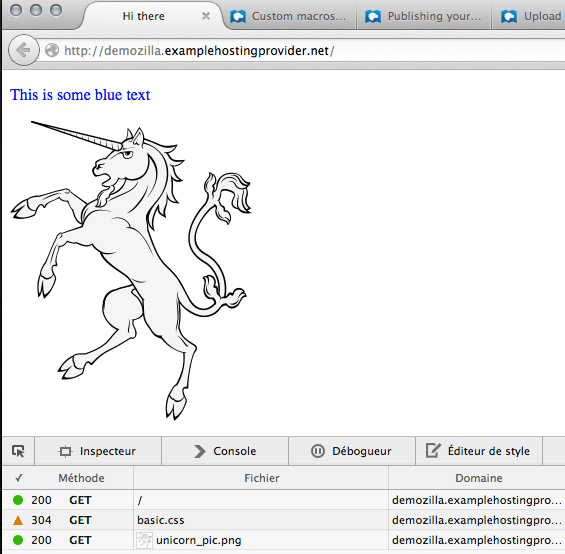
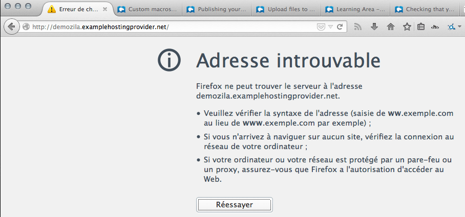
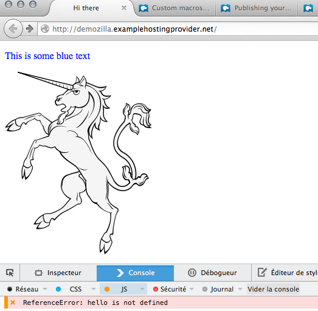
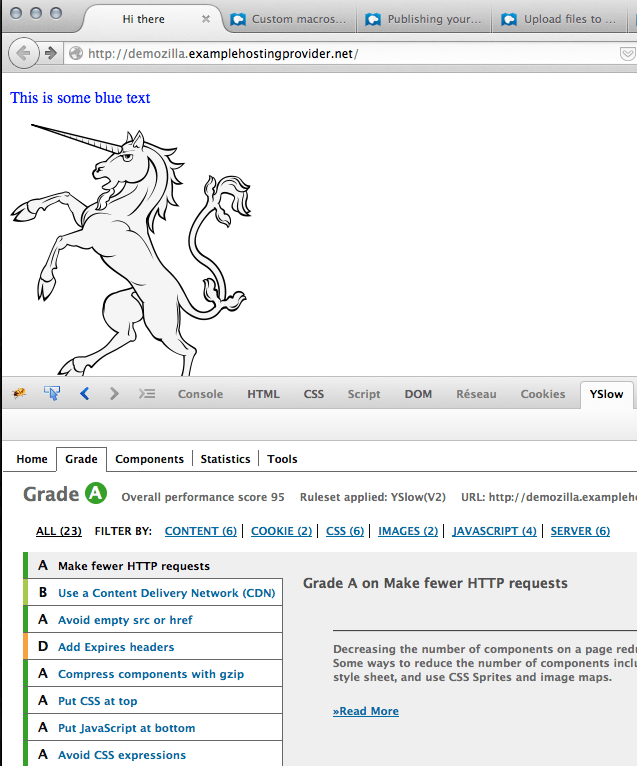

{{QuicklinksWithSubPages("Learn/Common_questions")}}

In this article, we go over various troubleshooting steps for a website and some basic actions to take in order to solve these issues.

<table>
  <tbody>
    <tr>
      <th scope="row">Prerequisites:</th>
      <td>
        You need to know how to
        <a
          href="/en-US/docs/Learn/Common_questions/Tools_and_setup/Upload_files_to_a_web_server"
          >upload files to a web server</a
        >.
      </td>
    </tr>
    <tr>
      <th scope="row">Objective:</th>
      <td>
        You will learn how to diagnose and resolve some basic issues you can run
        into with your website.
      </td>
    </tr>
  </tbody>
</table>

So you've published your website online? Very good! But are you sure it works properly?

A distant web server often behaves quite differently from a local one, so it's a good idea to test your website once it's online. You might be surprised at how many problems come up: images don't show up, pages don't load or load slowly, and so on. Most of the time it's no big deal, just a simple mistake or an issue with your web hosting configuration.

Let's see how to diagnose and solve those problems.

## Active Learning

_There is no active learning available yet. [Please, consider contributing](/en-US/docs/MDN/Community/Contributing/Getting_started)._

## Dig deeper

### Test in your browser

If you want to know whether your website works correctly, the first thing to do is fire up your browser and go to the page you want to test.

#### Uh-oh, where's the image?

Let's look at our personal website, `http://demozilla.examplehostingprovider.net/`. It's not showing the image we expected!



Open Firefox's Network tool (**Tools ➤ Web Developer ➤ Network**) and reload the page:



There's the problem, that "404" at the bottom. "404" means "resource not found", and that's why we didn't see the image.

#### HTTP statuses

Servers respond with a status message whenever they receive a request. Here are the most common statuses:

- **200: OK**
  - : The resource you asked for was delivered.
- **301: Moved permanently**
  - : The resource has moved to a new location. You won't see this much in your browser, but it's good to know about "301" since search engines use this information a lot to update their indexes.
- **304: Not modified**
  - : The file has not changed since the last time you asked for it, so your browser can display the version from its cache, resulting in faster response times and more efficient use of bandwidth.
- **403: Forbidden**
  - : You aren't allowed to display the resource. Usually it has to do with a configuration mistake (e.g. your hosting provider forgot to give you access rights to a directory).
- **404: Not found**
  - : Self-explanatory. We'll discuss how to solve this below.
- **500: Internal server error**
  - : Something went wrong on the server. For instance, maybe the server-side language ({{Glossary("PHP")}}, .Net, etc.) stopped working, or the web server itself has a configuration problem. Usually it's best to resort to your hosting provider's support team.
- **503: Service unavailable**
  - : Usually resulting from a short term system overload. The server has some sort of problem. Try again in a little while.

As beginners checking our (simple) website, we'll deal most often with 200, 304, 403, and 404.

#### Fixing the 404

So what went wrong?



At first glance, the image we asked for seems to be in the right place but the Network tool reported a "404". It turns out that we made a typo in our HTML code: `unicorn_pics.png` rather than `unicorn_pic.png`. So correct the typo in your code editor by changing the image's `src` attribute:



Save, [push to the server](/en-US/docs/Learn/Common_questions/Tools_and_setup/Upload_files_to_a_web_server), and reload the page in your browser:



There you go! Let's look at the {{Glossary("HTTP")}} statuses again:

- **200** for `/` and for `unicorn_pic.png` means that we succeeded in reloading the page and the image.
- **304** for `basic.css` means that this file has not changed since the last request, so the browser can use the file in its cache rather than receiving a fresh copy.

So we fixed the error and learned a few HTTP statuses along the way!

### Frequent errors

The most frequent errors that we find are these:

#### Typos in the address

We wanted to type `http://demozilla.examplehostingprovider.net/` but typed too fast and forgot an "l":



The address cannot be found. Indeed.

#### 404 errors

Many times the error results just from a typo, but sometimes maybe you either forgot to upload a resource or you lost your network connection while you were uploading your resources. First check the spelling and accuracy of the file path, and if there's still a problem, upload your files again. That will likely fix the problem.

#### JavaScript errors

Someone (possibly you) added a script to the page and made a mistake. This will not prevent the page from loading, but you will feel something went wrong.

Open the console (**Tools ➤ Web developer ➤ Web Console**) and reload the page:



In this example, we learn (quite clearly) what the error is, and we can go fix it (we will cover JavaScript in [another series](/en-US/docs/Learn/JavaScript) of articles).

### More things to check

We have listed a few simple ways to check that your website works properly, as well as the most common errors you may run across and how to fix them. You can also test if your page meets these criteria:

#### How's the performance?

Does the page load fast enough? Resources like [WebPageTest.org](https://www.webpagetest.org/) or browser add-ons like [YSlow](https://github.com/marcelduran/yslow) can tell you a few interesting things:



Grades go from A to F. Our page is just small and meets most criteria. But we can already note it would have been better to use a {{Glossary("CDN")}}. That doesn't matter very much when we're only serving one image, but it would be critical for a high-bandwidth website serving many thousands of images.

#### Is the server responsive enough?

`ping` is a useful shell tool that tests the domain name you provide and tells you if the server's responding or not:

```plain
$ ping mozilla.org
PING mozilla.org (63.245.215.20): 56 data bytes
64 bytes from 63.245.215.20: icmp_seq=0 ttl=44 time=148.741 ms
64 bytes from 63.245.215.20: icmp_seq=1 ttl=44 time=148.541 ms
64 bytes from 63.245.215.20: icmp_seq=2 ttl=44 time=148.734 ms
64 bytes from 63.245.215.20: icmp_seq=3 ttl=44 time=147.857 ms
^C
--- mozilla.org ping statistics ---
4 packets transmitted, 4 packets received, 0.0% packet loss
round-trip min/avg/max/stddev = 147.857/148.468/148.741/0.362 ms
```

Just keep in mind a handy keyboard shortcut: **Ctrl+C**. Ctrl+C sends an "interrupt" signal to the runtime and tells it to stop. If you don't stop the runtime, `ping` will ping the server indefinitely.

### A simple checklist

- Check for 404s
- Make sure all webpages are behaving as you expect
- Check your website in several browsers to make sure it renders consistently

## Next steps

Congratulations, your website is up and running for anyone to visit. That's a huge achievement. Now, you can start digging deeper into various subjects.

- Since people can come to your website from all over the world, you should consider making it [accessible to everybody](/en-US/docs/Learn/Common_questions/Design_and_accessibility/What_is_accessibility).
- Is the design of your website a bit too rough? It's time to [learn more about CSS](/en-US/docs/Learn/CSS/First_steps/How_CSS_works).
