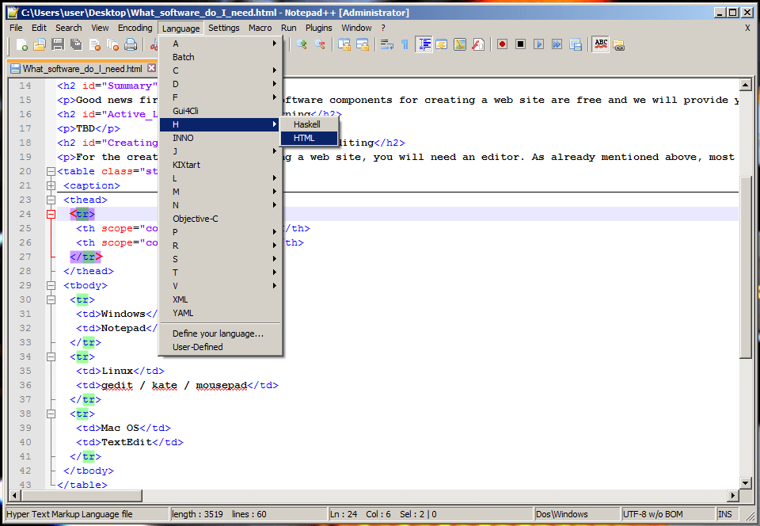
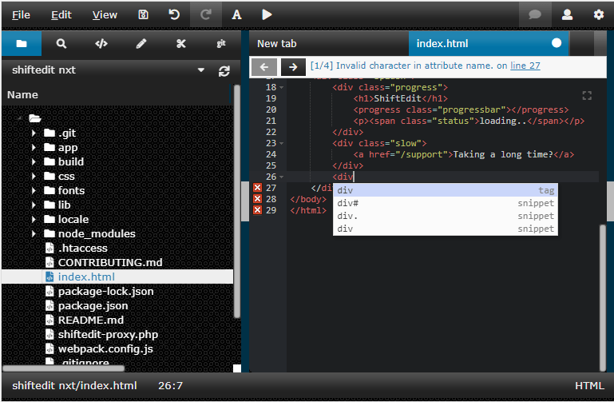

{{QuicklinksWithSubPages("Learn/Common_questions")}}

In this article, we lay out which software components you need when you're editing, uploading, or viewing a website.

<table class="standard-table">
  <tbody>
    <tr>
      <th scope="row">Prerequisites:</th>
      <td>
        You should already know
        <a
          href="/en-US/docs/Learn/Common_questions/Web_mechanics/Pages_sites_servers_and_search_engines"
          >the difference between webpages, websites, web servers, and search
          engines.</a
        >
      </td>
    </tr>
    <tr>
      <th scope="row">Objective:</th>
      <td>
        Learn which software components you need if you want to edit, upload, or
        view a website.
      </td>
    </tr>
  </tbody>
</table>

## Summary

You can download most of the programs you need for web development for free. We'll provide a few links in this article.

You'll need tools to:

- Create and edit webpages
- Upload files to your web server
- View your website

Nearly all operating systems by default include a text editor and a browser, which you can use to view websites. As a result, you usually only need to acquire software for transferring files to your web server.

## Active Learning

_There is no active learning available yet. [Please, consider contributing](/en-US/docs/MDN/Community/Contributing/Getting_started)._

## Dig deeper

### Creating and editing webpages

To create and edit a website, you need a text editor. Text editors create and modify unformatted text files. Other formats, like **{{Glossary("RTF")}}**, let you add formatting, like bold or underline. Those formats are not suitable for writing web pages. You should put some thought into which text editor you use, since you'll be working with it extensively while you're building the website.

All desktop operating systems come with a basic text editor. These editors are all straightforward, but lack special features for webpage coding. If you want something a bit fancier, there are plenty of third-party tools available. Third-party editors often come with extra features, including syntax coloring, auto-completion, collapsible sections, and code search. Here is a short list of editors:

<table class="standard-table">
  <thead>
    <tr>
      <th scope="col">Operating system</th>
      <th scope="col">Built-in editor</th>
      <th scope="col">Third-party editor</th>
    </tr>
  </thead>
  <tbody>
    <tr>
      <td>Windows</td>
      <td>
        <ul>
          <li>
            <a
              href="https://en.wikipedia.org/wiki/Notepad_%28software%29"
              rel="external"
              >Notepad</a
            >
          </li>
        </ul>
      </td>
      <td>
        <ul>
          <li><a href="https://notepad-plus-plus.org/">Notepad++</a></li>
          <li>
            <a href="https://www.visualstudio.com/">Visual Studio Code</a>
          </li>
          <li><a href="https://www.jetbrains.com/webstorm/">Web Storm</a></li>
          <li><a href="http://brackets.io/">Brackets</a></li>
          <li><a href="https://shiftedit.net/">ShiftEdit</a></li>
          <li><a href="https://www.sublimetext.com/">Sublime Text</a></li>
        </ul>
      </td>
    </tr>
    <tr>
      <td>Mac OS</td>
      <td>
        <ul>
          <li>
            <a href="https://en.wikipedia.org/wiki/TextEdit" rel="external"
              >TextEdit</a
            >
          </li>
        </ul>
      </td>
      <td>
        <ul>
          <li>
            <a href="https://www.barebones.com/products/textwrangler/"
              >TextWrangler</a
            >
          </li>
          <li>
            <a href="https://www.visualstudio.com/">Visual Studio Code</a>
          </li>
          <li><a href="http://brackets.io/">Brackets</a></li>
          <li><a href="https://shiftedit.net/">ShiftEdit</a></li>
          <li><a href="https://www.sublimetext.com/">Sublime Text</a></li>
        </ul>
      </td>
    </tr>
    <tr>
      <td>Linux</td>
      <td>
        <ul>
          <li>
            <a href="https://en.wikipedia.org/wiki/Vi" rel="external">Vi</a>
            (All UNIX)
          </li>
          <li>
            <a href="https://en.wikipedia.org/wiki/Gedit" rel="external"
              >GEdit</a
            >
            (Gnome)
          </li>
          <li>
            <a
              href="https://en.wikipedia.org/wiki/Kate_%28text_editor%29"
              rel="external"
              >Kate</a
            >
            (KDE)
          </li>
          <li>
            <a href="https://en.wikipedia.org/wiki/Leafpad" rel="external"
              >LeafPad</a
            >
            (Xfce)
          </li>
        </ul>
      </td>
      <td>
        <ul>
          <li><a href="https://www.gnu.org/software/emacs/">Emacs</a></li>
          <li><a href="https://www.vim.org/" rel="external">Vim</a></li>
          <li>
            <a href="https://www.visualstudio.com/">Visual Studio Code</a>
          </li>
          <li><a href="http://brackets.io/">Brackets</a></li>
          <li><a href="https://shiftedit.net/">ShiftEdit</a></li>
          <li><a href="https://www.sublimetext.com/">Sublime Text</a></li>
        </ul>
      </td>
    </tr>
    <tr>
      <td>Chrome OS</td>
      <td></td>
      <td>
        <ul>
          <li><a href="https://shiftedit.net/">ShiftEdit</a></li>
        </ul>
      </td>
    </tr>
  </tbody>
</table>

Here is a screenshot of an advanced text editor:

Here is a screenshot of an online text editor:

### Uploading files on the Web

When your website is ready for public viewing, you'll have to upload your webpages to your web server. You can buy space on a server from various providers (see [How much does it cost to do something on the web?](/en-US/docs/Learn/Common_questions/Tools_and_setup/How_much_does_it_cost)). Once you settle on which provider to use, the provider will email you the access information, usually in the form of an SFTP URL, username, password, and other information needed to connect to their server. Bear in mind that (S)FTP is now somewhat old-fashioned, and other uploading systems are starting to become popular, such as [RSync](https://en.wikipedia.org/wiki/Rsync) and [Git/GitHub](https://docs.github.com/en/pages/configuring-a-custom-domain-for-your-github-pages-site).

> **Note:** FTP is inherently insecure. You should make sure your hosting provider allows use of a secure connection, e.g. SFTP or RSync over SSH.

Uploading files to a web server is a very important step while creating a website, so we cover it in detail in [a separate article](/en-US/docs/Learn/Common_questions/Tools_and_setup/Upload_files_to_a_web_server). For now, here's a short list of free basic (S)FTP clients:

<table class="standard-table">
  <thead>
    <tr>
      <th scope="col">Operating system</th>
      <th colspan="2" scope="col">FTP software</th>
    </tr>
  </thead>
  <tbody>
    <tr>
      <td>Windows</td>
      <td>
        <ul>
          <li><a href="https://winscp.net">WinSCP</a></li>
          <li><a href="https://mobaxterm.mobatek.net/">Moba Xterm</a></li>
        </ul>
      </td>
      <td rowspan="3">
        <ul>
          <li>
            <a href="https://filezilla-project.org/">FileZilla</a> (All OS)
          </li>
        </ul>
      </td>
    </tr>
    <tr>
      <td>Linux</td>
      <td>
        <ul>
          <li>
            <a
              href="https://wiki.gnome.org/action/show/Apps/Files?action=show&#x26;redirect=Apps%2FNautilus"
              rel="external"
              >Nautilus/Files</a
            >
            (Gnome)
          </li>
          <li>
            <a href="https://dolphin.com/" rel="external">Dolphin</a> (KDE)
          </li>
        </ul>
      </td>
    </tr>
    <tr>
      <td>Mac OS</td>
      <td>
        <ul>
          <li><a href="https://cyberduck.de/">Cyberduck</a></li>
        </ul>
      </td>
    </tr>
    <tr>
      <td>Chrome OS</td>
      <td>
        <ul>
          <li><a href="https://shiftedit.net/">ShiftEdit</a> (All OS)</li>
        </ul>
      </td>
      <td></td>
    </tr>
  </tbody>
</table>

### Browsing websites

As you already know, you need a web browser to view websites. There are [dozens](https://en.wikipedia.org/wiki/List_of_web_browsers) of browser options for your personal use, but when you're developing a website you should test it at least with the following major browsers, to make sure your site works for most people:

- [Mozilla Firefox](https://www.mozilla.org/en-US/firefox/new/)
- [Google Chrome](https://www.google.com/chrome/)
- [Apple Safari](https://www.apple.com/safari/)

If you're targeting a specific group (e.g., technical platform or country), you may have to test the site with additional browsers, like [Opera](https://www.opera.com/), [Konqueror](https://apps.kde.org/konqueror/).

But testing gets complicated because some browsers only run on certain operating systems. Apple Safari runs on iOS and macOS, while Internet Explorer runs only on Windows. It's best to take advantage of services like [Browsershots](https://browsershots.org/) or [Browserstack](https://www.browserstack.com/). Browsershots furnishes screenshots of your website as it will look in various browsers. Browserstack actually gives you full remote access to virtual machines, so you can test your site in the most common environments. Alternatively, you can set up your own virtual machine, but that takes some expertise. (If you're going that route, Microsoft has made [ready-to-use virtual machines](https://developer.microsoft.com/en-us/microsoft-edge/tools/vms/) available.)

By all means run some tests on a real device, especially on real mobile devices. Mobile device simulation is a new, evolving technology and less reliable than desktop simulation. Mobile devices cost money, of course, so we suggest taking a look at the [Open Device Lab initiative](https://www.smashingmagazine.com/2016/11/worlds-best-open-device-labs/#odls-have-opened-doors-for-idls). You can also share devices if you want to test on many platforms without spending too much.

## Next steps

- Some of this software is free, but not all of it. [Find out how much it costs to do something on the web](/en-US/docs/Learn/Common_questions/Tools_and_setup/How_much_does_it_cost).
- If you'd like to learn more about text editors, read our article about [how to choose and install a text editor](/en-US/docs/Learn/Common_questions/Tools_and_setup/Available_text_editors).
- If you're wondering how to publish your website on the web, look at ["How to upload files to a web server"](/en-US/docs/Learn/Common_questions/Tools_and_setup/Upload_files_to_a_web_server).
