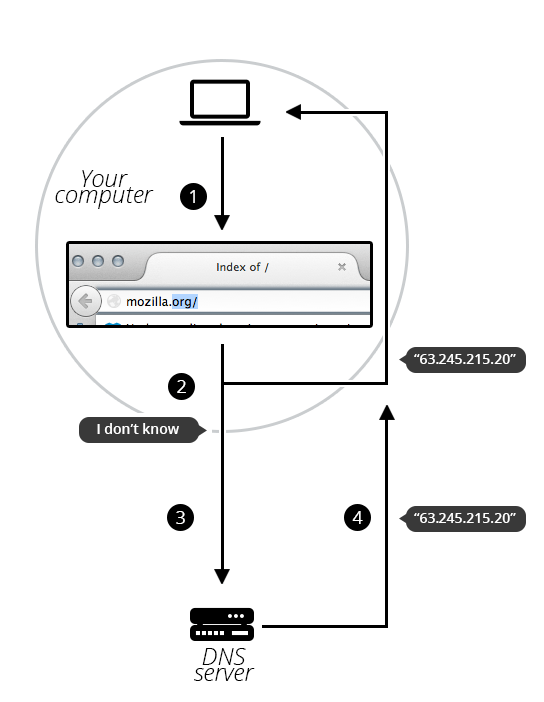

{{QuicklinksWithSubPages("Learn/Common_questions")}}

<table>
  <tbody>
    <tr>
      <th scope="row">Prerequisites:</th>
      <td>
        First you need to know
        <a href="/en-US/docs/Learn/Common_questions/Web_mechanics/How_does_the_Internet_work"
          >how the Internet works</a
        >
        and understand
        <a href="/en-US/docs/Learn/Common_questions/Web_mechanics/What_is_a_URL"
          >what URLs are</a
        >.
      </td>
    </tr>
    <tr>
      <th scope="row">Objective:</th>
      <td>
        Learn what domain names are, how they work, and why they are important.
      </td>
    </tr>
  </tbody>
</table>

## Summary

Domain names are a key part of the Internet infrastructure. They provide a human-readable address for any web server available on the Internet.

Any Internet-connected computer can be reached through a public {{Glossary("IP Address")}}, either an IPv4 address (e.g. `192.0.2.172`) or an IPv6 address (e.g., `2001:db8:8b73:0000:0000:8a2e:0370:1337`).

Computers can handle such addresses easily, but people have a hard time finding out who is running the server or what service the website offers. IP addresses are hard to remember and might change over time.

To solve all those problems we use human-readable addresses called domain names.

## Deeper dive

### Structure of domain names

A domain name has a simple structure made of several parts (it might be one part only, two, three…), separated by dots and **read from right to left**:


Each of those parts provides specific information about the whole domain name.

- {{Glossary("TLD")}} (Top-Level Domain).

  - : TLDs tell users the general purpose of the service behind the domain name. The most generic TLDs (`.com`, `.org`, `.net`) don't require web services to meet any particular criteria, but some TLDs enforce stricter policies so it is clearer what their purpose is. For example:

    - Local TLDs such as `.us`, `.fr`, or `.se` can require the service to be provided in a given language or hosted in a certain country — they are supposed to indicate a resource in a particular language or country.
    - TLDs containing `.gov` are only allowed to be used by government departments.
    - The `.edu` TLD is only for use by educational and academic institutions.

    TLDs can contain special as well as latin characters. A TLD's maximum length is 63 characters, although most are around 2–3.

    The full list of TLDs is [maintained by ICANN](https://www.icann.org/resources/pages/tlds-2012-02-25-en).

- Label (or component)

  - : The labels are what follow the TLD. A label is a case-insensitive character sequence anywhere from one to sixty-three characters in length, containing only the letters `A` through `Z`, digits `0` through `9`, and the '-' character (which may not be the first or last character in the label). `a`, `97`, and `hello-strange-person-16-how-are-you` are all examples of valid labels.

    The label located right before the TLD is also called a _Secondary Level Domain_ (SLD).

    A domain name can have many labels (or components). It is not mandatory nor necessary to have 3 labels to form a domain name. For instance, www\.inf.ed.ac.uk is a valid domain name. For any domain you control (e.g. [mozilla.org](https://www.mozilla.org/en-US/)), you can create "subdomains" with different content located at each, like [developer.mozilla.org](/), [iot.mozilla.org](https://iot.mozilla.org/), or [bugzilla.mozilla.org](https://bugzilla.mozilla.org).

### Buying a domain name

#### Who owns a domain name?

You cannot "buy a domain name". This is so that unused domain names eventually become available to be used again by someone else. If every domain name was bought, the web would quickly fill up with unused domain names that were locked and couldn't be used by anyone.

Instead, you pay for the right to use a domain name for one or more years. You can renew your right, and your renewal has priority over other people's applications. But you never own the domain name.

Companies called registrars use domain name registries to keep track of technical and administrative information connecting you to your domain name.

> **Note:** For some domain name, it might not be a registrar which is in charge of keeping track. For instance, every domain name under `.fire` is managed by Amazon.

#### Finding an available domain name

To find out whether a given domain name is available,

- Go to a domain name registrar's website. Most of them provide a "whois" service that tells you whether a domain name is available.
- Alternatively, if you use a system with a built-in shell, type a `whois` command into it, as shown here for `mozilla.org`:

  ```bash
  $ whois mozilla.org
  Domain Name:MOZILLA.ORG
  Domain ID: D1409563-LROR
  Creation Date: 1998-01-24T05:00:00Z
  Updated Date: 2013-12-08T01:16:57Z
  Registry Expiry Date: 2015-01-23T05:00:00Z
  Sponsoring Registrar:MarkMonitor Inc. (R37-LROR)
  Sponsoring Registrar IANA ID: 292
  WHOIS Server:
  Referral URL:
  Domain Status: clientDeleteProhibited
  Domain Status: clientTransferProhibited
  Domain Status: clientUpdateProhibited
  Registrant ID:mmr-33684
  Registrant Name:DNS Admin
  Registrant Organization:Mozilla Foundation
  Registrant Street: 650 Castro St Ste 300
  Registrant City:Mountain View
  Registrant State/Province:CA
  Registrant Postal Code:94041
  Registrant Country:US
  Registrant Phone:+1.6509030800
  ```

As you can see, I can't register `mozilla.org` because the Mozilla Foundation has already registered it.

On the other hand, let's see if I could register `afunkydomainname.org`:

```bash
$ whois afunkydomainname.org
NOT FOUND
```

As you can see, the domain does not exist in the `whois` database (at the time of writing), so we could ask to register it. Good to know!

#### Getting a domain name

The process is quite straightforward:

1. Go to a registrar's website.
2. Usually there is a prominent "Get a domain name" call to action. Click on it.
3. Fill out the form with all required details. Make sure, especially, that you have not misspelled your desired domain name. Once it's paid for, it's too late!
4. The registrar will let you know when the domain name is properly registered. Within a few hours, all DNS servers will have received your DNS information.

> **Note:** In this process the registrar asks you for your real-world address. Make sure you fill it properly, since in some countries registrars may be forced to close the domain if they cannot provide a valid address.

#### DNS refreshing

DNS databases are stored on every DNS server worldwide, and all these servers refer to a few special servers called "authoritative name servers" or "top-level DNS servers" — these are like the boss servers that manage the system.

Whenever your registrar creates or updates any information for a given domain, the information must be refreshed in every DNS database. Each DNS server that knows about a given domain stores the information for some time before it is automatically invalidated and then refreshed (the DNS server queries an authoritative server and fetches the updated information from it). Thus, it takes some time for DNS servers that know about this domain name to get the up-to-date information.

### How does a DNS request work?

As we already saw, when you want to display a webpage in your browser it's easier to type a domain name than an IP address. Let's take a look at the process:

1. Type `mozilla.org` in your browser's location bar.
2. Your browser asks your computer if it already recognizes the IP address identified by this domain name (using a local DNS cache). If it does, the name is translated to the IP address and the browser negotiates contents with the web server. End of story.
3. If your computer does not know which IP is behind the `mozilla.org` name, it goes on to ask a DNS server, whose job is precisely to tell your computer which IP address matches each registered domain name.
4. Now that the computer knows the requested IP address, your browser can negotiate contents with the web server.



## Next steps

Okay, we talked a lot about processes and architecture. Time to move on.

- If you want to get hands-on, it's a good time to start digging into design and explore [the anatomy of a web page](/en-US/docs/Learn/Common_questions/Design_and_accessibility/Common_web_layouts).
- It's also worth noting that some aspects of building a website cost money. Please refer to [how much it costs to build a website](/en-US/docs/Learn/Common_questions/Tools_and_setup/How_much_does_it_cost).
- Or read more about [Domain Names](https://en.wikipedia.org/wiki/Domain_name) on Wikipedia.
- You can also find [here](https://howdns.works/) a fun and colorful explanation of how DNS works.
