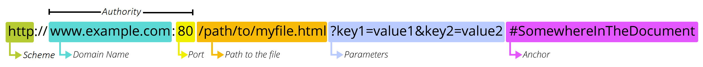
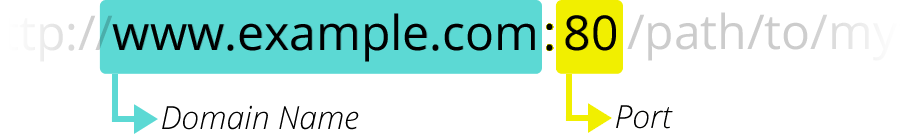
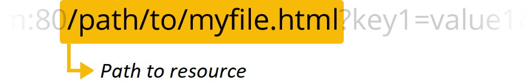
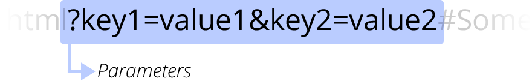
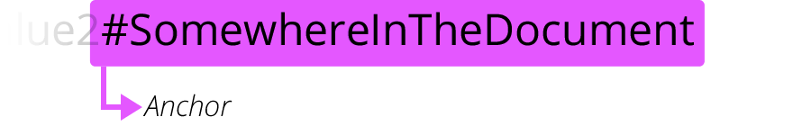

{{QuicklinksWithSubPages("Learn/Common_questions")}}

This article discusses Uniform Resource Locators (URLs), explaining what they are and how they're structured.

<table>
  <tbody>
    <tr>
      <th scope="row">Prerequisites:</th>
      <td>
        You need to first know
        <a href="/en-US/docs/Learn/Common_questions/Web_mechanics/How_does_the_Internet_work"
          >how the Internet works</a
        >,
        <a href="/en-US/docs/Learn/Common_questions/Web_mechanics/What_is_a_web_server"
          >what a Web server is</a
        >
        and
        <a href="/en-US/docs/Learn/Common_questions/Web_mechanics/What_are_hyperlinks"
          >the concepts behind links on the web</a
        >.
      </td>
    </tr>
    <tr>
      <th scope="row">Objective:</th>
      <td>You will learn what a URL is and how it works on the Web.</td>
    </tr>
  </tbody>
</table>

## Summary

With {{Glossary("Hypertext")}} and {{Glossary("HTTP")}}, **_URL_** is one of the key concepts of the Web. It is the mechanism used by {{Glossary("Browser","browsers")}} to retrieve any published resource on the web.

**URL** stands for _Uniform Resource Locator_. A URL is nothing more than the address of a given unique resource on the Web. In theory, each valid URL points to a unique resource. Such resources can be an HTML page, a CSS document, an image, etc. In practice, there are some exceptions, the most common being a URL pointing to a resource that no longer exists or that has moved. As the resource represented by the URL and the URL itself are handled by the Web server, it is up to the owner of the web server to carefully manage that resource and its associated URL.

## Basics: anatomy of a URL

Here are some examples of URLs:

```
https://developer.mozilla.org
https://developer.mozilla.org/en-US/docs/Learn/
https://developer.mozilla.org/en-US/search?q=URL
```

Any of those URLs can be typed into your browser's address bar to tell it to load the associated page (resource).

A URL is composed of different parts, some mandatory and others optional. The most important parts are highlighted on the URL below (details are provided in the following sections):



> **Note:** You might think of a URL like a regular postal mail address: the _scheme_ represents the postal service you want to use, the _domain name_ is the city or town, and the _port_ is like the zip code; the _path_ represents the building where your mail should be delivered; the _parameters_ represent extra information such as the number of the apartment in the building; and, finally, the _anchor_ represents the actual person to whom you've addressed your mail.

> **Note:** There are [some extra parts and some extra rules](https://en.wikipedia.org/wiki/Uniform_Resource_Locator) regarding URLs, but they are not relevant for regular users or Web developers. Don't worry about this, you don't need to know them to build and use fully functional URLs.

## Scheme


The first part of the URL is the _scheme_, which indicates the protocol that the browser must use to request the resource (a protocol is a set method for exchanging or transferring data around a computer network). Usually for websites the protocol is HTTPS or HTTP (its unsecured version). Addressing web pages requires one of these two, but browsers also know how to handle other schemes such as `mailto:` (to open a mail client), so don't be surprised if you see other protocols.

## Authority



Next follows the _authority_, which is separated from the scheme by the character pattern `://`. If present the authority includes both the _domain_ (e.g. `www.example.com`) and the _port_ (`80`), separated by a colon:

- The domain indicates which Web server is being requested. Usually this is a [domain name](/en-US/docs/Learn/Common_questions/Web_mechanics/What_is_a_domain_name), but an {{Glossary("IP address")}} may also be used (but this is rare as it is much less convenient).
- The port indicates the technical "gate" used to access the resources on the web server. It is usually omitted if the web server uses the standard ports of the HTTP protocol (80 for HTTP and 443 for HTTPS) to grant access to its resources. Otherwise it is mandatory.

> **Note:** The separator between the scheme and authority is `://`. The colon separates the scheme from the next part of the URL, while `//` indicates that the next part of the URL is the authority.
>
> One example of a URL that doesn't use an authority is the mail client (`mailto:foobar`). It contains a scheme but doesn't use an authority component. Therefore, the colon is not followed by two slashes and only acts as a delimiter between the scheme and mail address.

## Path to resource



`/path/to/myfile.html` is the path to the resource on the Web server. In the early days of the Web, a path like this represented a physical file location on the Web server. Nowadays, it is mostly an abstraction handled by Web servers without any physical reality.

## Parameters



`?key1=value1&key2=value2` are extra parameters provided to the Web server. Those parameters are a list of key/value pairs separated with the `&` symbol. The Web server can use those parameters to do extra stuff before returning the resource. Each Web server has its own rules regarding parameters, and the only reliable way to know if a specific Web server is handling parameters is by asking the Web server owner.

## Anchor



`#SomewhereInTheDocument` is an anchor to another part of the resource itself. An anchor represents a sort of "bookmark" inside the resource, giving the browser the directions to show the content located at that "bookmarked" spot. On an HTML document, for example, the browser will scroll to the point where the anchor is defined; on a video or audio document, the browser will try to go to the time the anchor represents. It is worth noting that the part after the **#**, also known as the **fragment identifier**, is never sent to the server with the request.

## How to use URLs

Any URL can be typed right inside the browser's address bar to get to the resource behind it. But this is only the tip of the iceberg!

The {{Glossary("HTML")}} language — [which will be discussed later on](/en-US/docs/Learn/HTML/Introduction_to_HTML) — makes extensive use of URLs:

- to create links to other documents with the {{HTMLElement("a")}} element;
- to link a document with its related resources through various elements such as {{HTMLElement("link")}} or {{HTMLElement("script")}};
- to display media such as images (with the {{HTMLElement("img")}} element), videos (with the {{HTMLElement("video")}} element), sounds and music (with the {{HTMLElement("audio")}} element), etc.;
- to display other HTML documents with the {{HTMLElement("iframe")}} element.

> **Note:** When specifying URLs to load resources as part of a page (such as when using the `<script>`, `<audio>`, ``, `<video>`, and the like), you should generally only use HTTP and HTTPS URLs, with few exceptions (one notable one being `data:`; see [Data URLs](/en-US/docs/Web/HTTP/Basics_of_HTTP/Data_URLs)). Using FTP, for example, is not secure and is no longer supported by modern browsers.

Other technologies, such as {{Glossary("CSS")}} or {{Glossary("JavaScript")}}, use URLs extensively, and these are really the heart of the Web.

## Absolute URLs vs. relative URLs

What we saw above is called an _absolute URL_, but there is also something called a _relative URL_. The [URL standard](https://url.spec.whatwg.org/#absolute-url-string) defines both — though it uses the terms [_absolute URL string_](https://url.spec.whatwg.org/#absolute-url-string) and [_relative URL string_](https://url.spec.whatwg.org/#relative-url-string), to distinguish them from [URL objects](https://url.spec.whatwg.org/#url) (which are in-memory representations of URLs).

Let's examine what the distinction between _absolute_ and _relative_ means in the context of URLs.

The required parts of a URL depend to a great extent on the context in which the URL is used. In your browser's address bar, a URL doesn't have any context, so you must provide a full (or _absolute_) URL, like the ones we saw above. You don't need to include the protocol (the browser uses HTTP by default) or the port (which is only required when the targeted Web server is using some unusual port), but all the other parts of the URL are necessary.

When a URL is used within a document, such as in an HTML page, things are a bit different. Because the browser already has the document's own URL, it can use this information to fill in the missing parts of any URL available inside that document. We can differentiate between an _absolute URL_ and a _relative URL_ by looking only at the _path_ part of the URL. If the path part of the URL starts with the "`/`" character, the browser will fetch that resource from the top root of the server, without reference to the context given by the current document.

Let's look at some examples to make this clearer.

### Examples of absolute URLs

<table>
  <tbody>
    <tr>
      <td>Full URL (the same as the one we used before)</td>
      <td><pre>https://developer.mozilla.org/en-US/docs/Learn</pre></td>
    </tr>
    <tr>
      <td>Implicit protocol</td>
      <td>
        <pre>//developer.mozilla.org/en-US/docs/Learn</pre>
        <p>
          In this case, the browser will call that URL with the same protocol as
          the one used to load the document hosting that URL.
        </p>
      </td>
    </tr>
    <tr>
      <td>Implicit domain name</td>
      <td>
        <pre>/en-US/docs/Learn</pre>
        <p>
          This is the most common use case for an absolute URL within an HTML
          document. The browser will use the same protocol and the same domain
          name as the one used to load the document hosting that URL.
          <strong>Note:</strong>
          <em
            >it isn't possible to omit the domain name without omitting the
            protocol as well</em
          >.
        </p>
      </td>
    </tr>
  </tbody>
</table>

### Examples of relative URLs

To better understand the following examples, let's assume that the URLs are called from within the document located at the following URL: `https://developer.mozilla.org/en-US/docs/Learn`

<table>
  <tbody>
    <tr>
      <td>Sub-resources</td>
      <td>
        <pre>Skills/Infrastructure/Understanding_URLs</pre>
        <p>
          Because that URL does not start with <code>/</code>, the browser will
          attempt to find the document in a subdirectory of the one containing
          the current resource. So in this example, we really want to reach
          this URL:
          https://developer.mozilla.org/en-US/docs/Learn/Skills/Infrastructure/Understanding_URLs.
        </p>
      </td>
    </tr>
    <tr>
      <td>Going back in the directory tree</td>
      <td>
        <pre>../CSS/display</pre>
        <p>
          In this case, we use the <code>../</code> writing convention —
          inherited from the UNIX file system world — to tell the browser we
          want to go up from one directory. Here we want to reach this URL:
          https://developer.mozilla.org/en-US/docs/Learn/../CSS/display, which
          can be simplified to:
          https://developer.mozilla.org/en-US/docs/CSS/display.
        </p>
      </td>
    </tr>
  </tbody>
</table>

## Semantic URLs

Despite their very technical flavor, URLs represent a human-readable entry point for a website. They can be memorized, and anyone can enter them into a browser's address bar. People are at the core of the Web, and so it is considered best practice to build what is called [_semantic URLs_](https://en.wikipedia.org/wiki/Semantic_URL). Semantic URLs use words with inherent meaning that can be understood by anyone, regardless of their technical know-how.

Linguistic semantics are of course irrelevant to computers. You've probably often seen URLs that look like mashups of random characters. But there are many advantages to creating human-readable URLs:

- It is easier for you to manipulate them.
- It clarifies things for users in terms of where they are, what they're doing, what they're reading or interacting with on the Web.
- Some search engines can use those semantics to improve the classification of the associated pages.

## See also

[Data URLs](/en-US/docs/Web/HTTP/Basics_of_HTTP/Data_URLs): URLs prefixed with the `data:` scheme, allow content creators to embed small files inline in documents.
